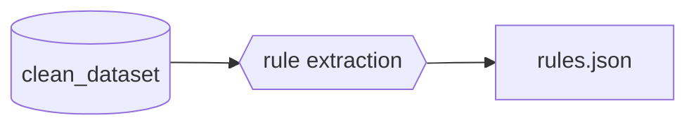
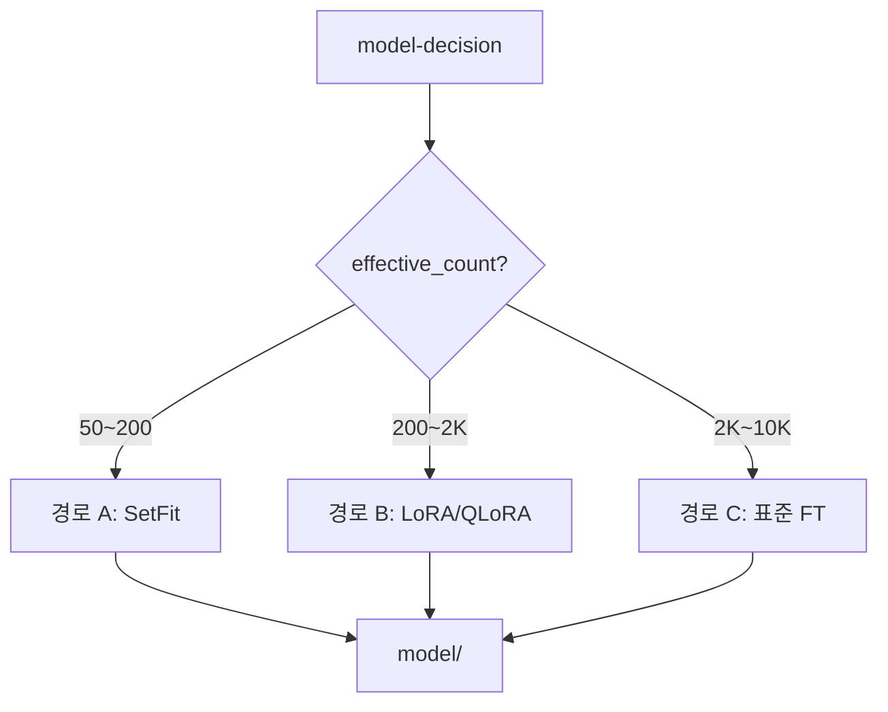
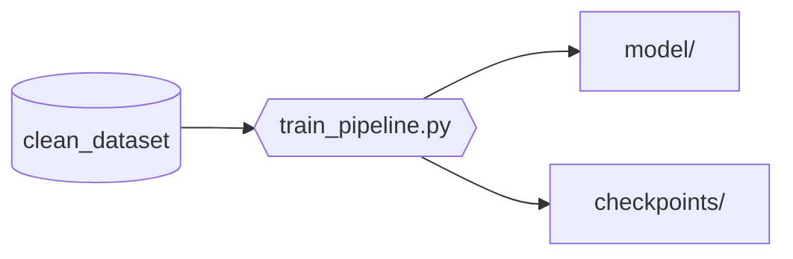

# mso-model-optimizer

> 이 스킬은 모델을 직접 서빙하지 않는다.
> **Training Level을 판단하고 해당 레벨의 학습 흐름을 실행**하여 model artifact(`slots/inference/model/`)와 deploy_spec.json을 생성한다.

---

## 핵심 정의

| 개념 | 정의 |
|------|------|
| **label-strategy** | 라벨 부족 시 최적 라벨 확보 전략을 자동 선택하는 Phase 1.5 모듈 (LS-0~3) |
| **Label Strategy (LS)** | 라벨 확보 전략 깊이. LS-0=Zero-shot 부트스트래핑, LS-1=Few-shot+증강, LS-2=Active Learning, LS-3=충분(직행) |
| **model-decision** | 데이터 가용성(+라벨 전략)·태스크 특성·모델 이력 3-Signal을 종합하여 Training Level을 결정하는 판단 노드 |
| **Training Level (TL)** | 학습 전략 깊이. TL-10=Rule/Heuristic, TL-20=경량 파인튜닝(SetFit/LoRA/QLoRA/표준), TL-30=전체 학습 |
| **data-augmentation** | EDA, Back-Translation, LLM Paraphrase로 라벨 데이터를 증폭하는 서브모듈 |
| **deploy_spec** | 학습된 모델의 배포 계약. Smart Tool manifest와 결합하여 inference 슬롯에 탑재 |
| **model-retraining** | data drift 감지 시 재학습 루프를 실행하는 Operational Module |
| **rollback** | 배포된 모델의 성능 저하 시 LLM passthrough 또는 이전 버전으로 복귀하는 정책 |

---

## Smart Tool 구조 표준

이 스킬의 산출물은 Smart Tool의 `slots/inference/` 슬롯에 배치된다.

```
{tool_name}/
├── manifest.json         ← Tool 메타: name, version, lifecycle_state, slots[]
├── slots/
│   ├── input_norm/       ← Input normalization
│   ├── rules/            ← Rule processing (mso-workflow-optimizer 산출물)
│   ├── inference/        ← Light model inference (mso-model-optimizer 산출물)
│   │   ├── model/        ← model artifact 배치 위치
│   │   └── serve.py      ← inference entry point
│   └── script/           ← Script / API execution
├── schemas/
│   ├── input.schema.json
│   └── output.schema.json
└── README.md
```

manifest.json 스키마: [schemas/smart_tool_manifest.schema.json](schemas/smart_tool_manifest.schema.json)

---

## Training Level과 Automation Level의 관계

Training Level(TL)은 이 스킬 내부의 독자적 단계이며, `mso-workflow-optimizer`의 Automation Level(Lv)과 의미가 다르다.

| Training Level | 의미 | Automation Level과의 관계 |
|---------------|------|--------------------------|
| TL-10 | Rule/Heuristic 생성 | Automation Lv20→Lv10 Escalation의 **후속 작업** |
| TL-20 | 경량 모델 파인튜닝 | Automation Lv30→Lv20 Escalation의 **전제 조건** |
| TL-30 | 전체 학습 / 다단계 파인튜닝 | 복잡한 inference 대체 시 |

**트리거 매핑**:

| workflow-optimizer Tier Escalation 신호 | model-optimizer Training Level |
|----------------------------------------|-------------------------------|
| Lv30→Lv20 전환 결정 (inference 패턴 안정화) | TL-20 또는 TL-30 (태스크 복잡도에 따라) |
| Lv20→Lv10 전환 결정 (완전 deterministic화) | TL-10 (rule로 대체 가능한 수준) |
| 직접 트리거 (사용자 요청) | model-decision이 TL 자율 결정 |

---

## 실행 프로세스

### Phase 0: 트리거 수신 + 대체 대상 식별

1. 트리거 유형 확인: `mso-workflow-optimizer`의 Tier Escalation 신호 또는 직접 트리거
2. 대체 대상 식별: 어떤 Smart Tool의 어떤 inference 패턴을 모델로 대체할지 확정
3. 입력 확정: `tool_name`, `inference_pattern`, `target_task_type`, `data_source[]`

**Handoff Payload 스키마** (workflow-optimizer → model-optimizer):

```json
{
  "trigger_type": "tier_escalation",
  "source_skill": "mso-workflow-optimizer",
  "escalation": {
    "from_level": 30,
    "to_level": 20,
    "workflow_name": "sop-intent-classifier",
    "run_id": "20260318-opt-001"
  },
  "target": {
    "tool_name": "sop-intent-classifier",
    "inference_pattern": "classification",
    "current_llm_calls_per_run": 42,
    "sample_io_ref": "{workspace}/.mso-context/active/20260318-opt-001/optimizer/sample_io.jsonl"
  }
}
```

> `trigger_type`: `"tier_escalation"` 또는 `"direct"`. `inference_pattern`: `"classification"`, `"ner"`, `"ranking"`, `"tagging"`, `"extraction"` 중 하나.
> 전체 스키마: [schemas/handoff_payload.schema.json](schemas/handoff_payload.schema.json)

**when_unsure**: 트리거 유형 불명확 시 `audit_global.db`의 최근 `work_type` 필드로 유추하고 사용자에게 확인 요청.

**산출물**: `trigger_context { tool_name, inference_pattern, target_task_type, data_source[] }`

---

### Phase 1: 학습 데이터 수집 + 정제

**데이터 소스** (우선순위 순):

| 소스 | 내용 | 비고 |
|------|------|------|
| Handoff Payload의 `sample_io_ref` | workflow-optimizer가 준비한 LLM I/O 샘플 | 1순위 |
| `audit_global.db` | 해당 inference 패턴의 과거 실행 이력 | 2순위 |
| workspace별 로그 저장소 | LLM 응답 전문 로그 (있는 경우) | 3순위 |
| 사용자 제공 데이터 | 수동 라벨링 데이터, 외부 데이터셋 | HITL 경유 |

**정제 과정**:

1. input/output 쌍 구성 (`raw_dataset.jsonl`)
2. 중복 제거, PII 마스킹
3. `mso-workflow-optimizer`의 `llm-as-a-judge` 모듈을 서브프로세스로 호출하여 라벨 품질 정량 검증
4. 데이터셋 분할: train / validation / test (기본 비율 8:1:1)

**when_unsure**: 데이터 소스 1~3순위 모두에서 충분한 데이터를 확보하지 못하면 HITL로 사용자에게 추가 데이터 제공 요청.

**산출물**: `clean_dataset.jsonl`, `dataset_stats.json`, `splits/`

---

### Phase 1.5: Label Strategy — 라벨 확보 전략 (조건부)

> `dataset_stats.json`의 `labeled_count`를 확인하여 라벨이 부족한 경우에만 실행. 충분(LS-3)하면 건너뜀.

**LS 결정 기준**:

| LS | 조건 | 전략 |
|----|------|------|
| LS-0 | 라벨 0개 | Zero-shot NLI → Clustering → HITL 검증 → LLM 합성 보충 |
| LS-1 | 클래스당 1~50개 | kNN baseline → Cleanlab 감사 → Augmentation → Clustering 추가 선정 |
| LS-2 | 클래스당 50~500개 | 초기 모델 → Active Learning (Uncertainty Sampling) → Augmentation |
| LS-3 | 클래스당 500개+ | Phase 2 직행 (선택적 Augmentation만) |

상세: [modules/module.label-strategy.md](modules/module.label-strategy.md), [modules/module.data-augmentation.md](modules/module.data-augmentation.md)

**산출물**: `label_strategy_output.json`, `augmented_dataset.jsonl` (증강 시)

---

### Phase 2: model-decision — Training Strategy 판단

model-decision은 3가지 신호를 종합하여 Training Level을 결정한다.
상세 판단 규칙은 [modules/module.model-decision.md](modules/module.model-decision.md) 참조.

**decision 출력**:

```json
{
  "training_level": "TL-20",
  "model_type": "classifier",
  "base_model": "distilbert-base-uncased",
  "rationale": ["Signal A: 2,847건 → TL-20", "Signal B: classification → TL-20", "Signal C: 이전 모델 없음"],
  "escalation_needed": false
}
```

**when_unsure**: Signal 간 충돌 시 보수적으로 낮은 TL 선택 후 `escalation_needed: true`.

**산출물**: `decision_output { training_level, model_type, base_model, rationale[], escalation_needed }`

---

### Phase 3: Training Level 실행

레벨별 실행 상세는 [modules/module.training-level.md](modules/module.training-level.md) 참조.

#### TL-10 — Rule/Heuristic 생성



#### TL-20 — 경량 모델 파인튜닝 (3경로 라우팅)



#### TL-30 — 전체 학습 / 다단계 파인튜닝



**산출물 경로**: `{workspace}/.mso-context/active/<run_id>/model-optimizer/tl{XX}_model/`

---

### Phase 4: 평가 + 성능 리포팅

1. `eval.py` 실행: test split 기반 정량 평가
2. LLM baseline 비교 평가 (동일 test set으로 LLM 추론 → 비교)
3. 평가 지표 산출 + `tl{XX}_eval_report.md` 생성
4. `audit_global.db`에 평가 결과 기록 (`mso-agent-audit-log` 경유)

**평가 지표 기준 (LLM 대비)**:

| 지표 | 기준 | 비고 |
|------|------|------|
| `f1` | LLM baseline 대비 ≥ 0.85 | 태스크 유형별 가중 |
| `latency_ms` | LLM 대비 ≤ 20% | inference 1건 기준 |
| `model_size_mb` | ≤ 500MB | Smart Tool 내 탑재 가능 수준 |
| `cost_per_1k` | LLM 대비 ≤ 10% | 1000건 처리 비용 |

**Pass/Fail 판정**: f1 기준 미달 시 Phase 5 진입 불가.
- `escalation_needed: false` → Phase 2로 회귀 (TL 재판단)
- `escalation_needed: true` → HITL 에스컬레이션 (기준 완화 여부 확인)

**audit payload 형식**:

```json
{
  "run_id": "<run_id>",
  "artifact_uri": "{workspace}/.mso-context/active/<run_id>/model-optimizer/tl{XX}_model/",
  "status": "completed | failed",
  "work_type": "model_optimization",
  "metadata": {
    "training_level": "TL-10 | TL-20 | TL-30",
    "tool_name": "<name>",
    "model_type": "<type>",
    "eval_f1": 0.91,
    "eval_latency_ms": 12,
    "llm_baseline_f1": 0.94,
    "pass": true | false
  }
}
```

---

### Phase 5: HITL 확인 → deploy spec 생성

1. 평가 리포트를 사용자에게 제시하고 배포 적합성 확인
2. 승인 시 `deploy_spec.json` 생성
3. Tool Lifecycle 판단: 이 모델을 포함한 tool의 승격 여부 평가

**deploy_spec.json 형식**:

```json
{
  "tool_name": "<name>",
  "version": "0.1.0",
  "model_artifact_path": "slots/inference/model/",
  "inference_slot": "slots/inference/",
  "runtime": "onnx | pytorch | rules",
  "input_schema": {},
  "output_schema": {},
  "reproducibility": {
    "base_model": "<model_id or null>",
    "dataset_version": "<hash>",
    "dataset_size": 5432,
    "labeled_count": 380,
    "augmented_count": 1140,
    "effective_count": 1178,
    "label_strategy": "LS-2",
    "training_level": "TL-20",
    "training_route": "lora | qlora | setfit | standard",
    "hyperparameters": {},
    "training_log_ref": "<path to training_log.jsonl>"
  },
  "evaluation": {
    "f1": 0.91,
    "latency_ms": 12,
    "model_size_mb": 45,
    "llm_baseline_f1": 0.94,
    "eval_report_ref": "<path>"
  },
  "rollback": {
    "fallback_strategy": "llm_passthrough | previous_version | rule_fallback",
    "degradation_threshold_f1": 0.80,
    "previous_version": "0.0.9 | null"
  },
  "lifecycle_state": "local | symlinked | global",
  "promotion_candidate": true | false,
  "approved_by": "human_feedback"
}
```

deploy_spec 스키마: [schemas/deploy_spec.schema.json](schemas/deploy_spec.schema.json)

**when_unsure**: HITL 응답 없음(타임아웃) → 배포 보류 + `carry_over_issues`에 "HITL 미응답" 기록. 모델 artifact는 보존.

---

## Rollback / Degradation 정책

배포된 모델의 프로덕션 성능 저하 시 `rolling_f1`, `latency_p95`, `error_rate`를 모니터링하고, 임계값 미달 시 3가지 Fallback(`llm_passthrough`, `previous_version`, `rule_fallback`) 중 하나를 발동한다. 기본적으로 HITL 확인 후 Fallback하며, `error_rate > 0.3` 시에만 긴급 자동 전환.

상세: [modules/module.rollback.md](modules/module.rollback.md)

---

## Operational Module: model-retraining

data drift 감지 시 Phase 1~5를 재진입하여 재학습한다. 핵심: 재학습된 모델이 **기존 모델 대비 개선되지 않으면 배포하지 않는다** (regression guard). 데이터 병합 전략(Append/Window/Full Replace)은 drift 심각도에 따라 결정.

상세: [modules/module.model-retraining.md](modules/module.model-retraining.md)

---

## Pack 내 관계

| 연결 | 방향 | 스킬 | Payload |
|------|------|------|---------|
| Tier Escalation 트리거 | ← | `mso-workflow-optimizer` | Handoff Payload (Phase 0 참조) |
| 라벨 품질 검증 | ↔ | `mso-workflow-optimizer` (llm-as-a-judge) | llm-as-a-judge 표준 I/O |
| 모니터링 + 재학습 트리거 | ← | `mso-observability` | `{ tool_name, rolling_f1, drift_detected }` |
| 평가 결과 기록 | → | `mso-agent-audit-log` | audit payload (work_type: `model_optimization`) |
| 배포 티켓 등록 | → | `mso-task-context-management` | deploy_spec.json |

---

## 상세 파일 참조 (필요 시에만)

| 상황 | 파일 |
|------|------|
| 5-Phase 불변 규칙 | [core.md](core.md) |
| Label Strategy (Phase 1.5) | [modules/module.label-strategy.md](modules/module.label-strategy.md) |
| Data Augmentation | [modules/module.data-augmentation.md](modules/module.data-augmentation.md) |
| model-decision 3-Signal 판단 | [modules/module.model-decision.md](modules/module.model-decision.md) |
| Training Level 실행 상세 | [modules/module.training-level.md](modules/module.training-level.md) |
| deploy_spec 스키마 | [schemas/deploy_spec.schema.json](schemas/deploy_spec.schema.json) |
| Smart Tool manifest 스키마 | [schemas/smart_tool_manifest.schema.json](schemas/smart_tool_manifest.schema.json) |
| model artifact 저장 경로 | `{workspace}/.mso-context/active/<run_id>/model-optimizer/tl{XX}_model/` |
| label_strategy 산출물 | `{workspace}/.mso-context/active/<run_id>/model-optimizer/label_strategy_output.json` |
| augmented_dataset | `{workspace}/.mso-context/active/<run_id>/model-optimizer/augmented_dataset.jsonl` |
| deploy_spec 저장 경로 | `{workspace}/.mso-context/active/<run_id>/model-optimizer/deploy_spec.json` |

---

## Quick Example

**Input**: "sop-intent-classifier 도구의 LLM 분류를 경량 모델로 대체해줘"

**Phase 0** → trigger_type: direct, tool_name: sop-intent-classifier, inference_pattern: classification
**Phase 1** → audit_global.db + sample_io.jsonl에서 3,200건 수집 → clean_dataset.jsonl (labeled=320, unlabeled=2,527)
**Phase 1.5** → LS-2 판정 (클래스당 ~64개) → Active Learning 3라운드 (+60건) → Back-Translation 증강 (×3) → effective_count=1,474
**Phase 2** → Signal A: effective_count=1,474 → TL-20 (LoRA 권고) / Signal B: classification (15클래스) → TL-20 / Signal C: 없음 → **TL-20 경로 B (LoRA)** 결정
**Phase 3** → lora_finetune.py 실행 → distilbert-base + LoRA(r=16) → adapter_model/ + merged model/ 생성
**Phase 4** → f1=0.92 (LLM baseline 0.95 대비 96.8%) ✓ / latency=8ms ✓ / kNN baseline f1=0.72 대비 +20% → Pass
**Phase 5** → 사용자 검토 → 승인 → deploy_spec.json 생성 (lifecycle_state: "local", training_route: "lora")
