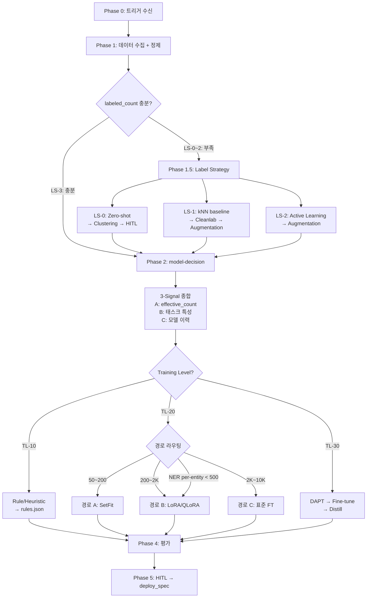
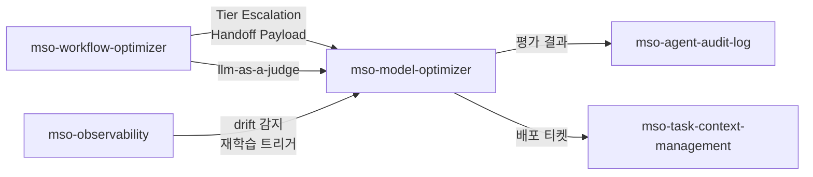

# Architecture — mso-model-optimizer v0.1.0

---

## 설계 원칙

1. **라벨 최소화 우선**: 라벨이 부족해도 학습 파이프라인을 포기하지 않는다. Label Strategy가 자동으로 최적 경로를 찾는다.
2. **점진적 정밀화**: Zero-shot(라벨 0) → Few-shot(8~50) → PEFT(200~2K) → Full FT(2K+)로 라벨 확보에 따라 학습 수준이 상승한다.
3. **보수적 판단**: 판단이 불확실하면 낮은 Training Level을 선택하고, 사용자에게 에스컬레이션한다.
4. **재현성 필수**: 모든 모델 artifact에 `reproducibility` 블록이 동반되어야 배포 가능하다.

---

## 전체 파이프라인



---

## Label Strategy 계층

v0.1.0에서 추가된 핵심 아키텍처. 라벨 상태에 따라 4단계 전략을 자동 선택한다.

```
라벨 0개 ──── LS-0: Zero-shot NLI → Clustering → HITL → 합성
                         ↓ (8+/class 확보)
라벨 1~50/class ── LS-1: kNN baseline → Cleanlab → Augmentation
                         ↓ (50+/class 확보)
라벨 50~500/class ─ LS-2: Active Learning → Augmentation → 수렴
                         ↓ (500+/class 확보)
라벨 500+/class ── LS-3: Phase 2 직행
```

### effective_count 계산

모든 라벨이 동등하지 않다. 소스별 품질 가중치:

| 소스 | 가중치 | 비고 |
|------|--------|------|
| 인간 검증 (HITL) | 1.0 | 최고 신뢰도 |
| Active Learning + 인간 라벨 | 1.0 | 인간 검증 동일 |
| Data Augmentation | 0.7 | 의미 보존 변형 |
| Weak Supervision | 0.7 | 규칙 기반 |
| LLM 합성 데이터 | 0.5 | 실제 분포 괴리 가능 |
| Zero-shot pseudo-label | 0.3 | 미검증 |

> **간이 공식** (Label Strategy 내부): `effective = labeled + 0.7 × (augmented + weak + synthetic)`
> **정밀 공식** (Signal A): 소스별 개별 가중치 적용

---

## TL-20 라우팅 아키텍처

v0.1.0에서 단일 fine-tuning을 3경로로 확장:

```
                    ┌─── 경로 A: SetFit ──────── Sentence Transformer
effective_count ────┼─── 경로 B: LoRA/QLoRA ──── base_model (frozen) + adapter
                    └─── 경로 C: 표준 FT ─────── base_model (full update)
```

| 경로 | 파라미터 수 | GPU 요구 | 학습 시간 | 라벨 필요량 |
|------|-----------|---------|----------|------------|
| SetFit | ~22M (MiniLM) | CPU 가능 | 분 단위 | 8~50/class |
| LoRA | base + ~1M adapter | RTX 4090 1장 | 시간 단위 | 200~2K |
| 표준 FT | ~110M (bert-base) | V100+ | 시간 단위 | 2K~10K |
| QLoRA | base(4-bit) + ~1M | RTX 4090 1장 | 시간 단위 | 200~2K |

### NER 오버라이드

NER/tagging 태스크는 `effective_count` 대신 **per-entity 라벨 수**가 라우팅을 결정:
- `min(entity별 라벨) < 500` → 경로 B (LoRA) 강제
- `min(entity별 라벨) ≥ 500` → effective_count 기준 유지

---

## 데이터 흐름

```
[트리거] → [raw I/O 수집] → [정제 + 분할]
                                  ↓
                        ┌─── labeled_count ──┐
                        │    unlabeled_count  │
                        └─────────────────────┘
                                  ↓
                    [Label Strategy (LS-0~3)]
                          ↓              ↓
                    [augmented_dataset] [embeddings_cache]
                          ↓
                    [effective_count 계산]
                          ↓
                    [model-decision (3-Signal)]
                          ↓
                    [Training Level 실행]
                          ↓
                    [model artifact]
                          ↓
                    [eval → deploy_spec]
```

---

## 산출물 경로 표준

```
{workspace}/.mso-context/active/<run_id>/model-optimizer/
├── label_strategy_output.json    ← LS 결정 + 결과
├── augmented_dataset.jsonl       ← 증강 데이터
├── embeddings_cache.npy          ← 임베딩 캐시 (Phase 4 재사용)
├── knn_baseline_report.md        ← kNN baseline 평가
├── cleanlab_audit.json           ← 라벨 품질 감사
├── tl{XX}_model/                 ← 학습 산출물
│   ├── model/ (또는 adapter_model/)
│   ├── tokenizer/
│   ├── training_log.jsonl
│   └── config.json
├── tl{XX}_eval_report.md         ← 평가 리포트
└── deploy_spec.json              ← 배포 계약
```

---

## Pack 내 위치


