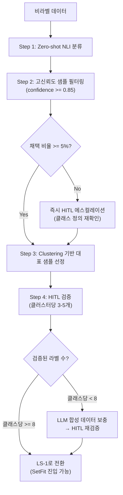
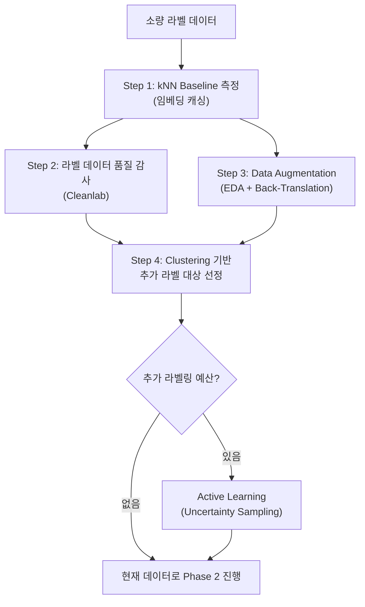
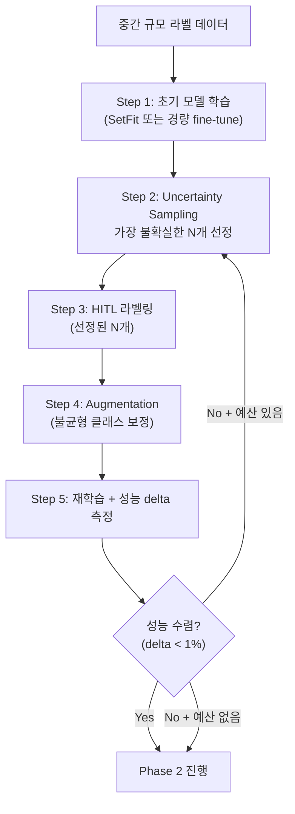

# module.label-strategy

> Phase 1.5 전용. 라벨 부족 시 최적의 라벨 확보 전략을 자동 선택하고 실행하는 모듈.
> Phase 1(데이터 수집) 완료 후, Phase 2(model-decision) 진입 전에 실행된다.

---

## 개요

Phase 1에서 수집된 데이터의 **라벨 유무 비율**을 분석하고, 라벨이 부족한 경우 최적의 라벨 확보 전략을 자동 선택한다. 목표는 **수작업 라벨링을 최소화**하면서 Phase 2~3에서 학습 가능한 수준의 라벨 데이터를 확보하는 것이다.

---

## 진입 조건

Phase 1 산출물인 `dataset_stats.json`에 다음 필드가 추가로 필요하다:

```json
{
  "total_count": 5000,
  "labeled_count": 120,
  "unlabeled_count": 4880,
  "label_ratio": 0.024,
  "label_classes": ["intent_A", "intent_B", "intent_C"],
  "class_count": 3,
  "class_distribution": { "intent_A": 45, "intent_B": 40, "intent_C": 35 },
  "min_class_count": 35,
  "has_domain_rules": false
}
```

---

## Label Strategy Level (LS)

라벨 상황에 따라 4단계 전략을 선택한다.

| LS | 라벨 상황 | 전략 | 목표 |
|----|----------|------|------|
| **LS-0** | 라벨 0개 | Zero-shot baseline + 자동 라벨 생성 | Phase 2 진입 가능한 최소 라벨 확보 |
| **LS-1** | 클래스당 1~50개 | Few-shot 최적화 + 증강 | 소량 라벨 효율 극대화 |
| **LS-2** | 클래스당 50~500개 | Active Learning + Augmentation | 라벨 품질·양 동시 개선 |
| **LS-3** | 클래스당 500개+ | 충분 — Phase 2 직행 | Augmentation만 선택적 |

### LS 결정 규칙

```
min_per_class = min(class_distribution.values()) if class_distribution else 0

if labeled_count == 0:
    LS = LS-0
elif min_per_class == 0:
    LS = LS-0    # 일부 클래스에 라벨 없음 → Zero-shot 부트스트래핑 필요
elif min_per_class < 50:
    LS = LS-1
elif min_per_class < 500:
    LS = LS-2
else:
    LS = LS-3
```

---

## LS-0: Zero-shot 기반 라벨 부트스트래핑

라벨이 전혀 없는 상태에서 학습 가능한 수준으로 라벨을 확보한다.

### 실행 흐름



### Step 1: Zero-shot NLI 분류

- 모델: `facebook/bart-large-mnli` 또는 다국어 NLI 모델
- 클래스 목록이 제공된 경우: hypothesis template으로 각 클래스 점수 산출
- 클래스 목록이 없는 경우: Embedding + HDBSCAN으로 자연 클러스터 발견 → HITL에 클래스 정의 요청

```
hypothesis_template: "이 텍스트는 {class_name}에 관한 것이다"
```

### Step 2: 고신뢰도 필터링

- `confidence >= 0.85`인 샘플만 pseudo-label로 채택
- 채택 비율이 전체의 20% 미만이면 warning + 임계값을 0.80으로 완화
- **조기 탈출**: 채택 비율이 5% 미만이면 클래스 정의 모호 판단 → Clustering 건너뛰고 즉시 HITL 에스컬레이션

### Step 3: Clustering 대표 샘플 선정

- SentenceTransformer 임베딩 → K-Means (K = class_count) 또는 HDBSCAN
- 각 클러스터 centroid 근접 3~5개 샘플을 HITL 검증 대상으로 선정
- 목적: Zero-shot이 놓친 패턴 발견 + 라벨 다양성 확보

### Step 4: HITL 검증

- 선정된 대표 샘플(클러스터당 3~5개)을 사용자에게 제시
- 사용자가 라벨 확인/수정
- 검증된 샘플 = 신뢰할 수 있는 seed 데이터

### LLM 합성 데이터 보충 (필요 시)

- 검증된 라벨이 클래스당 8개 미만이면 트리거
- 검증된 샘플을 few-shot 예시로 LLM에 제공 → 클래스당 부족분 합성
- 합성 데이터의 10%를 HITL 샘플링 검증
- 합성 데이터에는 `source: "synthetic"` 태그 부착

### LS-0 산출물

```json
{
  "label_strategy": "LS-0",
  "steps_executed": ["zero_shot_nli", "confidence_filter", "clustering", "hitl_review"],
  "pseudo_labeled_count": 340,
  "hitl_verified_count": 45,
  "synthetic_count": 0,
  "effective_count": 385,
  "min_per_class": 12,
  "next_strategy": "LS-1",
  "confidence_stats": { "mean": 0.89, "min": 0.85 }
}
```

---

## LS-1: Few-shot 최적화 + 증강

클래스당 1~50개 라벨 보유 시, 소량 라벨의 효율을 극대화한다.

### 실행 흐름



### Step 1: kNN Baseline + 임베딩 캐싱

- SentenceTransformer + kNN(k=5)으로 zero-cost baseline 측정
- 이 결과가 Phase 4 평가 시 비교 기준(baseline)으로 사용됨
- **baseline_f1 기록** → 이후 학습 모델이 이를 초과해야 의미 있음
- **임베딩 캐싱**: 이 단계에서 계산된 임베딩 행렬을 `embeddings_cache.npy`로 저장. Phase 4 평가, Clustering, Active Learning에서 재사용하여 중복 계산 방지

### Step 2: Cleanlab 품질 감사

- 기존 라벨 중 오류 의심 샘플 자동 감지
- 오류율 > 15%이면 HITL에 라벨 재검토 요청
- Weak Supervision / LLM 생성 라벨 사용 시 필수

### Step 3: Data Augmentation

- [module.data-augmentation.md](module.data-augmentation.md) 참조
- 라벨 데이터를 3~5배 증폭
- 불균형 클래스 우선 증강
- **SetFit 경로 유지 옵션**: effective_count가 200을 초과하면 TL-20 경로가 SetFit→LoRA로 전환된다. 소량 라벨 + SetFit이 목표라면 증강 배수를 제한하여 effective_count ≤ 200을 유지할 수 있다. 이 결정은 HITL에 제시한다.

### Step 4: Clustering 기반 추가 라벨 대상 선정

- 비라벨 데이터 중 기존 라벨 클러스터와 가장 **먼** 샘플 선정 (diversity)
- 기존 라벨 클러스터 **경계** 샘플 선정 (uncertainty)
- 두 전략의 혼합 비율: diversity 60%, uncertainty 40%

### LS-1 산출물

```json
{
  "label_strategy": "LS-1",
  "original_labeled": 120,
  "augmented_count": 480,
  "additional_labeled": 30,
  "cleanlab_flagged": 8,
  "knn_baseline_f1": 0.72,
  "effective_count": 622,
  "min_per_class": 42
}
```

---

## LS-2: Active Learning + Augmentation

클래스당 50~500개 라벨 보유 시, 추가 라벨링의 효율을 최적화한다.

### 실행 흐름



### Active Learning 파라미터

| 파라미터 | 기본값 | 설명 |
|---------|--------|------|
| `query_size` | 20 | 라운드당 HITL 요청 샘플 수 |
| `strategy` | `hybrid` | `uncertainty`, `diversity`, `hybrid` |
| `hybrid_ratio` | 0.6 | uncertainty 비중 (나머지 diversity) |
| `max_rounds` | 5 | 최대 Active Learning 라운드 |
| `convergence_threshold` | 0.01 | f1 delta 수렴 기준 |

### Weak Supervision 연계 (선택)

- 도메인 규칙이 있는 경우 (`has_domain_rules: true`):
  - Label Functions 작성 → Snorkel Label Model 학습 → 약성 라벨 생성
  - 약성 라벨은 `source: "weak_supervision"` 태그 + Cleanlab 감사 필수
  - 약성 라벨 + 인간 라벨 혼합 학습 시 Noisy Label Learning 기법 적용 권고

### LS-2 산출물

```json
{
  "label_strategy": "LS-2",
  "original_labeled": 800,
  "active_learning_rounds": 3,
  "additional_labeled": 60,
  "augmented_count": 2400,
  "weak_supervision_count": 0,
  "effective_count": 3260,
  "convergence_reached": true
}
```

---

## LS-3: 충분한 라벨 — Phase 2 직행

클래스당 500개 이상. 추가 라벨 전략 불필요. 선택적 Augmentation만 적용.

### 실행

1. Cleanlab 품질 감사 (권장, 필수 아님)
2. 클래스 불균형 시에만 소수 클래스 Augmentation
3. Phase 2 직행

### LS-3 산출물

```json
{
  "label_strategy": "LS-3",
  "original_labeled": 5000,
  "augmented_count": 0,
  "note": "sufficient_labels — direct_to_phase2"
}
```

---

## LS 결정 → TL 결정 연계

Label Strategy의 결과는 Phase 2 model-decision의 Signal A에 직접 반영된다.

| LS 결과 | Signal A 입력 | 기대 TL |
|---------|--------------|---------|
| LS-0 → 최종 라벨 < 100 | `labeled_count` < 100 | TL-10 또는 TL-20 (SetFit) |
| LS-1 → 증강 후 100~1K | `effective_count` 100~10K | TL-20 |
| LS-2 → 증강 후 1K~10K | `effective_count` 100~10K | TL-20 |
| LS-3 → 원본 > 10K | `effective_count` > 10K | TL-30 |

> `effective_count` 간이 공식 = `labeled + 0.7 × (augmented + weak + synthetic)`
> 정밀 공식은 module.model-decision.md의 A-3 라벨 소스 품질 가중치 참조 (synthetic=0.5, pseudo-label=0.3 등 소스별 차등 적용).
> 이 모듈에서는 간이 공식으로 LS 레벨을 판정하고, Phase 2 Signal A에서 정밀 공식을 적용한다.

---

## when_unsure

- 클래스 목록 미제공 + Zero-shot 불가: HITL에 클래스 정의 요청
- Zero-shot 신뢰도가 전체적으로 낮음 (mean < 0.5): 클래스 정의 모호 가능성 → HITL
- Active Learning 수렴하지 않음 (5 라운드 후): 데이터 품질 또는 태스크 난이도 문제 → HITL 에스컬레이션
- Weak Supervision LF 커버리지 < 30%: 규칙 부족 → 추가 LF 작성 요청 또는 다른 전략 전환

---

## Error Handling

| 상황 | 처리 |
|------|------|
| Zero-shot NLI 모델 로드 실패 | kNN baseline으로 fallback |
| Clustering 실패 (데이터 < 10건) | LS-0 건너뛰고 HITL에 직접 라벨링 요청 |
| Cleanlab import 불가 | 품질 감사 건너뛰고 warning 기록 |
| LLM 합성 API 실패 | 합성 없이 현재 라벨로 진행 |
| Augmentation 후 라벨 여전히 부족 | HITL 에스컬레이션 + 현재 데이터로 TL-10 시도 |
| LS-2 Active Learning max_rounds 도달 (수렴 안 함) | 현재 데이터로 Phase 2 진행 + warning 기록 |
| LS-3 불균형 보정 Augmentation 실패 | 증강 없이 원본 라벨로 Phase 2 진행 |

---

## 산출물 경로

| 파일 | 경로 |
|------|------|
| label_strategy_output.json | `{workspace}/.mso-context/active/<run_id>/model-optimizer/label_strategy_output.json` |
| augmented_dataset.jsonl | `{workspace}/.mso-context/active/<run_id>/model-optimizer/augmented_dataset.jsonl` |
| knn_baseline_report.md | `{workspace}/.mso-context/active/<run_id>/model-optimizer/knn_baseline_report.md` |
| cleanlab_audit.json | `{workspace}/.mso-context/active/<run_id>/model-optimizer/cleanlab_audit.json` |
| embeddings_cache.npy | `{workspace}/.mso-context/active/<run_id>/model-optimizer/embeddings_cache.npy` |
