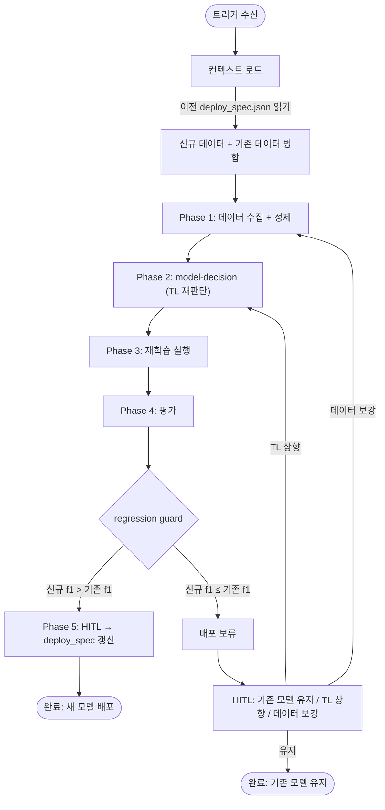

# module.model-retraining

> Operational Module. 배포된 모델의 data drift를 감지하고, 재학습 루프를 실행하며, regression guard로 품질을 보호한다.

---

## 트리거

| 트리거 | 발생 조건 | 진입 Phase |
|--------|-----------|-----------|
| 성능 저하 감지 | `rolling_f1` < `degradation_threshold_f1` (module.rollback 경유) | Phase 1 |
| 데이터 축적 | 신규 라벨링 데이터가 기존 학습 데이터 대비 ≥ 20% 추가 | Phase 1 |
| 수동 트리거 | 사용자 "모델 재학습해줘" 요청 | Phase 0 |
| Fallback 복구 | rollback 발동 후 model-optimizer 재트리거 | Phase 0 |

---

## 재학습 흐름



---

## 컨텍스트 로드

재학습은 이전 학습의 맥락 위에서 진행된다. 다음 정보를 로드한다:

| 항목 | 소스 | 용도 |
|------|------|------|
| 이전 `deploy_spec.json` | `{tool}/slots/inference/deploy_spec.json` 또는 `audit_global.db` | base_model, 하이퍼파라미터, 이전 f1 기준값 |
| 이전 `clean_dataset.jsonl` | 이전 run의 산출물 경로 | 데이터 병합 기준 |
| 이전 `training_log.jsonl` | 이전 run의 산출물 경로 | 학습 곡선 참조 |
| `rolling_f1` 추이 | `audit_global.db` | drift 심각도 판단 |

---

## 데이터 병합 전략

재학습 시 기존 데이터와 신규 데이터를 어떻게 조합할지 결정한다.

| 전략 | 조건 | 방법 |
|------|------|------|
| **Append** | 데이터 분포 유사 (drift 경미) | 기존 + 신규 데이터 합산 |
| **Window** | 데이터 분포 변화 (drift 유의미) | 최근 N건만 사용 (시간 윈도우) |
| **Full Replace** | 데이터 분포 급변 (drift 심각) | 신규 데이터만으로 학습 |

**drift 심각도 판단**:

```
mild_drift:   rolling_f1 하락 < 5%   → Append
moderate_drift: rolling_f1 하락 5~15% → Window (최근 70% 데이터)
severe_drift: rolling_f1 하락 > 15%  → Full Replace
```

**when_unsure**: drift 심각도 판단이 모호하면 Append로 시작하고, 재학습 결과가 개선되지 않으면 Window로 재시도.

---

## Regression Guard

재학습된 모델이 기존 모델보다 **나빠지면 배포하지 않는다**.

### 비교 기준

| 지표 | 비교 방식 | Pass 조건 |
|------|-----------|-----------|
| `f1` | 신규 모델 vs 기존 deploy_spec의 `evaluation.f1` | `new_f1 ≥ old_f1` |
| `latency_ms` | 신규 모델 vs 기존 | `new_latency ≤ old_latency × 1.2` (20% 허용) |
| `model_size_mb` | 신규 모델 vs 기존 | `new_size ≤ old_size × 1.5` (50% 허용) |

**f1이 하락하면 무조건 Fail**. latency와 size는 허용 범위 내 증가를 허용한다.

### Fail 시 처리

```
regression guard Fail
  ├── f1 하락 < 2%   → HITL에 "미세 하락, 배포할까요?" 질문
  ├── f1 하락 2~5%   → 배포 보류 + TL 상향 재시도 권고
  └── f1 하락 > 5%   → 배포 차단 + 데이터 품질 점검 권고
```

---

## deploy_spec 갱신

재학습 성공 시 기존 `deploy_spec.json`을 갱신한다:

```json
{
  "version": "0.2.0",
  "reproducibility": {
    "dataset_version": "<new_hash>",
    "dataset_size": 7200,
    "training_level": "TL-20",
    "hyperparameters": { "...": "..." },
    "training_log_ref": "<new_path>"
  },
  "evaluation": {
    "f1": 0.93,
    "latency_ms": 9,
    "llm_baseline_f1": 0.95,
    "eval_report_ref": "<new_path>"
  },
  "rollback": {
    "fallback_strategy": "previous_version",
    "degradation_threshold_f1": 0.82,
    "previous_version": "0.1.0"
  },
  "metadata": {
    "trigger_type": "retraining",
    "retrain_reason": "data_drift_moderate",
    "previous_f1": 0.91
  }
}
```

핵심: `rollback.previous_version`이 이전 버전으로 갱신되어, 새 모델 실패 시 롤백 가능.

---

## 재학습 주기 가이드

| 환경 | 권장 주기 | 비고 |
|------|-----------|------|
| 데이터 변화 빈번 (일 단위) | 트리거 기반 (자동) | rolling_f1 모니터링 필수 |
| 데이터 변화 완만 (주 단위) | 데이터 축적 20% 트리거 | 수동 점검 병행 |
| 데이터 변화 거의 없음 | 수동 트리거만 | 스케줄 비활성화 |

---

## audit_global.db 기록

재학습 완료 시 다음을 `mso-agent-audit-log`에 기록한다:

```json
{
  "run_id": "<run_id>",
  "work_type": "model_retraining",
  "status": "completed | failed | regression_blocked",
  "metadata": {
    "tool_name": "<name>",
    "trigger": "drift_detected | data_accumulated | manual | fallback_recovery",
    "merge_strategy": "append | window | full_replace",
    "old_f1": 0.91,
    "new_f1": 0.93,
    "regression_guard_pass": true,
    "training_level": "TL-20"
  }
}
```
