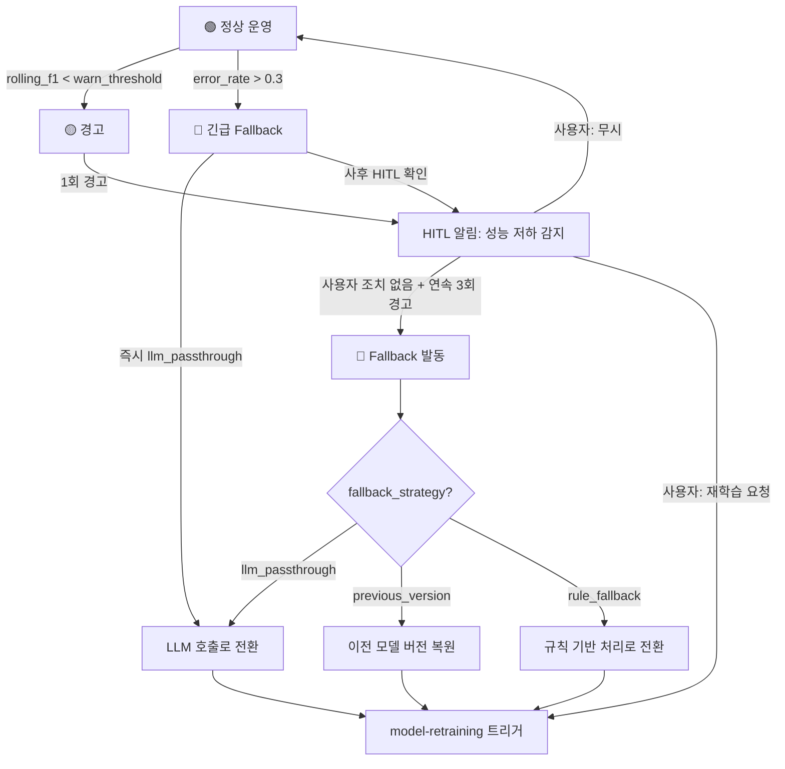

# module.rollback

> Operational Module. 배포된 모델의 프로덕션 성능을 모니터링하고, 저하 시 Fallback을 발동하며, model-retraining 재트리거를 관리한다.

---

## 모니터링 지표

`mso-observability`가 `audit_global.db`에서 다음 지표를 주기적으로 계산한다.

| 지표 | 계산 방식 | 갱신 주기 |
|------|-----------|-----------|
| `rolling_f1` | 최근 N건(기본 100건)의 inference 결과를 샘플링하여 F1 계산 | inference N건마다 |
| `latency_p95` | 최근 N건의 95 percentile latency | inference N건마다 |
| `error_rate` | 최근 N건 중 inference 실패(exception/timeout) 비율 | inference N건마다 |

### 모니터링 데이터 소스

```
audit_global.db
  └── audit_logs (work_type = 'model_inference')
        ├── metadata.tool_name
        ├── metadata.predicted_label
        ├── metadata.actual_label     ← 있는 경우 (지연 라벨링)
        ├── metadata.latency_ms
        └── status                    ← completed | error
```

**지연 라벨링(delayed labeling)**: `actual_label`이 즉시 제공되지 않는 경우가 많다. 이 경우:
1. `predicted_label`만으로 `error_rate`와 `latency_p95`를 모니터링
2. `actual_label`이 축적되면(N건 이상) `rolling_f1` 계산 시작
3. `actual_label` 부족 시 `llm-as-a-judge`로 샘플 검증하여 proxy f1 추정

---

## Degradation 단계



---

## 임계값 정의

| 임계값 | 기본값 | 소스 | 설명 |
|--------|--------|------|------|
| `warn_threshold` | `deploy_spec.rollback.degradation_threshold_f1` | deploy_spec.json | 이 값 미만이면 경고 |
| `critical_threshold` | `warn_threshold - 0.05` | 계산 | 이 값 미만이면 Fallback 즉시 발동 |
| `emergency_error_rate` | `0.3` | 고정 | inference 실패율 30% 초과 시 긴급 Fallback |
| `warn_consecutive_count` | `3` | 고정 | 연속 경고 횟수 초과 시 Fallback |
| `monitoring_window` | `100` | 설정 가능 | rolling 계산 윈도우 크기 (건) |

---

## Fallback 전략 상세

### llm_passthrough

가장 보수적인 fallback. Smart Tool의 inference 슬롯을 LLM 호출로 대체한다.

```
실행 경로:
  1. slots/inference/serve.py의 inference 호출을 중단
  2. LLM API로 동일 input을 전달하여 추론
  3. deploy_spec.output_schema에 맞춰 결과 포맷팅
  4. audit_global.db에 fallback 실행 기록
```

| 항목 | 값 |
|------|---|
| 비용 영향 | 높음 (LLM 호출 비용 원복) |
| latency 영향 | 높음 (LLM latency 원복) |
| 정확도 | 높음 (LLM baseline 수준) |
| 적합 상황 | 모델 심각 오류, 긴급 복구 |

### previous_version

이전 버전의 model artifact로 롤백한다.

```
실행 경로:
  1. deploy_spec.rollback.previous_version 확인
  2. 이전 버전 model artifact 경로 조회 (audit_global.db)
  3. slots/inference/model/ 을 이전 버전으로 교체
  4. serve.py 재로드
  5. audit_global.db에 rollback 기록
```

| 항목 | 값 |
|------|---|
| 비용 영향 | 없음 (동일 수준) |
| latency 영향 | 없음 (동일 수준) |
| 정확도 | 이전 버전 수준 |
| 적합 상황 | 신규 모델만 문제, 이전 버전 정상 |

**전제 조건**: `previous_version`이 null이 아니어야 한다. null이면 `llm_passthrough`로 자동 전환.

### rule_fallback

TL-10 수준의 규칙 기반 처리로 전환한다.

```
실행 경로:
  1. slots/rules/rules.json 존재 확인
  2. 있으면 rules.json 기반 추론으로 전환
  3. 없으면 llm_passthrough로 자동 전환
  4. audit_global.db에 fallback 기록
```

| 항목 | 값 |
|------|---|
| 비용 영향 | 최소 (규칙 기반) |
| latency 영향 | 최소 |
| 정확도 | 낮음 (규칙 커버리지 의존) |
| 적합 상황 | 규칙 커버리지가 높은 경우 |

---

## Fallback 실행 규칙

| 규칙 | 내용 |
|------|------|
| **HITL 우선** | 기본적으로 자동 Fallback하지 않는다. 경고 → HITL 확인 → Fallback 순서 |
| **긴급 예외** | `error_rate > 0.3` 시에만 `llm_passthrough`로 즉시 전환 후 사후 HITL 확인 |
| **이전 버전 보존** | `previous_version`이 존재하면 해당 model artifact를 절대 삭제하지 않는다 |
| **Fallback 기록** | 모든 Fallback 발동은 `audit_global.db`에 기록 (work_type: `model_rollback`) |
| **자동 재트리거** | Fallback 발동 후 `model-retraining` 트리거를 자동 등록 (HITL 승인 대기) |

---

## audit_global.db 기록

### 경고 기록

```json
{
  "run_id": "<monitoring_run_id>",
  "work_type": "model_monitoring",
  "status": "warning",
  "metadata": {
    "tool_name": "<name>",
    "rolling_f1": 0.78,
    "warn_threshold": 0.80,
    "latency_p95": 15,
    "error_rate": 0.02,
    "consecutive_warnings": 2
  }
}
```

### Fallback 기록

```json
{
  "run_id": "<fallback_run_id>",
  "work_type": "model_rollback",
  "status": "completed",
  "metadata": {
    "tool_name": "<name>",
    "fallback_strategy": "llm_passthrough",
    "trigger": "consecutive_warnings_exceeded | emergency_error_rate",
    "rolling_f1_at_fallback": 0.72,
    "previous_model_version": "0.1.0",
    "retraining_ticket_created": true
  }
}
```

---

## mso-observability 연동

이 모듈은 `mso-observability`와 다음과 같이 연동된다:

| observability 역할 | rollback 역할 |
|--------------------|--------------|
| `rolling_f1`, `latency_p95`, `error_rate` 계산 + 임계값 비교 | 임계값 제공 (deploy_spec에서) |
| 경고 이벤트 발생 + HITL 알림 | Fallback 전략 실행 |
| 패턴 분석 → drift 유형 판별 | model-retraining에 drift 정보 전달 |

```
mso-observability  ──(monitoring event)──►  module.rollback
                                               │
                                               ├──► Fallback 실행
                                               └──► module.model-retraining 트리거
```
