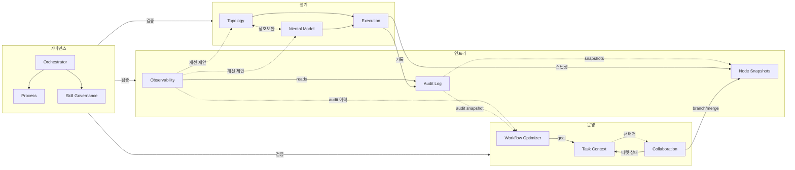

# Multi-Swarm Orchestrator (v0.0.6)

복잡한 AI 에이전트 작업의 **비재현성·비가시성·반복 실패**를 해결하기 위해 설계된 오케스트레이션 시스템.
워크플로우를 JSON 스키마로 정의하고, 실행을 티켓·감사 로그로 추적하며, 스킬 간 데이터 흐름을 계약(CC-01~09)으로 검증한다.

---

## 문서

| 문서 | 설명 |
|------|------|
| [아키텍처](docs/architecture.md) | Git-Metaphor 상태 모델, 전체 아키텍처, 업무/관제 공간, 버전별 주요 변경 |
| [3대 파이프라인 & 계약](docs/pipelines.md) | 설계·운영·인프라 파이프라인, CC-01~09, 티켓 생명주기, Hand-off Templates |
| [시작하기](docs/getting-started.md) | 디렉토리 구조, 설계·운영·검증 명령어 |
| [스킬 사용 매트릭스](docs/usage_matrix.md) | Phase × Swarm × Role 매트릭스, 실행 흐름 시퀀스 |
| [변경 이력](docs/changelog.md) | v0.0.3~v0.0.6 변경 이력 및 하위 호환 노트 |

---

## Roadmap

### v0.0.7 — mso-model-optimizer

프로세스 모듈에 필요한 pre-trained model의 fine-tuning 워크플로우를 제공하는 스킬.

`mso-workflow-optimizer`가 **프로세스 수준**의 automation-level 측정과 escalation을 담당한다면, `mso-model-optimizer`는 **모델 수준**의 성능 평가와 fine-tuning lifecycle을 담당한다.

| 스킬 | 평가 대상 | 핵심 역할 |
|------|-----------|-----------|
| `mso-workflow-optimizer` (v0.0.6) | 프로세스 구조 | Automation Level 측정 + escalation 환경 제공 |
| `mso-model-optimizer` (v0.0.7) | 프로세스 내부 모델 | Pre-trained model fine-tuning 워크플로우 제공 |

> **배경**: AI Model·AI Agent·Physical AI를 관통하는 평가 관점으로, 복잡도가 인지 수준을 초과한 AI System은 **멱등성**(동일 입력 → 동일 결과)과 **설명력**(왜 그 결과인가)으로 측정해야 하는 블랙박스에 수렴한다. 두 optimizer 스킬은 이 평가 축의 프로세스 레이어와 모델 레이어를 각각 커버한다.

---

## 의존성

- Python 3.10+

## License

[MIT](LICENSE)
