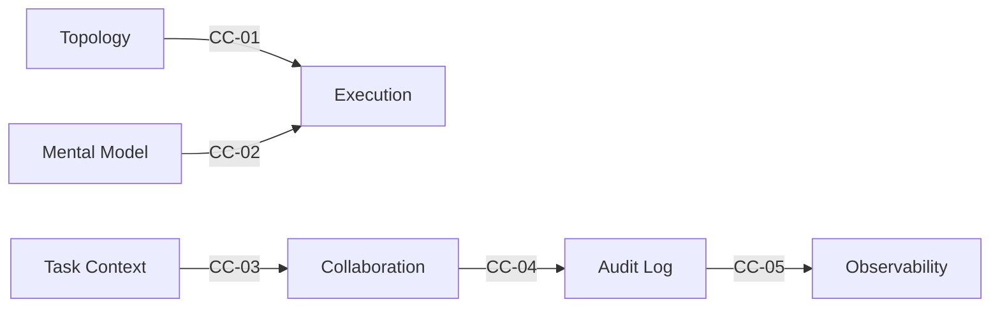
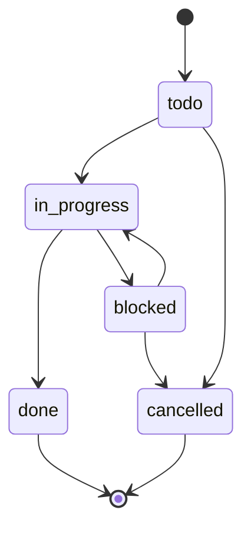

# Multi-Swarm Orchestrator

복잡한 AI 에이전트 작업을 수행하다 보면 필연적으로 다음과 같은 문제들에 직면합니다.

1. **비재현성**: 워크플로우의 실행 순서와 결정 맥락이 명확히 남지 않아, 과거의 실행 과정을 파악하거나 동일한 결과를 재현하기 어렵습니다.
2. **비가시성**: 에이전트가 생성한 JSON, 로그, 티켓이 여기저기 흩어져 있어 전체 흐름이 보이지 않습니다. 데이터 흐름이 불투명하여, 스킬 간 연결 과정에서 발생하는 문제를 즉시 파악하기 어렵습니다.
3. **반복되는 실패**: 동일한 유형의 실패가 반복되어도 이를 감지하고 근본적으로 개선하기 어렵습니다.

`MSO(Multi-Swarm Orchestrator)`는 이러한 문제를 해결하기 위해 설계된 오케스트레이션 시스템입니다.
워크플로우 구조를 JSON 스키마로 명확히 정의하고, 모든 에이전트 실행 과정을 티켓과 감사 로그(Audit Log)로 추적합니다. 또한 스킬 간 데이터 흐름을 엄격한 계약(Contract)으로 검증하며, 실행 결과는 분석 과정을 거쳐 다시 설계 개선 제안으로 환류(Feedback)됩니다.

---

## 업무 공간과 관제 공간

MSO는 _`다수의 사람`과 `다수의 에이전트`가 동시에 협업하는 환경_ 을 전제로 설계되었습니다. 이를 위해 _`일하는 곳`과 `보는 곳`을 명시적으로 분리_ 합니다.

```
workspace/                              ← 업무 공간: 에이전트가 실행하고 기록하는 곳
├── .mso-context/
│   ├── active/<Run ID>/                ← Run 단위 실행 산출물
│   ├── archive/                        ← 완료된 Run 보관
│   ├── registry/manifest-index.jsonl   ← 전체 Run 인덱스
│	└── config/policy.yaml              ← 운영 정책

mso-observation-workspace/              ← 관제 공간: 사람이 현황을 확인하는 곳
├── <observer-id>/
│   ├── <Run ID>/
│   ├── readme.md                       ← 상태, 진행률, 다음 액션
│   ├── 01_summary/ ~ 05_delivery/      ← 의사결정·산출물·리뷰
```

|           | 업무 공간 (`workspace`)            | 관제 공간 (`observation-workspace`) |
| --------- | ------------------------------ | ------------------------------- |
| **주 사용자** | 에이전트, 스크립트                     | 사람, 팀                           |
| **권한**    | 읽기 + 쓰기                        | 읽기 전용                           |
| **단위**    | Run (phase별 산출물)               | Run (요약·의사결정·전달물)               |
| **식별**    | `.anchor.json`의 `workspace_id` | `.anchor.json`의 `workspace_id`  |

에이전트가 `.mso-context/`에 결과를 기록하면, 관제 공간으로 자동 동기화됩니다. 각 관찰자(observer)는 자신의 `observer-id` 아래에서 관심 있는 Run만 모아볼 수 있습니다. 두 공간은 독립된 디렉토리이므로 어느 쪽이 이동되어도 `.anchor.json` 기반 탐지 프로토콜이 자동으로 상대를 재발견합니다.

---

## 전체 아키텍처


세 가지 핵심 파이프라인이 유기적으로 순환하는 구조입니다.

`설계(Design)` 단계에서 목표를 실행 가능한 구조로 변환하고, `운영(Ops)` 단계에서 티켓을 발행하여 실제 작업을 수행하며, `인프라(Infra)` 단계에서 그 결과를 기록하고 분석하여 피드백을 제공합니다. 이 모든 과정에서 `Governance`는 스킬 간의 계약(Contract)이 준수되고 있는지 지속적으로 검증합니다.

---

## 3대 핵심 파이프라인

### 설계 (Design)

목표(Goal)가 입력되면, 다음의 세 단계를 거쳐 실행 가능한 워크플로우 명세(Spec)로 구체화됩니다.

1. **Topology Design** — 목표를 노드(Node)와 엣지(Edge)로 구조화합니다. 작업을 어떤 단위로 나누고, 어떤 순서로 실행할지를 정의합니다.
2. **Mental Model Design** — 각 노드에 적절한 사고 모델(Mental Model)을 부여합니다. 어떤 노드는 명확한 판단이 필요하고, 어떤 노드는 광범위한 탐색이 필요할 수 있습니다.
3. **Execution Design** — 위의 두 가지를 통합하여 최종 실행 계획(Execution Plan)을 수립합니다. 실행 모드 정책, 핸드오프(Handoff) 규칙, 폴백(Fallback) 전략까지 포함됩니다.

Topology와 Mental Model은 상호보완적입니다. 어느 쪽에서 시작하든, 서로의 출력이 상대방을 정제하고 보완하는 구조를 가집니다.

### 운영 (Ops)

설계된 계획을 실제 실행 단계로 옮깁니다.

`Task Context Management`가 티켓을 발행하고 상태를 관리합니다. `todo → in_progress → done`으로 이어지는 상태 전이는 상태 머신(State Machine)에 의해 엄격하게 관리되며, 완료된 티켓은 로그에 기록된 후 정리됩니다.

멀티에이전트 협업이 필요한 경우에는 `Agent Collaboration`으로 작업을 분배(Dispatch)합니다. 수동 해결이 가능한 단일 티켓이라면 이 단계는 선택적으로 건너뛸 수 있습니다.

### 인프라 (Infra)

실행 결과는 단순히 사라지지 않고 자산화됩니다.

`Audit Log`가 모든 실행 기록을 SQLite 데이터베이스에 남기고, `Observability`가 저장된 로그를 분석하여 패턴을 도출합니다. 반복적인 실패, 비정상적인 비용 발생, 병목 구간 등이 감지되면, 이를 해결하기 위한 개선 제안을 설계 파이프라인으로 다시 전달합니다.

이러한 `피드백 루프(Feedback Loop)`가 동일한 실패의 반복을 끊어내는 핵심 메커니즘입니다.

---

## 스킬 간 계약 (Contracts)

스킬 간 데이터 교환은 암묵적인 합의에 의존하지 않습니다. 5가지 핵심 계약(CC-01~CC-05)을 통해 "반드시 존재해야 하는 필드와 포맷"을 명시적으로 정의합니다.



`Governance`가 이 계약을 자동으로 검증합니다. 필수 필드가 누락되거나 스키마가 일치하지 않으면, 파이프라인 진입 전에 즉시 차단하여 오류 확산을 방지합니다.

---

## 시작하기

### 디렉토리 구조

```
skills/
├── mso-skill-governance/            ← 계약 검증, 구조 점검
├── mso-workflow-topology-design/    ← 목표 → 노드 구조
├── mso-mental-model-design/        ← 노드별 사고 모델
├── mso-execution-design/           ← 실행 계획 생성
├── mso-task-context-management/    ← 티켓 관리
├── mso-agent-collaboration/        ← 멀티에이전트 디스패치
├── mso-agent-audit-log/            ← 감사 로그 (SQLite)
└── mso-observability/              ← 관찰, 환류
rules/
└── ORCHESTRATOR.md                 ← 실행 순서 가이드
```

각 스킬 디렉토리에는 `SKILL.md` 파일이 포함되어 있습니다. 이 문서만 확인하면 해당 스킬의 목적, 입출력, 실행 절차를 모두 파악할 수 있으며, `modules/`나 `schemas/`는 상세 구현을 확인할 때만 참조하면 됩니다.

`v0.0.2`부터는 별도 `config.yaml` 없이 동작합니다. 실행 기본값은 코드 내장값을 사용하며, 환경별 오버라이드는 `MSO_WORKSPACE_ROOT`, `MSO_OBSERVATION_ROOT`, `MSO_OBSERVER_ID`로만 처리합니다.

### 1. 워크플로우 설계 (Design)

```bash
# v0.0.2는 Run 단위 Runtime Workspace(`workspace/.mso-context`)에 산출물을 기록합니다.
# 여러 스텝을 같은 Run으로 묶으려면 --run-id를 명시하세요.
RUN_ID="YYYYMMDD-msowd-onboarding"

# 목표(Goal)를 입력하면 노드 구조(Topology)가 생성됩니다.
python3 skills/mso-workflow-topology-design/scripts/generate_topology.py \
  --run-id "$RUN_ID" \
  --skill-key msowd \
  --case-slug onboarding \
  --goal "사용자 온보딩 프로세스 설계"

# 각 노드에 적절한 사고 모델(Mental Model)을 매핑합니다.
python3 skills/mso-mental-model-design/scripts/build_bundle.py \
  --run-id "$RUN_ID" \
  --skill-key msowd \
  --case-slug onboarding

# 위 두 결과를 통합하여 최종 실행 계획을 생성합니다.
python3 skills/mso-execution-design/scripts/build_plan.py \
  --run-id "$RUN_ID" \
  --skill-key msowd \
  --case-slug onboarding
```

### 2. 티켓 운영 (Ops)

```bash
# 티켓 발행 (task-context는 collaboration phase 내부에 위치합니다)
TASK_ROOT="workspace/.mso-context/active/$RUN_ID/40_collaboration/task-context"

python3 skills/mso-task-context-management/scripts/create_ticket.py \
  "온보딩 플로우 구현" \
  --path "$TASK_ROOT"

# 완료된 티켓 정리 — 로그에 기록 후 삭제(Archive) 처리합니다
python3 skills/mso-task-context-management/scripts/archive_tasks.py \
  --path "$TASK_ROOT"
```

### 3. 검증 (Validation)

```bash
# 스키마 정합성 확인
python3 skills/mso-skill-governance/scripts/validate_schemas.py \
  --run-id "$RUN_ID" \
  --skill-key msogov \
  --case-slug onboarding \
  --json

# 전체 거버넌스 점검
python3 skills/mso-skill-governance/scripts/validate_all.py \
  --run-id "$RUN_ID" \
  --skill-key msogov \
  --case-slug onboarding

# 설계 → 운영 → 인프라 통합 테스트
python3 skills/mso-skill-governance/scripts/run_sample_pipeline.py \
  --goal "테스트 파이프라인" \
  --task-title "샘플 티켓" \
  --skill-key msowd \
  --case-slug onboarding
```

---

## 티켓 생명주기



`done`과 `cancelled`는 `터미널 상태(Terminal State)`입니다. 한 번 이 상태에 도달하면 이전 상태로 되돌릴 수 없습니다.
또한, 동일한 상태로의 전이를 중복 요청하더라도 오류 없이 안전하게 무시됩니다(Idempotent).

---

## 의존성

- `Python 3.10+`
- `ai-collaborator` — `mso-agent-collaboration` 내부에 기본 포함(`skills/mso-agent-collaboration/v0.0.1/Skill/ai-collaborator`)되며,
  이 저장소 내 번들만 사용하고 외부 전역 경로/환경변수는 탐색하지 않습니다.

---

## License

MIT
