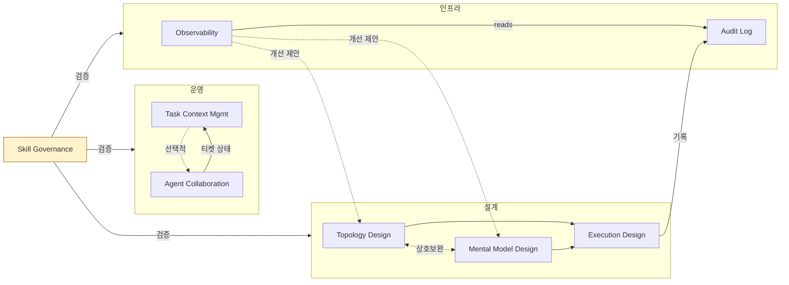
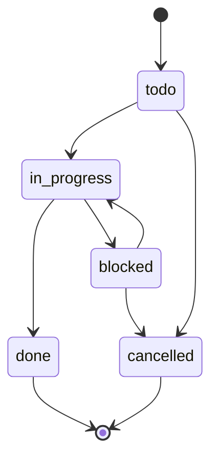

# Multi-Swarm Orchestrator

AI 에이전트 워크플로우를 **설계하고, 실행하고, 관찰하는** 8개 스킬 팩.

---

## 왜 만들었나

LLM 기반 에이전트를 실무에 쓰다 보면 반복되는 문제가 있다:

| 문제 | 증상 |
|------|------|
| 워크플로우가 머릿속에만 존재 | "이 작업을 왜 이 순서로 했지?" — 재현 불가 |
| 에이전트 실행 결과가 흩어짐 | JSON, 로그, 티켓이 각기 다른 곳에 |
| 스킬 간 계약이 암묵적 | A 스킬 출력을 B 스킬이 소비하는데, 필드가 바뀌면 조용히 실패 |
| 관찰 없이 반복 | 같은 실패를 반복해도 알 수 없음 |

**Multi-Swarm Orchestrator(MSO)** 는 이 문제를 해결한다:
- 워크플로우 구조를 **JSON 스키마로 명시**하고
- 에이전트 실행을 **티켓과 감사 로그로 추적**하고
- 스킬 간 데이터를 **계약(CC-01~CC-05)으로 검증**하고
- 실행 결과를 **관찰 → 개선 제안**으로 환류한다.

---

## 구조

### 전체 흐름



### 3개 파이프라인

| 파이프라인 | 스킬 | 하는 일 |
|-----------|------|---------|
| **Design** | Topology → Mental Model → Execution | 목표를 노드 기반 실행 구조로 변환 |
| **Ops** | Task Context → Agent Collaboration | 티켓 발행, 상태 관리, 멀티에이전트 디스패치 |
| **Infra** | Audit Log ← Observability | 실행 기록 수집, 패턴 분석, 개선 환류 |

**Skill Governance** 가 전체를 관통하며 스키마 정합성과 스킬 간 계약을 검증한다.

---

## 8개 스킬

| # | 스킬 | 역할 | 핵심 산출물 |
|---|------|------|------------|
| 00 | `mso-skill-governance` | 전체 정합성 검증, CC 계약 점검 | governance report |
| 01 | `mso-workflow-topology-design` | 목표 → 노드/엣지 구조 설계 | `workflow_topology_spec.json` |
| 02 | `mso-mental-model-design` | 노드별 사고 모델 매핑 | `mental_model_bundle.json` |
| 03 | `mso-execution-design` | topology + mental model → 실행 계획 | `execution_plan.json` |
| 04 | `mso-task-context-management` | 티켓 CRUD, 상태 전이, 아카이브 | `tickets/TKT-NNNN.md` |
| 05 | `mso-agent-collaboration` | 티켓 → 멀티에이전트 디스패치 | dispatch result JSON |
| 06 | `mso-agent-audit-log` | SQLite 기반 실행 감사 로그 | `agent_log.db` |
| 07 | `mso-observability` | 로그 분석, 이상 탐지, 개선 제안 | observation events |

---

## 스킬 간 계약 (Contract Coupling)

스킬 A의 출력이 스킬 B의 입력이 될 때, 필수 필드를 계약으로 보장한다.

| CC | Producer → Consumer | 핵심 필드 |
|----|---------------------|-----------|
| CC-01 | Topology → Execution | `nodes[].id`, `topology_type` |
| CC-02 | Mental Model → Execution | `local_charts[].id`, `node_chart_map` |
| CC-03 | Task Context → Collaboration | `id`, `status`, `owner`, `dependencies` |
| CC-04 | Collaboration → Audit Log | `dispatch_mode`, `handoff_payload` |
| CC-05 | Audit Log → Observability | `run_id`, `artifact_uri`, `status` |

---

## 빠른 시작

### 디렉토리 구조

```
skills/
├── mso-skill-governance/       ← 검증 도구
├── mso-workflow-topology-design/
├── mso-mental-model-design/
├── mso-execution-design/
├── mso-task-context-management/
├── mso-agent-collaboration/
├── mso-agent-audit-log/
└── mso-observability/
rules/
└── ORCHESTRATOR.md             ← 실행 라우팅 가이드
requirements.txt
```

### Design 파이프라인 실행

```bash
# 1) 목표 → 워크플로우 구조
python3 skills/mso-workflow-topology-design/scripts/generate_topology.py \
  --goal "사용자 온보딩 프로세스 설계" \
  --output outputs/workflow_topology_spec.json

# 2) 노드별 사고 모델 매핑
python3 skills/mso-mental-model-design/scripts/build_bundle.py \
  --topology outputs/workflow_topology_spec.json \
  --output outputs/mental_model_bundle.json

# 3) 실행 계획 생성
python3 skills/mso-execution-design/scripts/build_plan.py \
  --topology outputs/workflow_topology_spec.json \
  --bundle outputs/mental_model_bundle.json
```

### Ops 파이프라인 실행

```bash
# 티켓 생성
python3 skills/mso-task-context-management/scripts/create_ticket.py \
  --path task-context --title "온보딩 플로우 구현"

# 완료 티켓 정리 (로그 기록 + 삭제)
python3 skills/mso-task-context-management/scripts/archive_tasks.py \
  --path task-context
```

### 검증

```bash
# 스키마 정합성
python3 skills/mso-skill-governance/scripts/validate_schemas.py --json

# 전체 거버넌스 점검
python3 skills/mso-skill-governance/scripts/validate_all.py

# 통합 파이프라인 샘플
python3 skills/mso-skill-governance/scripts/run_sample_pipeline.py \
  --goal "테스트 파이프라인" --task-title "샘플 티켓"
```

---

## 티켓 상태 머신



- `done`/`cancelled`은 터미널 상태 (하향 전이 금지)
- 동일 전이 재요청은 no-op (idempotent)

---

## 각 스킬의 구조

```
mso-<skill-name>/
├── SKILL.md          ← 실행 지시문 (시스템 프롬프트)
├── core.md           ← 입출력 인터페이스, 불변 조건
├── modules/          ← 심층 분석용 참조 문서
├── references/       ← 외부 소스 매핑
├── schemas/          ← JSON Schema (있는 경우)
└── scripts/          ← Python 엔트리포인트
```

`SKILL.md`만으로 대부분의 작업을 수행할 수 있다. `modules/`와 `references/`는 깊은 분석이 필요할 때만 참조.

---

## 의존성

- **Python 3.10+** (`requirements.txt` 참조)
- **ai-collaborator** (선택): `mso-agent-collaboration`이 멀티에이전트 디스패치에 사용. 없어도 나머지 스킬은 정상 동작 (graceful fallback).

---

## License

MIT
