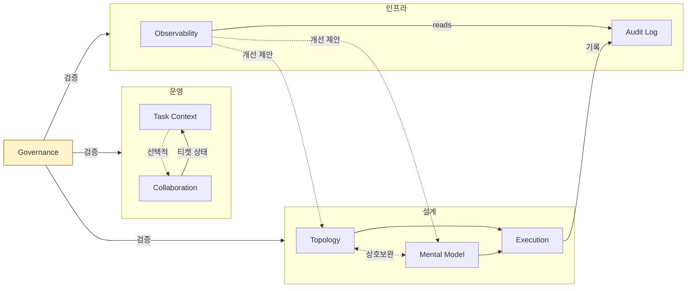
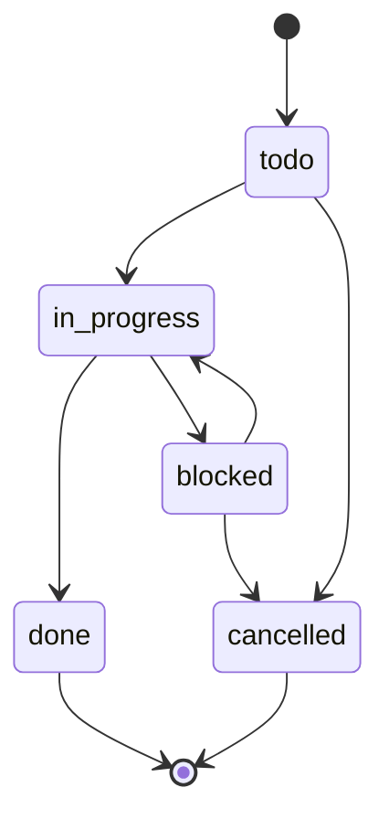

# Multi-Swarm Orchestrator

AI 에이전트로 복잡한 작업을 처리할 때, 결국 부딪히는 문제가 있다.

"이 워크플로우, 왜 이 순서로 했더라?" 재현이 안 된다.
에이전트가 만든 JSON, 로그, 티켓은 제각각 흩어져 있고, 스킬 A의 출력을 스킬 B가 받아 쓰는데 필드 하나 바뀌면 조용히 깨진다.
같은 실패를 반복해도 그걸 알아차릴 방법이 없다.

MSO는 이 문제를 정면으로 다룬다.
워크플로우 구조를 JSON 스키마로 명시하고, 에이전트 실행을 티켓과 감사 로그로 추적하며, 스킬 간 데이터 흐름을 계약으로 검증한다. 실행 결과는 관찰 → 개선 제안으로 다시 돌아온다.

---

## 전체 그림



세 갈래 파이프라인이 하나의 사이클을 이룬다.

**설계**에서 목표를 실행 가능한 구조로 바꾸고, **운영**에서 티켓을 발행해 실제로 돌리며, **인프라**가 그 결과를 기록하고 되먹임한다. Governance는 이 전체를 관통하며 "스킬 간 약속이 지켜지고 있는가"를 점검한다.

---

## 세 갈래 파이프라인

### 설계 (Design)

목표 하나가 들어오면, 세 단계를 거쳐 실행 가능한 워크플로우가 된다.

1. **Topology Design** — 목표를 노드와 엣지로 분해한다. "이 작업을 몇 단계로 나눌 것인가, 어떤 순서로 흘러갈 것인가."
2. **Mental Model Design** — 각 노드에 적절한 사고 모델을 붙인다. 어떤 노드는 좁은 판단이 필요하고, 어떤 노드는 넓은 탐색이 필요하다.
3. **Execution Design** — 위 두 결과를 합쳐 최종 실행 계획을 만든다. 모드 정책, 핸드오프 규칙, 폴백까지 포함한다.

Topology와 Mental Model은 어느 쪽이든 먼저 시작해도 된다. 서로의 출력이 상대를 정제하는 구조라, 상호보완적으로 동작한다.

### 운영 (Ops)

설계가 끝났으면 실제로 일을 시킨다.

**Task Context Management**가 티켓을 발행하고 상태를 관리한다. `todo → in_progress → done` 같은 전이는 상태 머신으로 강제되며, 완료된 티켓은 로그에 기록한 뒤 삭제된다.

멀티에이전트 협업이 필요하면 **Agent Collaboration**으로 디스패치한다. 단, 수동으로 해결할 수 있는 티켓은 굳이 이 스텝을 거치지 않는다. 선택적 실행이다.

### 인프라 (Infra)

실행 결과는 흘려보내지 않는다.

**Audit Log**가 SQLite에 모든 실행 기록을 남기고, **Observability**가 그 로그를 읽어 패턴을 분석한다. 반복 실패, 비용 이상, 병목 구간이 보이면 설계 파이프라인에 개선 제안을 올린다.

이 환류가 "같은 실패를 반복하는" 문제를 끊는 핵심 고리다.

---

## 스킬 간 계약

스킬 사이에 데이터가 오갈 때, 암묵적인 약속에 기대지 않는다. 다섯 개의 계약(CC-01~CC-05)이 "이 필드가 반드시 있어야 한다"를 명시한다.

```
Topology ──CC-01──▸ Execution ◂──CC-02── Mental Model
Task Context ──CC-03──▸ Collaboration ──CC-04──▸ Audit Log ──CC-05──▸ Observability
```

Governance가 이 계약을 자동 검증한다. 필드가 빠지거나 스키마가 어긋나면 파이프라인 진입 전에 잡아낸다.

---

## 시작하기

### 구조

```
skills/
├── mso-skill-governance/            ← 계약 검증, 구조 점검
├── mso-workflow-topology-design/    ← 목표 → 노드 구조
├── mso-mental-model-design/        ← 노드별 사고 모델
├── mso-execution-design/           ← 실행 계획 생성
├── mso-task-context-management/    ← 티켓 관리
├── mso-agent-collaboration/        ← 멀티에이전트 디스패치
├── mso-agent-audit-log/            ← 감사 로그 (SQLite)
└── mso-observability/              ← 관찰, 환류
rules/
└── ORCHESTRATOR.md                 ← 실행 순서 가이드
```

각 스킬 안에는 `SKILL.md`가 있다. 이것만 읽으면 해당 스킬의 목적, 입출력, 실행 절차를 파악할 수 있다. `modules/`와 `schemas/`는 깊이 들어갈 때만 펼치면 된다.

### 워크플로우 설계 (Design)

```bash
# 목표를 넣으면 노드 구조가 나온다
python3 skills/mso-workflow-topology-design/scripts/generate_topology.py \
  --goal "사용자 온보딩 프로세스 설계" \
  --output outputs/workflow_topology_spec.json

# 노드별 사고 모델을 매핑한다
python3 skills/mso-mental-model-design/scripts/build_bundle.py \
  --topology outputs/workflow_topology_spec.json \
  --output outputs/mental_model_bundle.json

# 둘을 합쳐 실행 계획을 만든다
python3 skills/mso-execution-design/scripts/build_plan.py \
  --topology outputs/workflow_topology_spec.json \
  --bundle outputs/mental_model_bundle.json
```

### 티켓 운영 (Ops)

```bash
# 티켓 발행
python3 skills/mso-task-context-management/scripts/create_ticket.py \
  --path task-context --title "온보딩 플로우 구현"

# 완료된 티켓 정리 — 로그에 기록하고 삭제
python3 skills/mso-task-context-management/scripts/archive_tasks.py \
  --path task-context
```

### 검증

```bash
# 스키마 정합성 확인
python3 skills/mso-skill-governance/scripts/validate_schemas.py --json

# 전체 거버넌스 점검
python3 skills/mso-skill-governance/scripts/validate_all.py

# 설계 → 운영 → 인프라 통합 테스트
python3 skills/mso-skill-governance/scripts/run_sample_pipeline.py \
  --goal "테스트 파이프라인" --task-title "샘플 티켓"
```

---

## 티켓 생명주기



`done`과 `cancelled`은 터미널 상태다. 한번 도달하면 되돌릴 수 없다.
같은 전이를 두 번 요청해도 오류가 아니라 무시된다(idempotent).

---

## 의존성

- **Python 3.10+**
- **ai-collaborator** (선택) — Agent Collaboration 스킬이 멀티에이전트 디스패치에 사용한다. 설치하지 않아도 나머지 7개 스킬은 정상 동작한다.

---

## License

MIT
