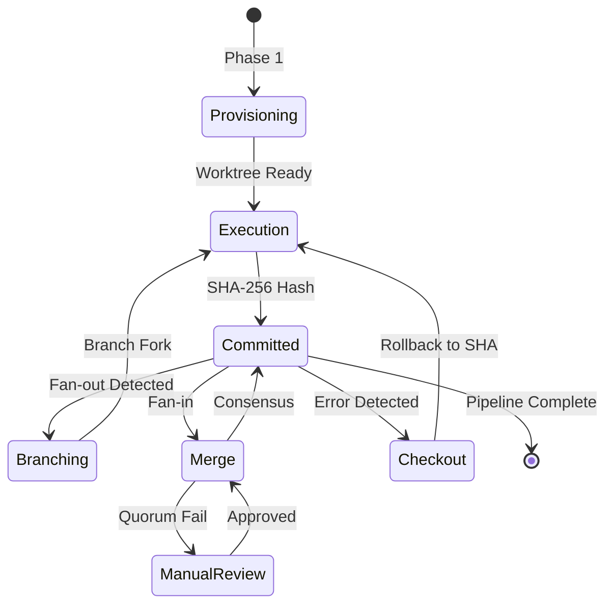
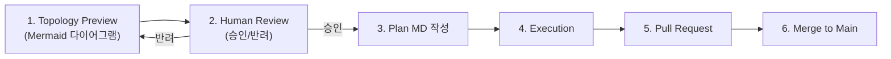
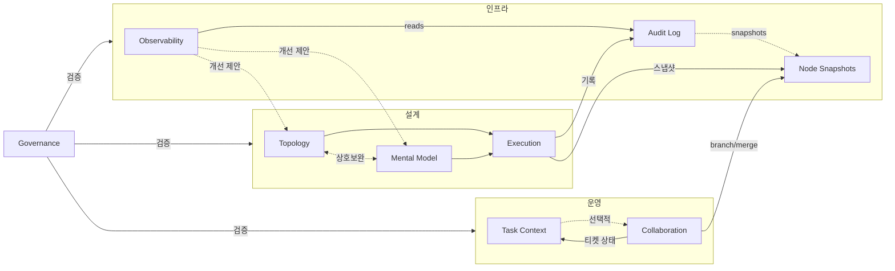
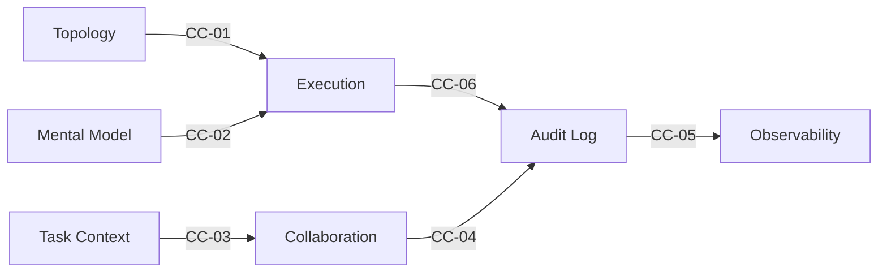
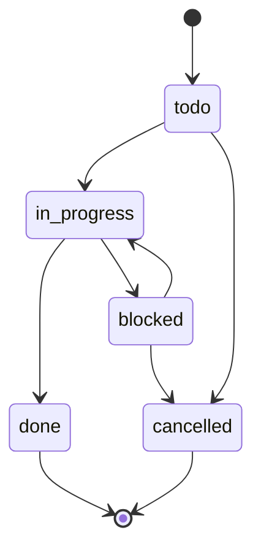

# Multi-Swarm Orchestrator (v0.0.5)

복잡한 AI 에이전트 작업을 수행하다 보면 필연적으로 다음과 같은 문제들에 직면합니다.

1. **비재현성**: 워크플로우의 실행 순서와 결정 맥락이 명확히 남지 않아, 과거의 실행 과정을 파악하거나 동일한 결과를 재현하기 어렵습니다.
2. **비가시성**: 에이전트가 생성한 JSON, 로그, 티켓이 여기저기 흩어져 있어 전체 흐름이 보이지 않습니다. 데이터 흐름이 불투명하여, 스킬 간 연결 과정에서 발생하는 문제를 즉시 파악하기 어렵습니다.
3. **반복되는 실패**: 동일한 유형의 실패가 반복되어도 이를 감지하고 근본적으로 개선하기 어렵습니다.

`MSO(Multi-Swarm Orchestrator)`는 이러한 문제를 해결하기 위해 설계된 오케스트레이션 시스템입니다.
워크플로우 구조를 JSON 스키마로 명확히 정의하고, 모든 에이전트 실행 과정을 티켓과 감사 로그(Audit Log)로 추적합니다. 또한 스킬 간 데이터 흐름을 엄격한 계약(Contract)으로 검증하며, 실행 결과는 분석 과정을 거쳐 다시 설계 개선 제안으로 환류(Feedback)됩니다.

---

## v0.0.3: Git-Metaphor 상태 모델

v0.0.3은 단순 DAG 실행을 넘어 **Git 개념의 버전화된 상태 전이 그래프**를 도입합니다.

각 노드(에이전트)의 실행 결과를 **불변 스냅샷(Commit)** 단위로 캡처하고, 에러 복구나 병렬 실험 시 **브랜치(Branch)**와 **병합(Merge)** 개념을 활용하여 자기 치유적(Self-healing) 오케스트레이션을 구현합니다.



| Git 개념 | MSO 런타임 | 설명 |
|----------|-----------|------|
| Worktree | Run Workspace | 매 실행마다 격리된 디렉토리 |
| Commit | Node Snapshot | 노드 완료 시점의 불변 DB 기록 |
| Branch | Dynamic 분기 | 병렬 실험 경로 |
| Merge | Fan-in Consensus | 브랜치 결과 합의 |
| Checkout | Fallback/Rollback | 절대 SHA로 안정 상태 복원 |

> **인프라 노트**: 실제 Git CLI에 의존하지 않습니다. 파일시스템 분리 + SQLite DB 해싱 에뮬레이션 방식입니다.

---

## v0.0.4: Global DB와 Work Tracking

v0.0.4는 **에이전트 자기 기록(Self-Recording)**과 **패턴 기반 개선 제안**을 도입합니다.

### Global Audit DB

Run-local DB(`active/<Run ID>/50_audit/agent_log.db`)를 **Global DB**(`workspace/.mso-context/audit_global.db`)로 통합합니다. 모든 Run의 감사 데이터가 하나의 DB에 축적되어 Cross-Run 패턴 분석이 가능해집니다.

```
workspace/.mso-context/
├── audit_global.db          ← v0.0.4: 전체 감사 데이터 SoT (WAL 모드)
├── active/<Run ID>/         ← Run별 산출물 (기존)
└── config/policy.yaml       ← 운영 정책
```

### Work Tracking 스키마 (v1.5.0)

`audit_logs` 테이블에 8개 컬럼이 추가되어 작업의 유형, 소요 시간, 영향 범위를 구조적으로 기록합니다.

| 컬럼 | 타입 | 설명 |
|------|------|------|
| `work_type` | TEXT | execution, modification, structure, document, skill, error, review |
| `triggered_by` | TEXT | user_request, auto, hook |
| `duration_sec` | REAL | 작업 소요 시간(초) |
| `files_affected` | TEXT | 영향받은 파일 목록 (JSON array) |
| `sprint` | TEXT | 스프린트 식별자 |
| `pattern_tag` | TEXT | 반복 패턴 태그 (비동기 배치 할당) |
| `session_id` | TEXT | 세션 식별자 |
| `intent` | TEXT | 작업 목적 1줄 요약 |

### 패턴 분석 시그널

Observability가 새로운 3가지 시그널을 자동 탐지합니다.

| 시그널 | 조건 | 이벤트 |
|--------|------|--------|
| **Work Type Imbalance** | 단일 work_type > 50% | `improvement_proposal` |
| **Pattern Tag Candidate** | (work_type, files_affected) 3회+ 반복 | `improvement_proposal` |
| **Error Hotspot** | 동일 파일 fail 2회+ | `anomaly_detected` |

### 스크립트 독립화

`init_db.py`와 `append_from_payload.py`가 `_shared` 모듈 의존 없이 독립 실행 가능합니다. DB 경로는 4단계 우선순위로 resolve됩니다: CLI 인자 → `MSO_WORKSPACE` 환경변수 → CWD 상위 탐색 → `~/.mso-context/audit_global.db`.

---

## v0.0.5: Worktree Branch Process와 Work Process

v0.0.5는 **worktree 단위의 작업 관리를 명시적 프로세스로 정의**하고, **반복 작업 패턴을 구조화된 Work Process로 표준화**합니다.

### 용어 도입

worktree 단위의 작업을 명확히 관리하기 위해 다음 Git 개념을 명시적으로 도입합니다.

| 용어 | 정의 |
|------|------|
| **branch** | worktree는 항상 특정 branch에 연결되어야 합니다. 실험·변경·검토가 필요한 모든 작업은 branch 단위로 분리하여 main의 안정성을 유지합니다. |
| **pull request (PR)** | worktree branch에서 수행한 작업 결과를 workspace main으로 반영하기 위한 공식 검토 단위입니다. 계획·의도·변경 범위를 설명하는 커뮤니케이션 인터페이스로 취급합니다. |
| **merge** | 검토가 완료된 branch를 main에 반영하는 행위입니다. workflow 변경이 포함된 경우에는 human approval을 필수로 요구합니다. |

### Workspace Main 사용 원칙

workspace의 main에서는 직접 작업을 지양해야 합니다. 다음 유형의 작업은 반드시 worktree branch process를 통해서만 진행해야 합니다.

- workflow topology 변경
- agent orchestration 규칙 수정
- execution order, dependency, concurrency 변경
- 공용 template(PRD, SPEC, Skill 등) 수정

### Worktree Branch Process

worktree branch process는 "생각 → 미리보기 → 실행"의 단계를 분리합니다.



**Planning 단계**에서는 workflow를 직접 수정하지 않고, Mermaid 기반 topology preview를 먼저 생성합니다. 노드(Agent, Skill, Tool), Edge(Trigger, Dependency, Fan-out/Fan-in), 변경 전/후 비교를 포함하여 "이 변경이 전체 시스템에 어떤 파장을 일으키는가"를 실행 없이 검증합니다.

### Work Process

work process는 `workflow의 프리셋(template)`에 가깝습니다. 반복적으로 등장하는 작업 패턴을 구조화합니다.

**Planning Process — 2-depth Planning**

1. **에이전트 초안 작성**: 구조와 범위 정의 목적. "불확실한 지점"과 "추정한 전제"를 명시합니다.
2. **Human-in-the-loop 검토**: 승인(계획 고정) 또는 반려(수정 요청). 책임 소재를 명확히 합니다.
3. **Plan MD 작성**: 승인 기준으로 이후 모든 실행·토론·SPEC의 기준점(anchor)이 됩니다.

**Discussion Process — Critique Discussion**

판단 품질을 높이기 위한 구조적 마찰을 의도합니다. critique는 누락된 가정, 과도한 낙관, 시스템적 리스크(확장성·비용·통제성) 관점을 최소한으로 포함해야 합니다.

### Hand-off Templates

작업 간 인수인계를 위한 표준 템플릿이 각 스킬의 `templates/` 디렉토리에 정의되어 있습니다. 전체 인덱스는 `skills/mso-orchestrator/SKILL.md`에서 관리합니다.

| 템플릿 | 소속 스킬 | 용도 |
|--------|----------|------|
| **PRD** | mso-task-context-management | "왜 지금 이 방식이어야 하는가"를 설명. Scenarios 단위로 SPEC과 1:1 또는 1:N 매핑 |
| **SPEC** | mso-task-context-management | 실행 계획 + Execution Policy + Ticket List + Check List. Scenario별 구체적 실행 명세 |
| **ADR** | mso-task-context-management | 아키텍처 의사결정 기록. 결정·대안·기각 사유·영향을 독립 문서로 추적 |
| **HITL Escalation Brief** | mso-observability | H1/H2 Gate 에스컬레이션 시 사람에게 전달하는 구조화된 판단 요청서 |
| **Run Retrospective** | mso-observability | Run 완료 후 메트릭·교훈·이월 항목을 종합하는 회고 문서 |
| **Design Handoff Summary** | mso-execution-design | Design Swarm 산출물을 Ops Swarm에 전달하는 요약 문서 |

---

## 업무 공간과 관제 공간

MSO는 _`다수의 사람`과 `다수의 에이전트`가 동시에 협업하는 환경_ 을 전제로 설계되었습니다. 이를 위해 _`일하는 곳`과 `보는 곳`을 명시적으로 분리_ 합니다.

```
workspace/                              ← 업무 공간: 에이전트가 실행하고 기록하는 곳
├── .mso-context/
│   ├── audit_global.db                 ← v0.0.4: 전체 감사 데이터 SoT (WAL)
│   ├── active/<Run ID>/                ← Run 단위 실행 산출물
│   │   ├── worktree/                   ← v0.0.3: 격리된 실행 워크트리
│   │   └── 50_audit/snapshots/         ← v0.0.3: 스냅샷 아티팩트
│   ├── archive/                        ← 완료된 Run 보관
│   ├── registry/manifest-index.jsonl   ← 전체 Run 인덱스
│	└── config/policy.yaml              ← 운영 정책 (lifecycle_policy 포함)

mso-observation-workspace/              ← 관제 공간: 사람이 현황을 확인하는 곳
├── <observer-id>/
│   ├── <Run ID>/
│   ├── readme.md                       ← 상태, 진행률, 다음 액션
│   ├── 01_summary/ ~ 05_delivery/      ← 의사결정·산출물·리뷰
```

|           | 업무 공간 (`workspace`)            | 관제 공간 (`observation-workspace`) |
| --------- | ------------------------------ | ------------------------------- |
| **주 사용자** | 에이전트, 스크립트                     | 사람, 팀                           |
| **권한**    | 읽기 + 쓰기                        | 읽기 전용                           |
| **단위**    | Run (phase별 산출물)               | Run (요약·의사결정·전달물)               |
| **식별**    | `.anchor.json`의 `workspace_id` | `.anchor.json`의 `workspace_id`  |

에이전트가 `.mso-context/`에 결과를 기록하면, 관제 공간으로 자동 동기화됩니다. 각 관찰자(observer)는 자신의 `observer-id` 아래에서 관심 있는 Run만 모아볼 수 있습니다. 두 공간은 독립된 디렉토리이므로 어느 쪽이 이동되어도 `.anchor.json` 기반 탐지 프로토콜이 자동으로 상대를 재발견합니다.

---

## 전체 아키텍처



세 가지 핵심 파이프라인이 유기적으로 순환하는 구조입니다.

`설계(Design)` 단계에서 목표를 실행 가능한 구조로 변환하고, `운영(Ops)` 단계에서 티켓을 발행하여 실제 작업을 수행하며, `인프라(Infra)` 단계에서 그 결과를 기록하고 분석하여 피드백을 제공합니다. 이 모든 과정에서 `Governance`는 스킬 간의 계약(Contract)이 준수되고 있는지 지속적으로 검증합니다.

---

## 3대 핵심 파이프라인

### 설계 (Design)

목표(Goal)가 입력되면, 다음의 세 단계를 거쳐 실행 가능한 워크플로우 명세(Spec)로 구체화됩니다.

1. **Topology Design** — 목표를 노드(Node)와 엣지(Edge)로 구조화합니다. 작업을 어떤 단위로 나누고, 어떤 순서로 실행할지를 정의합니다.
2. **Mental Model Design** — 각 노드에 적절한 사고 모델(Mental Model)을 부여합니다. 어떤 노드는 명확한 판단이 필요하고, 어떤 노드는 광범위한 탐색이 필요할 수 있습니다.
3. **Execution Design** — 위의 두 가지를 통합하여 최종 실행 계획(Execution Plan)을 수립합니다. v0.0.3에서는 `execution_graph`(Git-metaphor DAG)로 출력되며, 브랜칭/머지 정책, 에러 분류 체계 기반 폴백 전략, 라이프사이클 정책까지 포함됩니다.

Topology와 Mental Model은 상호보완적입니다. 어느 쪽에서 시작하든, 서로의 출력이 상대방을 정제하고 보완하는 구조를 가집니다.

### 운영 (Ops)

설계된 계획을 실제 실행 단계로 옮깁니다.

`Task Context Management`가 티켓을 발행하고 상태를 관리합니다. `todo → in_progress → done`으로 이어지는 상태 전이는 상태 머신(State Machine)에 의해 엄격하게 관리되며, 완료된 티켓은 로그에 기록된 후 정리됩니다.

멀티에이전트 협업이 필요한 경우에는 `Agent Collaboration`으로 작업을 분배(Dispatch)합니다. v0.0.3에서는 브랜치 노드의 포크와 머지 노드의 집계가 6개 에이전트 역할(Provisioning/Execution/Handoff/Branching/Critic-Judge/Sentinel)에 의해 수행됩니다.

### 인프라 (Infra)

실행 결과는 단순히 사라지지 않고 자산화됩니다.

`Audit Log`가 모든 실행 기록을 SQLite 데이터베이스에 남기고(v0.0.4: Global DB, `node_snapshots` + `suggestion_history` 테이블 포함), `Observability`가 저장된 로그를 분석하여 패턴을 도출합니다. 반복적인 실패, 비정상적인 비용 발생, 병목 구간, 분기/머지 빈도, work_type 편중, 에러 핫스팟 등이 감지되면, 이를 해결하기 위한 개선 제안을 설계 파이프라인으로 다시 전달합니다.

이러한 `피드백 루프(Feedback Loop)`가 동일한 실패의 반복을 끊어내는 핵심 메커니즘입니다.

---

## 스킬 간 계약 (Contracts)

스킬 간 데이터 교환은 암묵적인 합의에 의존하지 않습니다. 6가지 핵심 계약(CC-01~CC-06)을 통해 "반드시 존재해야 하는 필드와 포맷"을 명시적으로 정의합니다.



`Governance`가 이 계약을 자동으로 검증합니다. 필수 필드가 누락되거나 스키마가 일치하지 않으면, 파이프라인 진입 전에 즉시 차단하여 오류 확산을 방지합니다.

---

## 시작하기

### 디렉토리 구조

```
skills/
├── mso-skill-governance/            ← 계약 검증, 구조 점검
├── mso-workflow-topology-design/    ← 목표 → 노드 구조
├── mso-mental-model-design/        ← 노드별 사고 모델
├── mso-execution-design/           ← 실행 계획 생성 (execution_graph)
├── mso-task-context-management/    ← 티켓 관리
│   └── templates/                  ← Hand-off Templates (PRD.md, SPEC.md, ADR.md)
├── mso-agent-collaboration/        ← 멀티에이전트 디스패치 (branch/merge)
├── mso-agent-audit-log/            ← 감사 로그 (SQLite, node_snapshots, suggestion_history)
│   └── history/                    ← v0.0.4: 스키마 버전 스냅샷
├── mso-observability/              ← 관찰, 환류 (패턴 분석 + v0.0.4 시그널)
│   └── templates/                  ← Hand-off Templates (HITL_ESCALATION_BRIEF.md, RUN_RETROSPECTIVE.md)
├── mso-orchestrator/               ← 메타 오케스트레이션 (라우팅, 프로세스, 템플릿 인덱스)
└── _shared/                        ← 공통 유틸 (runtime_workspace.py)
rules/
└── ORCHESTRATOR.md                 ← 불변 정책 (운영 상세는 mso-orchestrator/SKILL.md)
```

각 스킬 디렉토리에는 `SKILL.md` 파일이 포함되어 있습니다. 이 문서만 확인하면 해당 스킬의 목적, 입출력, 실행 절차를 모두 파악할 수 있으며, `modules/`나 `schemas/`는 상세 구현을 확인할 때만 참조하면 됩니다.

`v0.0.3`부터는 별도 `config.yaml` 없이 동작합니다. 실행 기본값은 코드 내장값을 사용하며, 환경별 오버라이드는 `MSO_WORKSPACE_ROOT`, `MSO_OBSERVATION_ROOT`, `MSO_OBSERVER_ID`로만 처리합니다.

### 1. 워크플로우 설계 (Design)

```bash
# v0.0.3은 Run 단위 Runtime Workspace에 산출물을 기록합니다.
RUN_ID="YYYYMMDD-msowd-onboarding"

# 목표(Goal)를 입력하면 노드 구조(Topology)가 생성됩니다.
python3 skills/mso-workflow-topology-design/scripts/generate_topology.py \
  --run-id "$RUN_ID" \
  --skill-key msowd \
  --case-slug onboarding \
  --goal "사용자 온보딩 프로세스 설계"

# 각 노드에 적절한 사고 모델(Mental Model)을 매핑합니다.
python3 skills/mso-mental-model-design/scripts/build_bundle.py \
  --run-id "$RUN_ID" \
  --skill-key msowd \
  --case-slug onboarding

# 위 두 결과를 통합하여 execution_graph를 생성합니다.
python3 skills/mso-execution-design/scripts/build_plan.py \
  --run-id "$RUN_ID" \
  --skill-key msowd \
  --case-slug onboarding
```

### 2. 티켓 운영 (Ops)

```bash
TASK_ROOT="workspace/.mso-context/active/$RUN_ID/40_collaboration/task-context"

python3 skills/mso-task-context-management/scripts/create_ticket.py \
  "온보딩 플로우 구현" \
  --path "$TASK_ROOT"

python3 skills/mso-task-context-management/scripts/archive_tasks.py \
  --path "$TASK_ROOT"
```

### 3. 검증 (Validation)

```bash
# 스키마 정합성 확인 (--schema-version 1.5.0)
python3 skills/mso-skill-governance/scripts/validate_schemas.py \
  --run-id "$RUN_ID" \
  --skill-key msogov \
  --case-slug onboarding \
  --json

# 전체 거버넌스 점검
python3 skills/mso-skill-governance/scripts/validate_all.py \
  --run-id "$RUN_ID" \
  --skill-key msogov \
  --case-slug onboarding

# 설계 → 운영 → 인프라 통합 테스트
python3 skills/mso-skill-governance/scripts/run_sample_pipeline.py \
  --goal "테스트 파이프라인" \
  --task-title "샘플 티켓" \
  --skill-key msowd \
  --case-slug onboarding
```

---

## 티켓 생명주기



`done`과 `cancelled`는 `터미널 상태(Terminal State)`입니다. 한 번 이 상태에 도달하면 이전 상태로 되돌릴 수 없습니다.
또한, 동일한 상태로의 전이를 중복 요청하더라도 오류 없이 안전하게 무시됩니다(Idempotent).

---

## v0.0.5 변경 이력

### 핵심 변경

| 변경 | 내용 |
|------|------|
| **Worktree 용어 도입** | branch, pull request(PR), merge를 명시적 운영 개념으로 정의. worktree 단위 작업 관리 체계 확립 |
| **Workspace Main 사용 원칙** | workflow topology 변경, orchestration 규칙 수정 등 핵심 변경은 반드시 worktree branch process를 통해서만 진행 |
| **Worktree Branch Process** | "생각 → 미리보기 → 실행" 단계 분리. Mermaid 기반 topology preview를 실행 전 필수 생성 |
| **Work Process 정의** | Planning Process(2-depth Planning)와 Discussion Process(Critique Discussion) 표준화 |
| **Hand-off Templates 확장** | PRD, SPEC, ADR, HITL Escalation Brief, Run Retrospective, Design Handoff Summary 6종. 각 스킬의 `templates/` 디렉토리에 배치 |
| **mso-orchestrator 스킬 분리** | `rules/ORCHESTRATOR.md`를 불변 정책만 남기고, 운영 상세(라우팅, 프로세스, 에러 분류, 인프라)를 `skills/mso-orchestrator/SKILL.md`로 분리 |

### 수정 파일

**스킬 (신규)**
- `skills/mso-orchestrator/SKILL.md` — **신규** (메타 오케스트레이션: 실행 모델, 라우팅, Work Process, 템플릿 인덱스, 에러 분류, 인프라 노트)

**템플릿 (신규)**
- `skills/mso-task-context-management/templates/PRD.md` — **신규** (PRD 표준 템플릿)
- `skills/mso-task-context-management/templates/SPEC.md` — **신규** (SPEC 표준 템플릿)
- `skills/mso-task-context-management/templates/ADR.md` — **신규** (Architecture Decision Record)
- `skills/mso-observability/templates/HITL_ESCALATION_BRIEF.md` — **신규** (HITL 에스컬레이션 판단 요청서)
- `skills/mso-observability/templates/RUN_RETROSPECTIVE.md` — **신규** (Run 회고 문서)
- `skills/mso-execution-design/templates/DESIGN_HANDOFF_SUMMARY.md` — **신규** (Design → Ops 핸드오프 요약)

**문서 (수정)**
- `rules/ORCHESTRATOR.md` — 불변 정책만 남기고 축소 (`mso-runtime-policy`로 이름 변경)
- `skills/mso-task-context-management/SKILL.md` — Templates 섹션 추가
- `skills/mso-observability/SKILL.md` — Templates 섹션 추가
- `skills/mso-execution-design/SKILL.md` — Templates 섹션 추가
- `skills/_shared/runtime_workspace.py` — `mso-orchestrator`/`msoorch` 스킬 키 추가
- `README.md` — v0.0.5 반영

### 하위 호환 노트 (v0.0.4 → v0.0.5)

- **스키마**: 변경 없음. DB 스키마 v1.5.0 유지
- **CC Contracts**: CC-01~CC-06 변경 없음
- **스크립트**: 실행 스크립트 변경 없음. 기존 파이프라인 호환성 유지
- **ORCHESTRATOR.md**: 기존 운영 상세는 `skills/mso-orchestrator/SKILL.md`로 이동. 정책 내용은 보존
- **신규 추가만**: 템플릿, mso-orchestrator 스킬, 스킬 키 매핑은 순수 추가. 기존 동작에 영향 없음

---

## v0.0.4 변경 이력

### 핵심 변경

| 변경 | 내용 |
|------|------|
| **Global Audit DB** | Run-local DB → `audit_global.db`로 통합. Cross-Run 패턴 분석 기반 마련 |
| **스키마 v1.5.0** | `audit_logs`에 8개 work tracking 컬럼 추가. `suggestion_history` 테이블, 분석 뷰 3개 |
| **WAL 모드** | `PRAGMA journal_mode=WAL` 적용으로 동시 읽기 성능 향상 |
| **스크립트 독립화** | `init_db.py`, `append_from_payload.py`에서 `_shared` 의존성 제거. 4단계 DB 경로 resolve |
| **패턴 분석 시그널** | Observability에 work_type imbalance, pattern_tag candidate, error hotspot 탐지 추가 |
| **Self-Recording Rules** | 7개 work_type별 기록 트리거/단위 정의. 기록 제외 대상, Merge Rules, Logging Policy |
| **Suggestion History** | 패턴 제안의 승인/거절 이력 기록. 3회 거절 시 자동 제안 제외 |

### 수정 파일 (13개)

**스키마 (Layer 1)**
- `skills/mso-agent-audit-log/schema/init.sql` — v1.5.0, 8개 컬럼 + suggestion_history + 뷰 3개
- `skills/mso-agent-audit-log/schema/migrate_v1_4_to_v1_5.sql` — **신규** (멱등 마이그레이션)

**스크립트 (Layer 2)**
- `skills/mso-agent-audit-log/scripts/init_db.py` — _shared 제거, resolve_audit_db_path(), WAL
- `skills/mso-agent-audit-log/scripts/append_from_payload.py` — _shared 제거, 8개 신규 필드 매핑

**샘플/규칙 (Layer 3)**
- `skills/mso-agent-audit-log/samples/pipeline_completed.json` — schema 1.5.0 + 8개 필드
- `skills/mso-agent-audit-log/rules/audit-log-rule.md` — Self-Recording/Merge/Logging Policy

**문서 (Layer 4)**
- `skills/mso-agent-audit-log/SKILL.md` — v0.0.4, global DB, schema 1.5.0
- `skills/mso-agent-audit-log/core.md` — v0.0.4, 입출력 필드 확장
- `skills/mso-observability/SKILL.md` — v0.0.4, 3개 탐지 시그널
- `skills/mso-observability/scripts/collect_observations.py` — 3개 탐지 함수 + 스키마 fallback
- `rules/ORCHESTRATOR.md` — v0.0.4, global DB, WAL, 스크립트 독립성

**히스토리 (신규)**
- `skills/mso-agent-audit-log/history/init_v1.5.0.sql` — **신규** (스키마 스냅샷)
- `skills/mso-agent-audit-log/history/README.md` — **신규** (스냅샷 인덱스)

### 검증 결과

Claude Code(Opus 4.6)로 4개 에이전트 병렬 리뷰 수행.

| 영역 | 결과 |
|------|------|
| Schema 정합성 (init.sql ↔ migration ↔ history) | PASS |
| Script 로직 (독립 실행, 컬럼 매핑, placeholder 수) | PASS |
| 문서 정합성 (버전, 경로, 내용 완전성) | PASS (4건 수정 후) |
| Observability 스크립트 (탐지 함수, fallback, 통합) | PASS |

### 하위 호환 노트 (v0.0.3 → v0.0.4)

- **DB 경로**: Global DB가 기본이나, 기존 Run-local 경로도 레거시 fallback으로 지원
- **스키마**: 8개 신규 컬럼은 모두 nullable. 기존 INSERT 쿼리는 수정 없이 동작
- **Observability**: `read_db_rows()`가 try/except로 구 스키마 자동 fallback
- **_shared**: `collect_observations.py`는 기존대로 `_shared` 의존 유지 (리뷰 스코프 외)
- **CC Contracts**: CC-01~CC-06 변경 없음

---

## v0.0.3 변경 이력

### 핵심 변경

| 변경 | 내용 |
|------|------|
| **execution_graph 도입** | 기존 flat 구조(`node_chart_map`, `task_to_chart_map`, `node_mode_policy`, `model_selection_policy`) → `execution_graph` DAG 객체로 전면 교체. 각 노드에 `type`(commit/branch/merge), `parent_refs`, `tree_hash_ref`(SHA-256, nullable) 포함 |
| **node_snapshots 테이블** | Audit DB v1.4.0에 불변 스냅샷 기록용 테이블 추가. `agent_role`(6종), `phase`(1-4), `merge_policy`, `fallback_target` 포함. FTS5 + 인덱스 + lineage 뷰 |
| **에러 분류 체계** | `fallback_rules`를 object → array로 변경. 4가지 에러 유형(`schema_validation_error`/`hallucination`/`timeout`/`hitl_block`)에 `severity`/`action`/`max_retry` 매핑 |
| **CC-06 계약** | `mso-execution-design` → `mso-agent-audit-log` 간 신규 계약. execution_graph 노드가 node_snapshots로 기록 가능해야 함 |
| **lifecycle_policy** | `branch_ttl_days`(7), `artifact_retention_days`(30), `archive_on_merge`(true), `cleanup_job_interval_days`(1) |
| **6개 에이전트 역할** | Provisioning, Execution, Handoff, Branching, Critic/Judge, Sentinel — 4단계 런타임 Phase에 매핑 |

### 수정 파일 (22개)

**스키마/인프라 (Layer 1)**
- `skills/mso-execution-design/schemas/execution_plan.schema.json` — 재작성
- `skills/mso-agent-audit-log/schema/init.sql` — v1.4.0, node_snapshots 추가
- `skills/mso-agent-audit-log/schema/migrate_v1_3_to_v1_4.sql` — **신규** (멱등 마이그레이션)
- `skills/_shared/runtime_workspace.py` — lifecycle_policy, worktree_root, snapshots_dir 추가

**스크립트 (Layer 2)**
- `skills/mso-execution-design/scripts/build_plan.py` — execution_graph DAG 출력으로 리팩터
- `skills/mso-agent-audit-log/scripts/init_db.py` — v1.4.0, 마이그레이션 로직 추가

**스킬 문서 (Layer 3)**
- `skills/mso-execution-design/` — SKILL.md, core.md, modules_index.md 재작성 + `module.execution-graph.md`, `module.merge-policy.md` **신규**
- `skills/mso-agent-audit-log/` — SKILL.md, core.md 수정
- `skills/mso-agent-collaboration/SKILL.md` — 6-agent 역할, Phase 2b 브랜칭/머지
- `skills/mso-observability/` — SKILL.md 수정, `observability_callback.schema.json` 이벤트 타입 8종으로 확장

**룰/문서 (Layer 4)**
- `rules/ORCHESTRATOR.md` — v0.0.3 전면 재작성 (Git-Metaphor, 런타임 Phase, 에러 분류, 라이프사이클)
- `README.md` — v0.0.3 반영

**거버넌스 (Layer 5)**
- `skills/mso-skill-governance/scripts/_cc_defaults.py` — CC_VERSION 0.0.3, CC-06 추가
- `skills/mso-skill-governance/scripts/validate_schemas.py` — 출력 버전 0.0.3
- `skills/mso-skill-governance/scripts/validate_cc_contracts.py` — CC-06 핸들링
- `skills/mso-skill-governance/scripts/run_sample_pipeline.py` — v0.0.3 태그, 스키마 1.4.0

### 검증 결과

Codex CLI(`gpt-5.3-codex-spark`, reasoning effort `xhigh`)로 2회 검증 수행.

| 항목 | 1차 | 2차 (수정 후) |
|------|-----|--------------|
| V1. Schema Consistency | PASS | PASS |
| V2. SQL Integrity | PASS | PASS |
| V3. Script Correctness | PASS | PASS |
| V4. Cross-Reference Integrity | PASS | PASS |
| V5. runtime_workspace.py | PASS | PASS |
| V6. Documentation Coherence | PASS | PASS |
| V7. Tag Consistency | FAIL → 수정 | PASS |

1차에서 발견된 `runtime-v003`/`runtime-v0.0.3` 태그 불일치를 수정 후 2차 검증에서 7/7 PASS.

### Skill Authoring Best Practices 검토

[Skill-authoring-best-practices.md](https://docs.anthropic.com/en/docs/agents-and-tools/agent-skills/best-practices) 기준으로 4개 SKILL.md 검토 후 5건 수정.

| 이슈 | 조치 |
|------|------|
| `mso-execution-design` description에 "Use when" 누락 | 추가 |
| `mso-agent-collaboration`에 `when_unsure` + `상세 파일 참조` 누락 | 추가 |
| 모듈 파일 참조 2레벨 깊이 | SKILL.md에서 직접 참조 추가 |
| description이 3인칭이 아닌 명령형 서술 | 4개 모두 3인칭으로 수정 |
| 에이전트 역할 테이블 중복 | 현행 유지 (각 Skill은 독립 로드 단위) |

---

## 하위 호환 노트 (v0.0.2 → v0.0.3)

- **스키마**: `additionalProperties: true` 유지로 v0.0.2 아티팩트 로드는 가능하나, `execution_graph` required 키가 없으므로 validation은 실패
- **build_plan.py**: 기존 flat 키(`node_chart_map`, `task_to_chart_map` 등) 제거. `execution_graph` 구조만 출력 (clean break)
- **SQL**: `node_snapshots`는 순수 추가. 기존 테이블/트리거 변경 없음
- **CC Contracts**: CC-01~CC-05 유지, CC-06 추가 (execution_graph → node_snapshots)
- **Runtime workspace**: `lifecycle_policy` 등 신규 정책 키는 `_deep_merge_missing()`으로 자동 채워짐

---

## 의존성

- `Python 3.10+`
- `ai-collaborator` — `mso-agent-collaboration` 내부에 기본 포함(`skills/mso-agent-collaboration/v0.0.1/Skill/ai-collaborator`)되며,
  이 저장소 내 번들만 사용하고 외부 전역 경로/환경변수는 탐색하지 않습니다.

---

## License

MIT
