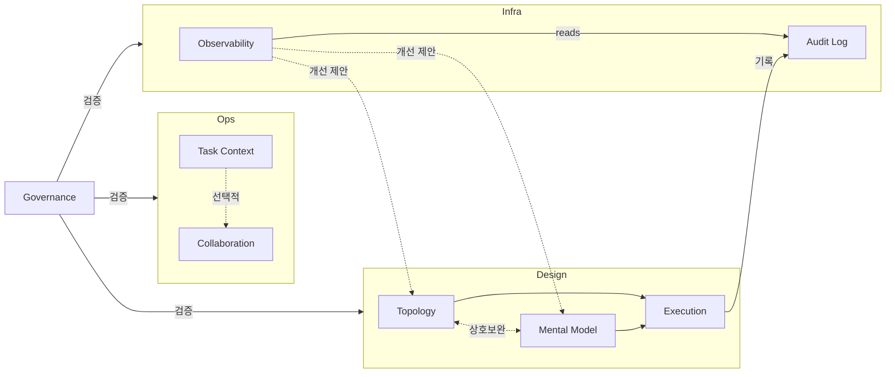

# Multi-Swarm Orchestrator

MSO(Multi-Swarm Orchestrator)는 멀티 에이전트 실행을 Runtime Workspace(`workspace/.mso-context`) 단위로 관리하는 오케스트레이션 시스템이다.

핵심 목표:
1. 실행 재현성 확보 (`manifest.json`, phase 산출물, audit log)
2. 실행 가시성 확보 (`mso-observation-workspace/<observer-id>/<Run ID>/`)
3. 반복 실패 감지/개선 (observability -> design feedback)

---

## 전체 아키텍처



---

## Runtime Workspace 구조 (v0.0.2)

```text
workspace/
  .mso-context/
    active/<Run ID>/
      00_collect/
      10_topology/
      20_mental-model/
      30_execution/
      40_collaboration/
      50_audit/
      60_observability/
      70_governance/
      80_delivery/
      90_meta/
      manifest.json
    archive/YYYY-MM/
    registry/manifest-index.jsonl
    config/policy.yaml

mso-observation-workspace/
  <observer-id>/<Run ID>/
    01_summary/
    02_decisions/
    03_artifacts/
    04_review/
    05_delivery/
    readme.md
```

---

## 주요 스크립트

- 런타임 샘플 실행: `python3 skills/mso-skill-governance/scripts/run_sample_pipeline.py`
- 스키마 검증: `python3 skills/mso-skill-governance/scripts/validate_schemas.py --json`
- CC 계약 검증: `python3 skills/mso-skill-governance/scripts/validate_cc_contracts.py --json`
- 거버넌스 검증: `python3 skills/mso-skill-governance/scripts/validate_gov.py --json`
- 통합 검증: `python3 skills/mso-skill-governance/scripts/validate_all.py`

공통 인자:
- `--config <path>`
- `--run-id <YYYYMMDD-<skill-key>-<case-slug>>` (optional)
- `--skill-key <msowd|msomm|...>`
- `--case-slug <kebab-case>`
- `--observer-id <id>` (optional, default: `$USER` 또는 config)

---

## 빠른 시작

```bash
# 1) 샘플 파이프라인 실행 (run 생성 -> phase 실행 -> manifest/index 반영)
python3 skills/mso-skill-governance/scripts/run_sample_pipeline.py \
  --goal "사용자 온보딩 프로세스 설계" \
  --task-title "온보딩 플로우 구현" \
  --skill-key msowd \
  --case-slug onboarding-flow

# 2) 런타임 스키마/계약 검증
python3 skills/mso-skill-governance/scripts/validate_schemas.py \
  --skill-key msogov \
  --case-slug onboarding-flow \
  --json

python3 skills/mso-skill-governance/scripts/validate_cc_contracts.py \
  --skill-key msogov \
  --case-slug onboarding-flow \
  --json
```

---

## 의존성

- Python 3.10+
- `PyYAML>=6.0`
- `jsonschema>=4.24.0`
- `ai-collaborator` 내장 번들: `skills/mso-agent-collaboration/v0.0.1/Skill/ai-collaborator`

---

## License

MIT
