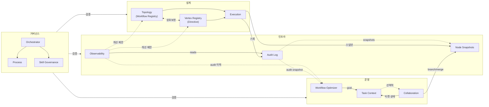

# Multi-Swarm Orchestrator (v0.0.8)

복잡한 AI 에이전트 작업의 **비재현성·비가시성·반복 실패**를 해결하기 위해 설계된 오케스트레이션 시스템.
워크플로우를 JSON 스키마로 정의하고, 실행을 티켓·감사 로그로 추적하며, 스킬 간 데이터 흐름을 계약(CC-01~10)으로 검증한다.


```mermaid
graph LR
    subgraph Design ["설계"]
        S00["Topology<br/>(Workflow Registry)"] <-.->|상호보완| S01["Vertex Registry<br/>(Directive)"]
        S00 & S01 --> S02["Execution"]
    end
    subgraph Ops ["운영"]
        S03["Task Context"] -.->|선택적| S04["Collaboration"]
        S10["Workflow Optimizer"] -->|goal| S03
    end
    subgraph Infra ["인프라"]
        S06["Observability"] -->|reads| S05["Audit Log"]
        S05 -.->|snapshots| SNAP["Node Snapshots"]
    end
    subgraph Gov ["거버넌스"]
        S07["Orchestrator"] --> S08["Process"]
        S07 --> S09["Skill Governance"]
    end
    S02 -->|기록| S05
    S02 -->|스냅샷| SNAP
    S06 -.->|개선 제안| S00
    S06 -.->|개선 제안| S01
    S06 -.->|audit 이력| S10
    S05 -.->|audit snapshot| S10
    S04 -->|티켓 상태| S03
    S04 -->|branch/merge| SNAP
    Gov -->|검증| Design
    Gov -->|검증| Ops
    Gov -->|검증| Infra
```

---

## 문서

| 문서 | 설명 |
|------|------|
| [아키텍처](docs/architecture.md) | Git-Metaphor 상태 모델, 전체 아키텍처, 업무/관제 공간, 버전별 주요 변경 |
| [3대 파이프라인 & 계약](docs/pipelines.md) | 설계·운영·인프라 파이프라인, CC-01~10, 티켓 생명주기, Hand-off Templates |
| [시작하기](docs/getting-started.md) | 디렉토리 구조, 설계·운영·검증 명령어 |
| [스킬 사용 매트릭스](docs/usage_matrix.md) | Phase × Swarm × Role 매트릭스, 실행 흐름 시퀀스 |
| [변경 이력](docs/changelog.md) | v0.0.3~v0.0.8 변경 이력 및 하위 호환 노트 |

---

## 변경 이력

### v0.0.8 — Global Registry + Local Chart

> **한 줄 요약**: Vertex Registry와 Workflow Registry를 **글로벌 경로(`~/.mso-registry/`)**로 통합하여 프로젝트 간 재사용을 가능하게 하고, 멘탈모델 좌표계(Local Chart)를 도입하여 도메인 지식을 의미 공간에서 관리한다.

v0.0.7에서 Vertex Registry(directive 택소노미)와 Workflow Registry(Graph Search)를 도입했지만, 모든 데이터가 워크스페이스 안에 갇혀 있었다. 다른 프로젝트에서 같은 분석 프레임워크를 쓰려면 매번 복사해야 했고, 한번 만든 멘탈모델 좌표계를 재활용할 방법이 없었다. v0.0.8은 이 두 가지를 해결한다.

1. **레지스트리를 글로벌로**: directive와 워크플로우 메타데이터를 `~/.mso-registry/`에 저장한다. 어떤 프로젝트에서든 같은 레지스트리를 참조하고, 새로 등록한 directive는 즉시 다른 프로젝트에서도 검색된다. 워크스페이스 로컬은 fallback으로 유지한다.
2. **멘탈모델에 좌표계 부여**: 도메인별로 의미 축(axis)을 정의하고, 각 directive를 좌표(axis_coord)로 배치하는 Local Chart를 도입한다. 새 개념을 추가할 때 기존 N개 vertex와 전부 비교하지 않고 K개 축에 투영만 하면 된다(Mode C). 좌표계가 없으면 Purpose 기반으로 처음부터 구성한다(Mode D).

| 개선 영역 | Before (v0.0.7) | After (v0.0.8) |
|----------|-----------------|----------------|
| 레지스트리 범위 | 워크스페이스 로컬 전용 | `~/.mso-registry/` 글로벌 + 로컬 fallback |
| 신규 directive 추가 | 수동 MD 작성 + 등록 | Mode C: 좌표 투영으로 위치 배정 + 자동 등록 |
| 도메인 좌표계 | 없음 | chart.json (축 정의 + vertex 좌표 + 직교성 메트릭) |
| 워크플로우 검색 | SKILL.md에만 참조 | `graph_search.py` 구현 완료 |

---

#### Part 1: Global Registry (`~/.mso-registry/`)

레지스트리 경로를 사용자 홈 디렉토리로 승격. 프로젝트 간 공유가 기본이 된다.

```
~/.mso-registry/
├── _meta/registry_config.json    # 해석 순서, 도메인 목록
├── workflows/                    # Workflow Registry (Mode B)
├── ir-deck/                      # 도메인별 Directive + chart.json
├── analysis/                     # Seed directive
└── general/                      # Fallback directive
```

**해석(Resolution) 순서**:
1. `~/.mso-registry/<domain>/` — 글로벌 (우선)
2. `{workspace}/.mso-context/vertex_registry/<domain>/` — 워크스페이스 로컬
3. `{skill}/directives/` — seed

id 충돌 시 글로벌이 우선한다(UNION + Global Priority).

#### Part 2: Local Chart (Mode C/D)

도메인별 의미 좌표계(`chart.json`)를 도입. 각 directive를 의미 공간의 좌표로 관리한다.

- **Mode C (Chart Projection)**: 기존 chart에 새 vertex 투영. N×N 전체 재연산 대신 1×K 투영만 수행
- **Mode D (Chart Bootstrap)**: Purpose 정의 → 프롬프트 생성 → LLM 의미 근사 → 직교성 검증 → 축 유도 → chart.json 생성
- **Sparsity 원칙**: 주도 축 ≥ 0.7, 보조 축 ≤ 0.3. 1 vertex = 1 핵심 관심사
- **LLM 의미 근사**: Embedding 모델 대신 LLM이 유사도 판단 (추후 교체 포인트)

#### Part 3: 신규/수정 스크립트

| 스크립트 | 스킬 | 상태 |
|---------|------|------|
| `init_global_registry.py` | mental-model | **신규** — 글로벌 registry 초기화 + seed 복사 |
| `project_vertex.py` | mental-model | **신규** — Mode C scaffold |
| `bootstrap_chart.py` | mental-model | **신규** — Mode D scaffold |
| `graph_search.py` | topology | **신규** — intent 기반 워크플로우 검색 |
| `registry_upsert.py` | topology | **신규** — 워크플로우 레지스트리 등록 |
| `bind_directives.py` | mental-model | **수정** — `_load_registry_multi()` 이원 구조 |
| `search_directives.py` | mental-model | **수정** — 글로벌 default + 로컬 fallback |
| `register_directive.py` | mental-model | **수정** — 글로벌 default + `--local` flag |

상세: [docs/changelog.md](docs/changelog.md)

---

## Roadmap

### v0.1.0 — Processing Tier 최적화 최소 환경

v0.0.7에서 Tier Escalation 메커니즘(`pattern_stability` 공식, Level 30→20→10 자동 이동 규칙)과 Graph Search Loader(워크플로우 레지스트리 검색)를 도입했다. v0.1.0은 이를 기반으로 **각 Tier에서 실행 가능한 최소 환경을 자동 구성**하는 시스템을 완성한다.

| 스킬 | 역할 | 비고 |
|------|------|------|
| `mso-workflow-optimizer` | Tier 전환 자율 감지 + Logical/Light 환경 구성 지시 | v0.0.7: Tier Escalation + `pattern_stability` 구현 완료 |
| `mso-model-optimizer` | 모델 수준 성능 평가 + fine-tuning lifecycle | v0.1.0에서 신규 개발 |

`mso-workflow-optimizer`가 **프로세스 수준**의 tier 최적화를, `mso-model-optimizer`는 **모델 수준**의 평가와 fine-tuning을 담당한다.

---

## 의존성

- Python 3.10+

## License

[MIT](LICENSE)
