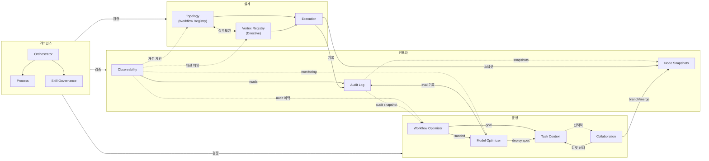
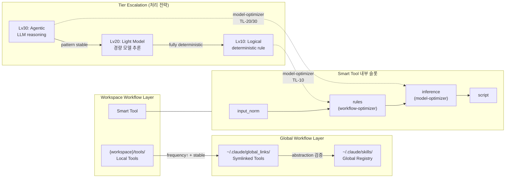

# Multi-Swarm Orchestrator (v0.0.10)

복잡한 AI 에이전트 작업의 **비재현성·비가시성·반복 실패**를 해결하기 위해 설계된 오케스트레이션 시스템.
워크플로우를 JSON 스키마로 정의하고, 실행을 티켓·감사 로그로 추적하며, 스킬 간 데이터 흐름을 계약(CC-01~14)으로 검증한다.

## 스킬 아키텍처

```mermaid
graph LR
    subgraph Design ["설계"]
        S00["Topology<br/>(Workflow Registry)"] <-.->|상호보완| S01["Vertex Registry<br/>(Directive)"]
        S00 & S01 --> S02["Execution"]
    end
    subgraph Ops ["운영"]
        S03["Task Context"] -.->|선택적| S04["Collaboration"]
        S10["Workflow Optimizer"] -->|goal| S03
        S10 -->|Handoff| S11["Model Optimizer"]
        S11 -->|deploy spec| S03
    end
    subgraph Infra ["인프라"]
        S06["Observability"] -->|reads| S05["Audit Log"]
        S05 -.->|snapshots| SNAP["Node Snapshots"]
    end
    subgraph Gov ["거버넌스"]
        S07["Orchestrator"] --> S08["Process"]
        S07 --> S09["Skill Governance"]
    end
    S02 -->|기록| S05
    S02 -->|스냅샷| SNAP
    S06 -.->|개선 제안| S00
    S06 -.->|개선 제안| S01
    S06 -.->|audit 이력| S10
    S06 -.->|monitoring| S11
    S05 -.->|audit snapshot| S10
    S11 -->|eval 기록| S05
    S04 -->|티켓 상태| S03
    S04 -->|branch/merge| SNAP
    Gov -->|검증| Design
    Gov -->|검증| Ops
    Gov -->|검증| Infra
```

## Automation Escalation — Tool Layer 구조

MSO의 Tool은 **global workflow**와 **workspace workflow** 두 레이어에서 동일한 개념으로 사용된다. Tier Escalation으로 패턴이 안정되면 LLM → Light Model → Rule로 처리 전략이 하강하고, 사용 빈도와 범용성이 올라가면 Tool Lifecycle(Local → Symlinked → Global)으로 배치 scope가 상승한다.

```mermaid
graph LR
    subgraph GlobalLayer ["Global Workflow Layer"]
        direction LR
        GR["~/.claude/skills/<br/>Global Registry"]
        GL["~/.claude/global_links/<br/>Symlinked Tools"]
    end
    subgraph WorkspaceLayer ["Workspace Workflow Layer"]
        direction LR
        WT["{workspace}/tools/<br/>Local Tools"]
        ST["Smart Tool"]
    end
    subgraph SmartToolSlots ["Smart Tool 내부 슬롯"]
        direction LR
        IN["input_norm"] --> RU["rules<br/>(workflow-optimizer)"]
        RU --> IF["inference<br/>(model-optimizer)"]
        IF --> SC["script"]
    end

    WT -->|"frequency↑ + stable"| GL
    GL -->|"abstraction 검증"| GR

    ST --- SmartToolSlots

    subgraph TierEscalation ["Tier Escalation (처리 전략)"]
        direction TB
        L30["Lv30: Agentic<br/>LLM reasoning"]
        L20["Lv20: Light Model<br/>경량 모델 추론"]
        L10["Lv10: Logical<br/>deterministic rule"]
        L30 -->|"pattern stable"| L20
        L20 -->|"fully deterministic"| L10
    end

    L30 -.->|"model-optimizer<br/>TL-20/30"| IF
    L10 -.->|"model-optimizer<br/>TL-10"| RU
```

| 축                              | 방향                              | 관리 주체                |
| ------------------------------- | --------------------------------- | ------------------------ |
| **Tier Escalation** (처리 전략) | Lv30 → Lv20 → Lv10 (하강)         | `mso-workflow-optimizer` |
| **Tool Lifecycle** (배치 scope) | Local → Symlinked → Global (상승) | Tool Registry (v0.1.0)   |
| **Training Level** (모델 학습)  | TL-10 / TL-20 / TL-30             | `mso-model-optimizer`    |

세 축은 **직교**한다. Local tool이 Lv10 전략을 쓸 수도 있고, Global tool이 Lv30 전략을 쓸 수도 있다.

---

## 문서

| 문서                                       | 설명                                                         |
| ------------------------------------------ | ------------------------------------------------------------ |
| [아키텍처](docs/architecture.md)           | Git-Metaphor 상태 모델, 전체 아키텍처, Automation Escalation |
| [3대 파이프라인 & 계약](docs/pipelines.md) | 설계·운영·인프라 파이프라인, CC-01~14, 티켓 생명주기         |
| [시작하기](docs/getting-started.md)        | 디렉토리 구조, 설계·운영·검증 명령어                         |
| [스킬 사용 매트릭스](docs/usage_matrix.md) | Phase × Swarm × Role 매트릭스                                |
| [변경 이력](docs/changelog.md)             | v0.0.3~v0.0.10 변경 이력 및 하위 호환 노트                   |

---

## 변경 이력

### v0.0.10 — Smart Tool Factory (Automation Escalation 테스트 환경)

> **한 줄 요약**: `mso-model-optimizer` 스킬을 신설하고 Smart Tool 구조를 표준화하여, Tier Escalation 시 경량 모델을 자동 생산·배포하는 **Automation Escalation 테스트 환경**을 구성했다.

| 개선 영역      | Before (v0.0.9)   | After (v0.0.10)                               |
| -------------- | ----------------- | --------------------------------------------- |
| 경량 모델 생산 | 없음 (LLM에 위임) | `mso-model-optimizer` 5-Phase + TL-10/20/30   |
| 모델 배포 계약 | 없음              | `deploy_spec.json` (재현성 + 평가 + rollback) |
| Tool 구조 표준 | 비공식            | `manifest.json` + `slots/` 4-slot 아키텍처    |
| Tool 재사용    | workspace 고착    | Local → Symlinked → Global 승격 경로 정의     |
| 모델 모니터링  | 없음              | rolling_f1 + degradation + 3가지 fallback     |
| CC 계약        | CC-01~10          | CC-01~14 (model-optimizer 4건 추가)           |

일정 수준 이상의 Automation Escalation이 실운용에서 검증되면 **v0.1.0**(Tool Lifecycle 자동화 + Processing Tier 최소 환경)으로 승격 예정.

상세: [docs/changelog.md](docs/changelog.md)

---

## Roadmap

### v0.1.0 — Tool Lifecycle 자동화 + Processing Tier 최소 환경

v0.0.10에서 Automation Escalation 테스트 환경을 구성했다. v0.1.0은 실운용 검증 결과를 기반으로 다음을 완성한다.

| 영역                      | 작업                                                             | 승격 조건                    |
| ------------------------- | ---------------------------------------------------------------- | ---------------------------- |
| Tool Lifecycle 자동화     | `module.tool-lifecycle.md` + `tool_registry.json` + symlink 규약 | Escalation 2회 이상 성공     |
| Observability 연동        | rolling_f1 모니터링 + 승격 후보 자동 제안                        | CC-14 실행 경로 검증         |
| Processing Tier 최소 환경 | Tier 전환 시 model/rules artifact 자동 구성                      | TL-20 파인튜닝 1회 이상 성공 |

---

## 의존성

- Python 3.10+

## License

[MIT](LICENSE)
