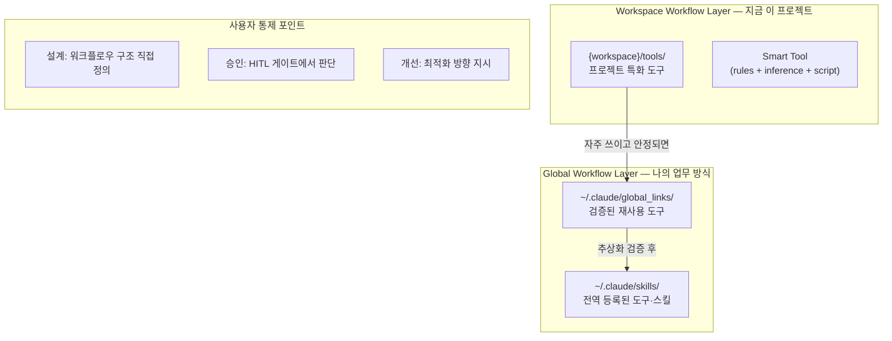
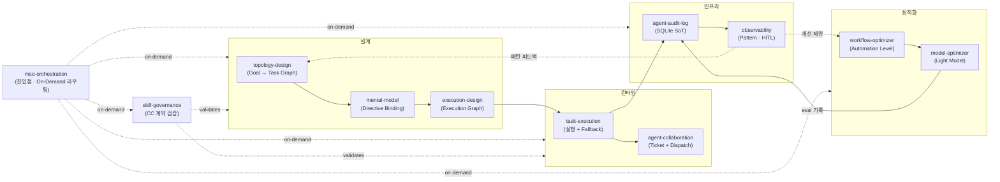
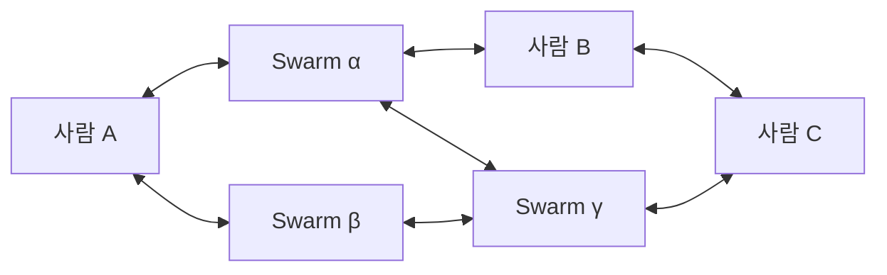

# Multi-Swarm Orchestrator (v0.2.1)

> *A Companion of Agent Swarm* — Agent Swarm은 뒤에서 일하는 도구가 아니라, 믿을 수 있는 동료다.
사람과 Agent Swarm이 동료로서 함께 일하는 오케스트레이션 시스템.

기존 AIOS가 약속하는 것은 자동화다. 하지만 정작 "내 업무 방식대로 흐름을 통제할 수 있는가", "이 결과를 왜 믿어야 하는가"라는 질문에는 답하지 못한다. MSO는 다른 접근을 택한다. Agent를 사용자 대신 일하는 블랙박스가 아니라, **함께 일하는 동료 Swarm**으로 본다.

**"빠른 설계, 점진적 최적화"** — 처음부터 완벽한 자동화를 목표로 하지 않는다. 사용자가 직접 워크플로우를 설계하고, 실행하고, 결과를 보면서 점진적으로 최적화해 나간다. 반복되는 패턴이 확인되면 LLM 호출을 경량 모델로, 경량 모델을 규칙으로 단계적으로 대체한다. 이 과정에서 사용자는 항상 결정권을 가진다.

궁극적으로는 **여러 사람과 여러 Swarm이 하나의 워크플로우 안에서 동료로서 협업하는 상태**를 만든다. 핵심은 자동화 수준이 아니라 **신뢰 수준**이다. 맡은 일의 결과를 명확히 전달하고, 판단 근거를 물으면 설명하고, 문제가 생기면 스스로 알리는 — 팀원이 해야 할 것을 하는 Swarm.

> **현재 구조**: MSO 스킬셋은 `mso-orchestration`과 MSM 스킬셋의 `msm-orchestration`, 두 오케스트레이션 스킬을 진입점으로 두고 나머지 서브스킬을 on-demand로 로드하는 방식으로 운영된다. 향후 두 팩의 역할이 충분히 수렴하면 단일 Thick 스킬로 통합하는 방안을 검토 중이다.

---

## 설계 철학: Thin Agent, Thick Smart Tools

|                 | 기존 AIOS 접근              | MSO 접근                                             |
| --------------- | --------------------------- | ---------------------------------------------------- |
| **Agent 역할**  | LLM이 모든 것을 처리        | Agent는 흐름만 제어 (Thin)                           |
| **Tool 역할**   | 단순 API wrapper            | 자체 workflow를 가진 실행 모듈 (Thick Smart Tool)    |
| **사용자 통제** | 블랙박스 — 내부 동작 불투명 | 설계·승인·개선 전 과정에 사용자 결정권               |
| **최적화 방식** | 처음부터 완전 자동화 시도   | 빠른 설계 → 반복 실행 → 점진적 자동화                |
| **비용 구조**   | LLM 호출에 비례하여 증가    | 패턴 안정화에 따라 경량 모델/규칙으로 대체           |
| **재사용**      | 플랫폼 종속                 | Local → Symlinked → Global 승격으로 프로젝트 간 공유 |

---

## 두 가지 워크플로우 레이어

MSO는 사용자의 업무를 **Global Workflow**와 **Workspace Workflow** 두 레이어로 나누어 관리한다.


```mermaid
graph TB
    subgraph GlobalLayer ["Global Workflow Layer — 나의 업무 방식"]
        direction LR
        GR["~/.claude/skills/<br/>전역 등록된 도구·스킬"]
        GL["~/.claude/global_links/<br/>검증된 재사용 도구"]
    end
    subgraph WorkspaceLayer ["Workspace Workflow Layer — 지금 이 프로젝트"]
        direction LR
        WT["{workspace}/tools/<br/>프로젝트 특화 도구"]
        ST["Smart Tool<br/>(rules + inference + script)"]
    end

    WT -->|"자주 쓰이고 안정되면"| GL
    GL -->|"추상화 검증 후"| GR

    subgraph UserControl ["사용자 통제 포인트"]
        direction TB
        H1["설계: 워크플로우 구조 직접 정의"]
        H2["승인: HITL 게이트에서 판단"]
        H3["개선: 최적화 방향 지시"]
    end
```

| 레이어                 | 범위               | 역할                              | 예시                                            |
| ---------------------- | ------------------ | --------------------------------- | ----------------------------------------------- |
| **Global Workflow**    | 전체 프로젝트 공통 | 나의 업무 방식·도구·스킬을 정의   | 반복 사용하는 분석 프레임워크, 검증된 분류 모델 |
| **Workspace Workflow** | 특정 프로젝트 한정 | 지금 이 프로젝트의 실행 흐름 관리 | 프로젝트별 데이터 파이프라인, 도메인 특화 규칙  |

프로젝트에서 만든 도구(Local Tool)가 반복적으로 잘 동작하면, symlink를 통해 다른 프로젝트에서도 재사용(Symlinked)하고, 충분히 추상화되면 전역 등록(Global)한다. 처음부터 전역으로 설계할 수도 있다.

---

## 점진적 최적화: Automation Escalation

워크플로우를 처음 실행할 때는 LLM이 대부분을 처리한다(Lv30). 반복 실행으로 패턴이 안정되면, 시스템이 자동으로 더 효율적인 처리 방식을 제안한다.

```
첫 실행                  패턴 안정화              완전 자동화
──────                  ──────────              ──────────
Lv30: LLM reasoning   → Lv20: 경량 모델 추론   → Lv10: 규칙 기반 처리
(비용 높음, 유연)         (비용 절감, 빠름)         (비용 최소, 결정론적)
```

이 전환은 자동으로 일어나지 않는다. **사용자가 HITL(Human-in-the-Loop) 게이트에서 승인**해야 다음 단계로 넘어간다. "이 정도면 경량 모델로 대체해도 되겠다"는 판단은 시스템이 제안하고, 사용자가 결정한다.

| 단계             | 처리 방식            | 비용 | 통제 수준              |
| ---------------- | -------------------- | ---- | ---------------------- |
| Lv30 Agentic     | LLM reasoning        | 높음 | 유연하지만 예측 어려움 |
| Lv20 Light Model | 파인튜닝된 경량 모델 | 중간 | 도메인 특화, 빠름      |
| Lv10 Logical     | 규칙/스크립트        | 최소 | 완전 결정론적          |

`mso-workflow-optimizer`가 언제 전환할지 판단하고, `mso-model-optimizer`가 전환에 필요한 경량 모델을 학습·배포한다.

---

## 스킬 아키텍처

10개 스킬이 설계·런타임·인프라·최적화·거버넌스 5개 레이어에서 협업한다. `mso-orchestration`이 진입점이며, 서브스킬은 on-demand로 로드된다.


```mermaid
graph LR
    ORCH["mso-orchestration<br/>(진입점 · On-Demand 라우팅)"]

    subgraph Design["설계"]
        WT["topology-design<br/>(Goal → Task Graph)"]
        MM["mental-model<br/>(Directive Binding)"]
        ED["execution-design<br/>(Execution Graph)"]
        WT --> MM --> ED
    end
    subgraph Runtime["런타임"]
        TE["task-execution<br/>(실행 + Fallback)"]
        AC["agent-collaboration<br/>(Ticket + Dispatch)"]
        TE --> AC
    end
    subgraph Infra["인프라"]
        AAL["agent-audit-log<br/>(SQLite SoT)"]
        OBS["observability<br/>(Pattern · HITL)"]
        AAL --> OBS
    end
    subgraph Optimize["최적화"]
        WO["workflow-optimizer<br/>(Automation Level)"]
        MO["model-optimizer<br/>(Light Model)"]
        WO --> MO
    end
    GOV["skill-governance<br/>(CC 계약 검증)"]

    ORCH -.->|on-demand| Design
    ORCH -.->|on-demand| Runtime
    ORCH -.->|on-demand| Infra
    ORCH -.->|on-demand| Optimize
    ORCH -.->|on-demand| GOV
    ED --> TE
    TE --> AAL
    OBS -.->|개선 제안| WO
    OBS -.->|패턴 피드백| WT
    MO -->|eval 기록| AAL
    GOV -.->|validates| Design
    GOV -.->|validates| Runtime
```

| 레이어 | 스킬 | 하는 일 |
| ------ | ---- | ------- |
| **설계** | topology-design · mental-model · execution-design | Goal → Task Graph → Directive Binding → Execution Graph |
| **런타임** | task-execution · agent-collaboration | 실행 조율 + Fallback Policy, 티켓 관리 + 멀티에이전트 Dispatch |
| **인프라** | agent-audit-log · observability | 실행 로그 SQLite SoT, 패턴 분석·이상 감지·HITL 체크포인트 |
| **최적화** | workflow-optimizer · model-optimizer | Automation Level 10/20/30 판단, 경량 모델 학습·배포 |
| **거버넌스** | skill-governance | CC-01~14 계약 검증, 스킬 구조 검사, 레거시 참조 탐지 |

---

## 문서

| 문서                                       | 설명                                                         |
| ------------------------------------------ | ------------------------------------------------------------ |
| [아키텍처](docs/architecture.md)           | Git-Metaphor 상태 모델, 전체 아키텍처, Automation Escalation |
| [3대 파이프라인 & 계약](docs/pipelines.md) | 설계·운영·인프라 파이프라인, CC-01~15, 티켓 생명주기         |
| [시작하기](docs/getting-started.md)        | 디렉토리 구조, 설계·운영·검증 명령어                         |
| [스킬 사용 매트릭스](docs/usage_matrix.md) | Phase × Swarm × Role 매트릭스                                |
| [KO 매핑](docs/knowledge-object-mapping.md) | 기존 산출물의 명시지 분류 매핑표                             |
| [변경 이력](docs/changelog.md)             | v0.0.3~v0.1.3 변경 이력 및 하위 호환 노트                    |

---

## 설치

```bash
git clone https://github.com/WMJOON/multi-swarm-orchestrator.git
cd multi-swarm-orchestrator
./install.sh          # Claude Code만
./install.sh --codex  # Codex만
./install.sh --all    # Claude Code + Codex
```

`install.sh`는 두 가지를 생성한다:

| 생성 경로 | 내용 |
|----------|------|
| `~/.claude/skills/mso-orchestration` | 진입점 스킬 심링크 |
| `~/.skill-modules/mso-skills/` | 서브스킬 디렉토리 심링크 |

이미 같은 경로가 존재하면 건너뛰고 출력한다.

### 서브스킬 On-Demand 로딩

서브스킬은 `~/.skill-modules/mso-skills/`에 위치한다. 필요할 때 아래 경로를 Read 도구로 직접 읽으면 로드된다:

```
~/.skill-modules/mso-skills/SKILL_NAME/SKILL.md
```

`SKILL_NAME`을 아래 라우팅 테이블의 스킬명으로 교체한다.

### 스킬 라우팅

| 요청 유형 | 담당 스킬 |
|----------|----------|
| Goal → Task Graph 설계 | `mso-workflow-topology-design` |
| Mental Model · Directive 바인딩 | `mso-mental-model` |
| Execution Graph 설계 | `mso-execution-design` |
| 워크플로우 실행 · Fallback | `mso-task-execution` |
| 티켓 관리 · 멀티에이전트 Dispatch | `mso-agent-collaboration` |
| 멀티 프로바이더 실행 (Codex·Claude·Gemini) | `mso-agent-collaboration` → `collaborate.py` |
| 실행 로그 · SQLite SoT | `mso-agent-audit-log` |
| 패턴 분석 · HITL 체크포인트 | `mso-observability` |
| Automation Level 판단 · 최적화 | `mso-workflow-optimizer` |
| 경량 모델 학습 · 배포 | `mso-model-optimizer` |
| 스킬 구조 · CC 계약 검증 | `mso-skill-governance` |

**설치 확인**

```bash
python3 skills/mso-skill-governance/scripts/validate_gov.py \
  --pack-root ~/.claude \
  --pack mso \
  --json
```

`"status": "ok"`, `"findings": []`이면 정상.

---

## v0.2.1 변경 이력 — ai-collaborator 완전 흡수

> **멀티 프로바이더 CLI 통합.** 별도 스킬로 운영되던 ai-collaborator(Codex·Claude·Gemini)를 `mso-agent-collaboration`으로 완전 흡수. `collaborate.py`와 `ai_collaborator` 패키지가 이제 `~/.skill-modules/mso-skills/mso-agent-collaboration/scripts/`에 위치한다.

| 개선 영역 | v0.2.0 | v0.2.1 |
|-----------|--------|--------|
| **멀티 프로바이더 실행** | ai-collaborator 별도 스킬 | **`mso-agent-collaboration`** 흡수 — `collaborate.py` + `ai_collaborator` 패키지 통합 |
| **파이프라인** | [A]~[D] 4개 | **[E] 멀티 프로바이더 실행** 추가 |
| **swarm 실행** | dispatch_mode enum만 | 티켓 `swarm_db`+`swarm_agents` 필드로 tmux swarm 직접 실행 |

상세: [docs/changelog.md](docs/changelog.md)

---

## Roadmap

```
v0.1.x  Perfect architecture later. Working system first.                                ✓ 완료
v0.2.x  스킬 통합 재편 — 굵게 적게, 워크플로우 완결성 강화                              ← 현재
v0.3.x  Explicit Knowledge Architecture — Better Outcomes from the Same AI
v1.0.0  A Companion of Agent Swarm
```

---

### v0.2.x — 스킬 통합 재편

> **얇게 많이 → 굵게 적게.** 각 스킬의 워크플로우 완결성을 높이고, 프로세스 규약과 티켓 관리를 소유자 스킬로 흡수. Runtime 구현 완성(`wrapper.otel`/`wrapper.guardrails`·NHI Attestation)까지를 이 선상에서 진행한다.

| 방법론 | 한 줄 정의 |
|--------|-----------|
| ***Thick Skill*** | 컨텍스트 전환 없이 하나의 스킬이 더 넓은 범위를 스스로 해결한다 |
| ***Ownership over Reference*** | 정책·규약·템플릿은 실제로 사용하는 스킬이 직접 소유한다 |

| 작업 영역 | 내용 |
|-----------|------|
| 스킬 통합 (완료) | 13개 → 10개 재편, 크로스 레퍼런스 전체 정합 |
| ai-collaborator 흡수 (완료) | Codex·Claude·Gemini 멀티 프로바이더 CLI → `mso-agent-collaboration` |
| Runtime 구현 | `wrapper.otel`·`wrapper.guardrails` 실구현 `[spec-only → impl]` |
| NHI Attestation | `nhi_policy.json` 기반 fail-closed 전환 `[spec-only → impl]` |

---

### v0.1.0 — Perfect architecture later. Working system first.

> 완벽한 구조보다 작동하는 시스템이 먼저다.
> **v0.1.x는 개인 업무 환경에서의 검증 단계이며, 외부 사용은 권장하지 않는다.**

| 방법론                                                             | 한 줄 정의                                                                                    |
| ------------------------------------------------------------------ | --------------------------------------------------------------------------------------------- |
| ***Thin Agent, Thick Smart Tools***                                | Agent는 흐름만 제어하고, 실행은 자체 workflow를 가진 Smart Tool이 맡는다                      |
| ***Automation Escalation and Label-Lean Training, Progressively*** | Lv30(LLM) → Lv20(경량 모델) → Lv10(규칙)을 점진적으로 대체하되, 라벨이 부족해도 멈추지 않는다 |

---

### v0.3.0 — Explicit Knowledge Architecture: Better Outcomes from the Same AI

> 개인적인 업무 도구에서 벗어나, **다른 사람들도 실질적인 도구로 활용할 수 있는 상태**를 목표로 한다.
> 기록된 것과 이해할 수 있는 것은 다르다. 협업 가능한 지식만이 명시지다.

| 방법론                            | 한 줄 정의                                                                           |
| --------------------------------- | ------------------------------------------------------------------------------------ |
| ***Contract Surface Design***     | 명시지는 인간과 AI 사이의 계약면이다. 결과뿐 아니라 선택 근거와 전제를 고정한다      |
| ***Gate as Knowledge Projector*** | Gate는 멈춤 지점이 아니라, 내부의 복잡한 상태를 협업 가능한 단위로 투영하는 변환기다 |
| ***Semantic Handoff Protocol***   | 다음 주체가 행동할 수 있는 최소 충분 조건을 구조화하여 전달한다                      |

**핵심 테제**: Agent 내부의 workspace는 로그로 저장되어 있어도, 인간이 재구성할 수 없다면 사실상 암묵지로 작동한다. 명시지는 단지 저장된 정보가 아니라, handoff 가능하도록 구조화된 지식이어야 한다.

| 작업 영역             | 내용                                                                    |
| --------------------- | ----------------------------------------------------------------------- |
| 명시지 분류 체계      | 모든 산출물을 결정형/실행형/연결형으로 분류 + 품질 기준 적용            |
| Gate 재설계           | HITL Gate를 Knowledge Projector로 재정의, drill-down 구조 설계          |
| 시각화 체계           | reasoning skeleton, 비교 테이블, dependency map 등 시각적 명시지 표준화 |
| 저장 데이터 승격 정책 | audit log, training log에서 명시지로 승격할 항목 기준 수립              |
| Tool Lifecycle 자동화 | `tool_registry.json` + symlink 규약 공식화                              |
| Observability 연동    | rolling_f1 모니터링 + 승격 후보 자동 제안                               |

---

### v1.0.0 — A Companion of Agent Swarm

> Agent는 뒤에서 일하는 도구가 아니라, **믿을 수 있는 동료**다.
> 그리고 그 동료는 단일 Instance가 아니라 **Swarm**이다.

| 방법론                          | 한 줄 정의                                                                                                   |
| ------------------------------- | ------------------------------------------------------------------------------------------------------------ |
| ***Two Layers Workflow Space*** | Global(나의 업무 방식) + Workspace(지금 이 프로젝트) — 지식과 도구가 자연스럽게 승격된다                     |
| ***Trust-Level Collaboration*** | 핵심은 자동화 수준이 아니라 신뢰 수준이다. 맡기면 되는 상태를 만든다                                         |
| ***Swarm-Native Teamwork***     | 사람이 팀원의 뉴런을 공유하지 않듯, Swarm도 내부 reasoning을 드러낼 필요 없다. 대신 팀원이 해야 할 것을 한다 |

사람이 팀에서 일할 때 개별 사고 과정을 공유하지 않듯, Agent Swarm도 내부 reasoning을 낱낱이 드러낼 필요는 없다. 대신 팀원이 해야 할 것을 한다 — 맡은 일의 결과를 명확히 전달하고, 판단 근거를 물으면 설명하고, 문제가 생기면 스스로 알리고, 동료의 작업을 이어받을 수 있다.


```mermaid
graph LR
    A["사람 A"] <--> SA["Swarm α"]
    SA <--> B["사람 B"]
    A <--> SB["Swarm β"]
    SA <--> SG["Swarm γ"]
    SB <--> SG
    SG <--> C["사람 C"]
    B <--> C
```

#### v1.0.0의 조건

| 조건                 | 의미                                                                                  |
| -------------------- | ------------------------------------------------------------------------------------- |
| **안전성**           | Swarm의 행동이 예측 가능하고, 실패 시 안전하게 복귀하며, 사람이 언제든 개입할 수 있다 |
| **이해 가능성**      | Swarm이 왜 이 결정을 했는지, 무엇을 근거로 삼았는지 사람이 파악할 수 있다             |
| **다자간 협업**      | 사람 × 사람, 사람 × Swarm, Swarm × Swarm 간의 handoff가 동일한 계약 구조로 작동한다   |
| **동료 수준의 신뢰** | Swarm에게 일을 맡겼을 때 "확인해봐야 안심이 된다"가 아니라 "맡기면 된다"의 상태       |

이것은 기술적 마일스톤이 아니라 **협업 경험의 마일스톤**이다. 여러 사람과 여러 Swarm이 하나의 워크플로우 안에서 동료로서 함께 일할 수 있는 최소 상태를 달성하는 것이 v1.0.0이다.

---

## 의존성

- Python 3.10+

## License

[MIT](LICENSE)
