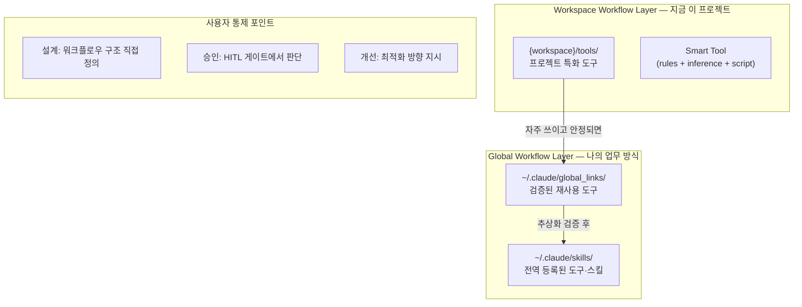
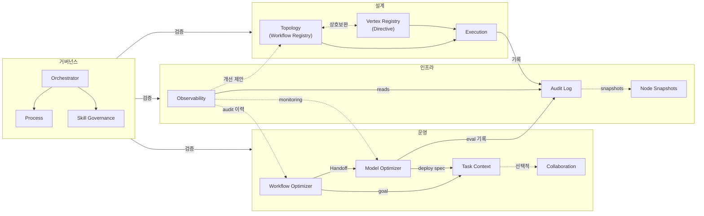
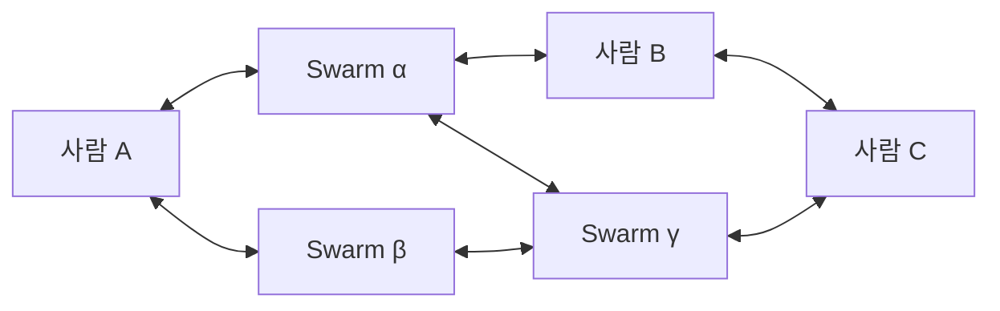

# Multi-Swarm Orchestrator (v0.1.0)

**내게 맞는 Agentic AI OS**를 향한 오케스트레이션 시스템.

기존 AIOS라 불리는 서비스들은 사용자에게 자동화를 약속하지만, 정작 "내 업무 방식대로 흐름을 통제할 수 있는가"라는 질문에는 답하지 못한다. 워크플로우가 블랙박스 안에서 돌아가고, 무엇이 왜 실패했는지 알 수 없으며, 같은 실수가 반복된다. MSO는 이 **사용자 통제력**의 부재를 핵심 문제로 보고, 다른 접근을 택한다.

**"빠른 설계, 점진적 최적화"** — 처음부터 완벽한 자동화를 목표로 하지 않는다. 사용자가 직접 워크플로우를 설계하고, 실행하고, 결과를 보면서 점진적으로 최적화해 나간다. 반복되는 패턴이 확인되면 LLM 호출을 경량 모델로, 경량 모델을 규칙으로 단계적으로 대체한다. 이 과정에서 사용자는 항상 결정권을 가진다.

궁극적으로는 **여러 사람이 여러 에이전트 스웜과 협업하는 환경**을 구성한다. 이를 위한 전제 조건은 사용자가 에이전트의 존재를 의식하지 않아도 되는 **Agent UX** — 에이전트가 뒤에서 일하되, 사용자는 자신의 업무 흐름 안에서 자연스럽게 협업하는 것이다.

---

## 설계 철학: Thin Agent, Thick Smart Tools

|                 | 기존 AIOS 접근              | MSO 접근                                             |
| --------------- | --------------------------- | ---------------------------------------------------- |
| **Agent 역할**  | LLM이 모든 것을 처리        | Agent는 흐름만 제어 (Thin)                           |
| **Tool 역할**   | 단순 API wrapper            | 자체 workflow를 가진 실행 모듈 (Thick Smart Tool)    |
| **사용자 통제** | 블랙박스 — 내부 동작 불투명 | 설계·승인·개선 전 과정에 사용자 결정권               |
| **최적화 방식** | 처음부터 완전 자동화 시도   | 빠른 설계 → 반복 실행 → 점진적 자동화                |
| **비용 구조**   | LLM 호출에 비례하여 증가    | 패턴 안정화에 따라 경량 모델/규칙으로 대체           |
| **재사용**      | 플랫폼 종속                 | Local → Symlinked → Global 승격으로 프로젝트 간 공유 |

---

## 두 가지 워크플로우 레이어

MSO는 사용자의 업무를 **Global Workflow**와 **Workspace Workflow** 두 레이어로 나누어 관리한다.


```mermaid
graph TB
    subgraph GlobalLayer ["Global Workflow Layer — 나의 업무 방식"]
        direction LR
        GR["~/.claude/skills/<br/>전역 등록된 도구·스킬"]
        GL["~/.claude/global_links/<br/>검증된 재사용 도구"]
    end
    subgraph WorkspaceLayer ["Workspace Workflow Layer — 지금 이 프로젝트"]
        direction LR
        WT["{workspace}/tools/<br/>프로젝트 특화 도구"]
        ST["Smart Tool<br/>(rules + inference + script)"]
    end

    WT -->|"자주 쓰이고 안정되면"| GL
    GL -->|"추상화 검증 후"| GR

    subgraph UserControl ["사용자 통제 포인트"]
        direction TB
        H1["설계: 워크플로우 구조 직접 정의"]
        H2["승인: HITL 게이트에서 판단"]
        H3["개선: 최적화 방향 지시"]
    end
```

| 레이어                 | 범위               | 역할                              | 예시                                            |
| ---------------------- | ------------------ | --------------------------------- | ----------------------------------------------- |
| **Global Workflow**    | 전체 프로젝트 공통 | 나의 업무 방식·도구·스킬을 정의   | 반복 사용하는 분석 프레임워크, 검증된 분류 모델 |
| **Workspace Workflow** | 특정 프로젝트 한정 | 지금 이 프로젝트의 실행 흐름 관리 | 프로젝트별 데이터 파이프라인, 도메인 특화 규칙  |

프로젝트에서 만든 도구(Local Tool)가 반복적으로 잘 동작하면, symlink를 통해 다른 프로젝트에서도 재사용(Symlinked)하고, 충분히 추상화되면 전역 등록(Global)한다. 처음부터 전역으로 설계할 수도 있다.

---

## 점진적 최적화: Automation Escalation

워크플로우를 처음 실행할 때는 LLM이 대부분을 처리한다(Lv30). 반복 실행으로 패턴이 안정되면, 시스템이 자동으로 더 효율적인 처리 방식을 제안한다.

```
첫 실행                  패턴 안정화              완전 자동화
──────                  ──────────              ──────────
Lv30: LLM reasoning   → Lv20: 경량 모델 추론   → Lv10: 규칙 기반 처리
(비용 높음, 유연)         (비용 절감, 빠름)         (비용 최소, 결정론적)
```

이 전환은 자동으로 일어나지 않는다. **사용자가 HITL(Human-in-the-Loop) 게이트에서 승인**해야 다음 단계로 넘어간다. "이 정도면 경량 모델로 대체해도 되겠다"는 판단은 시스템이 제안하고, 사용자가 결정한다.

| 단계             | 처리 방식            | 비용 | 통제 수준              |
| ---------------- | -------------------- | ---- | ---------------------- |
| Lv30 Agentic     | LLM reasoning        | 높음 | 유연하지만 예측 어려움 |
| Lv20 Light Model | 파인튜닝된 경량 모델 | 중간 | 도메인 특화, 빠름      |
| Lv10 Logical     | 규칙/스크립트        | 최소 | 완전 결정론적          |

`mso-workflow-optimizer`가 언제 전환할지 판단하고, `mso-model-optimizer`가 전환에 필요한 경량 모델을 학습·배포한다.

---

## 스킬 아키텍처

12개 스킬이 설계·운영·인프라·거버넌스 4개 영역에서 협업한다.


```mermaid
graph LR
    subgraph Design ["설계"]
        S00["Topology<br/>(Workflow Registry)"] <-.->|상호보완| S01["Vertex Registry<br/>(Directive)"]
        S00 & S01 --> S02["Execution"]
    end
    subgraph Ops ["운영"]
        S03["Task Context"] -.->|선택적| S04["Collaboration"]
        S10["Workflow Optimizer"] -->|goal| S03
        S10 -->|Handoff| S11["Model Optimizer"]
        S11 -->|deploy spec| S03
    end
    subgraph Infra ["인프라"]
        S06["Observability"] -->|reads| S05["Audit Log"]
        S05 -.->|snapshots| SNAP["Node Snapshots"]
    end
    subgraph Gov ["거버넌스"]
        S07["Orchestrator"] --> S08["Process"]
        S07 --> S09["Skill Governance"]
    end
    S02 -->|기록| S05
    S06 -.->|개선 제안| S00
    S06 -.->|audit 이력| S10
    S06 -.->|monitoring| S11
    S11 -->|eval 기록| S05
    Gov -->|검증| Design
    Gov -->|검증| Ops
    Gov -->|검증| Infra
```

| 영역         | 스킬                                                             | 하는 일                                        |
| ------------ | ---------------------------------------------------------------- | ---------------------------------------------- |
| **설계**     | topology-design, mental-model-design, execution-design           | 목표를 실행 가능한 워크플로우 구조로 변환      |
| **운영**     | task-context, collaboration, workflow-optimizer, model-optimizer | 티켓 관리, 에이전트 협업, 성과 평가, 모델 학습 |
| **인프라**   | audit-log, observability                                         | 실행 기록, 패턴 분석, 피드백 루프              |
| **거버넌스** | process-template, skill-governance                               | 프로세스 규약, CC-01~14 계약 검증              |

---

## 문서

| 문서                                       | 설명                                                         |
| ------------------------------------------ | ------------------------------------------------------------ |
| [아키텍처](docs/architecture.md)           | Git-Metaphor 상태 모델, 전체 아키텍처, Automation Escalation |
| [3대 파이프라인 & 계약](docs/pipelines.md) | 설계·운영·인프라 파이프라인, CC-01~14, 티켓 생명주기         |
| [시작하기](docs/getting-started.md)        | 디렉토리 구조, 설계·운영·검증 명령어                         |
| [스킬 사용 매트릭스](docs/usage_matrix.md) | Phase × Swarm × Role 매트릭스                                |
| [변경 이력](docs/changelog.md)             | v0.0.3~v0.1.0 변경 이력 및 하위 호환 노트                    |

---

## v0.1.0 변경 이력

> `mso-model-optimizer`에 Label Strategy(LS-0~3)와 PEFT(SetFit/LoRA/QLoRA)를 통합하여, 소량 라벨 환경에서도 Automation Escalation이 가능하도록 했다.

| 개선 영역      | v0.0.10                           | v0.1.0                                                                                    |
| -------------- | --------------------------------- | ----------------------------------------------------------------------------------------- |
| 라벨 부족 대응 | 없음 (수작업 라벨링 전제)         | **Label Strategy (LS-0~3)** — Zero-shot/Clustering/Active Learning/Augmentation 자동 선택 |
| 학습 방식      | TL-20: 표준 Fine-tuning 단일 경로 | **TL-20 3경로** — SetFit(8개/class) / LoRA·QLoRA / 표준 FT 자동 라우팅                    |
| 데이터 증강    | 없음                              | **Data Augmentation** — EDA, Back-Translation, LLM Paraphrase                             |
| Signal A 기준  | `total_count` 단일                | `effective_count` + 라벨 소스 품질 가중치 (인간=1.0, 증강=0.7, 합성=0.5)                  |
| 최소 라벨      | 100건 미만 → TL-10 강제           | **라벨 0건에서도 학습 가능** (Zero-shot → HITL → SetFit)                                  |
| NER 라우팅     | effective_count 기준              | **per-entity 오버라이드** (entity별 < 500 → LoRA 강제)                                    |

v0.0.10 Roadmap의 "Processing Tier 최소 환경" 조건을 충족: Label Strategy가 소량 데이터에서도 TL-20 파인튜닝 진입을 가능하게 했다.

상세: [docs/changelog.md](docs/changelog.md)

---

## Roadmap

### v0.2.0 — 명시지 중심 설계: 인간과 AI의 협업 구조 재정의

> **핵심 테제**: 명시지는 인간과 AI 사이에서 handoff 가능하도록 구조화된 지식이다.

v0.1.0이 "적은 데이터로도 모델을 생산할 수 있는가"를 해결했다면, v0.2.0은 "AI가 만든 산출물이 인간과 협업 가능한 형태인가"를 다룬다.

#### 문제 인식

Agent 시대에는 "형식적으로는 드러나 있지만, 기능적으로는 이해할 수 없는 정보"가 폭발적으로 증가한다. 기록 가능한 것과 명시지는 다르다. Agent의 내부 workspace는 로그로 저장되어 있어도, 인간이 재구성할 수 없다면 사실상 암묵지로 작동한다.

| 구분        | 저장된 데이터                      | 명시지                            |
| ----------- | ---------------------------------- | --------------------------------- |
| 목적        | 시스템 상태 보존                   | 협업, 전달, 결정                  |
| 형태        | raw log, trace, intermediate state | 문서, 코드, 요약, 스펙, 판단 근거 |
| 해석 가능성 | 낮을 수 있음                       | 높아야 함                         |
| 활용 방식   | 디버깅/추적 중심                   | 실행/검토/합의 중심               |

#### 명시지의 세 가지 형태

| 형태       | 역할                                   | MSO 대응 산출물                                 |
| ---------- | -------------------------------------- | ----------------------------------------------- |
| **결정형** | 판단 근거 제공 — 왜 A가 B보다 나은가   | eval_report, decision_output, trade-off summary |
| **실행형** | 즉시 행동 가능 — 오해 없는 구조        | deploy_spec, rules.json, API spec, runbook      |
| **연결형** | 다음 주체에 맥락 전달 — 최소 충분 조건 | Handoff Payload, context card, artifact summary |

#### 명시지 품질 기준

| 기준          | 질문                                   | 실패 사례                              |
| ------------- | -------------------------------------- | -------------------------------------- |
| 이해 가능성   | 읽고 의미 구조를 재구성할 수 있는가    | 너무 짧거나 너무 길어서 핵심이 안 잡힘 |
| 결정 가능성   | 다음 행동을 고를 수 있는가             | 정보는 많지만 결정을 내릴 수 없음      |
| 추적 가능성   | 결론의 근거 경로를 확인할 수 있는가    | 결과만 있고 왜 그런지 모름             |
| 재사용 가능성 | 나중에도 같은 구조를 다시 쓸 수 있는가 | 특정 세션에만 유효한 일회성 출력       |

#### Gate = 암묵지 → 명시지 변환 인터페이스

Gate는 단지 workflow 상의 멈춤 지점이 아니다. **내부의 복잡한 상태를 협업 가능한 단위로 투영**하는 인터페이스다. 좋은 Gate는:

1. 내부 상태를 협업 가능한 단위로 투영한다
2. 의미 중심을 잃지 않는다
3. 다음 행동이 가능한 형태로 구성한다
4. 필요 시 더 깊은 층위로 drill-down할 수 있다

#### v0.2.0 작업 영역

| 영역                  | 작업                                                                                 | 승격 조건                     |
| --------------------- | ------------------------------------------------------------------------------------ | ----------------------------- |
| 명시지 분류 체계      | 모든 Phase 산출물을 결정형/실행형/연결형으로 분류 + 품질 기준 적용                   | 전 Phase 산출물 매핑 완료     |
| Gate 재설계           | HITL Gate를 "암묵지 → 명시지 변환기"로 재정의, drill-down 구조 설계                  | Gate별 투영 규칙 정의         |
| 시각화 체계           | reasoning skeleton graph, 선택지 비교 테이블, dependency map 등 시각적 명시지 표준화 | 주요 Gate에 시각화 적용       |
| 저장 데이터 승격 정책 | audit_global.db, training_log 등에서 명시지로 승격할 항목 기준 수립                  | 승격 규칙 + 자동화 파이프라인 |
| Tool Lifecycle 자동화 | `tool_registry.json` + symlink 규약 공식화                                           | Escalation 2회 이상 성공      |
| Observability 연동    | rolling_f1 모니터링 + 승격 후보 자동 제안                                            | CC-14 실행 경로 검증          |

---

### v1.0.0 — 안전하고 이해 가능한 다자간 워크플로우

> Agent는 뒤에서 일하는 도구가 아니라, **믿을 수 있는 동료**처럼 일할 수 있는 상태.

#### 철학: A Companion of Agent Swarm

MSO에서 Agent를 단일 Instance보다 **군집 단위의 동료**라는 관점으로 바라본다.

사람이 팀에서 일할 때 개별 뉴런이나 사고 과정을 공유하지 않듯, Agent Swarm도 내부 reasoning을 낱낱이 드러낼 필요는 없다. 대신 팀원이 해야 할 것을 한다 — 맡은 일의 결과를 명확히 전달하고, 판단 근거를 물으면 설명하고, 문제가 생기면 스스로 알리고, 동료의 작업을 이어받을 수 있다.


```mermaid
graph LR
    A["사람 A"] <--> SA["Swarm α"]
    SA <--> B["사람 B"]
    A <--> SB["Swarm β"]
    SA <--> SG["Swarm γ"]
    SB <--> SG
    SG <--> C["사람 C"]
    B <--> C
```

이 구조에서 핵심은 자동화 수준이 아니라 **신뢰 수준**이다. 각 참여자(사람이든 Swarm이든)가 서로의 산출물을 검토하고, 이어받고, 되돌릴 수 있어야 한다.

#### v1.0.0의 조건

| 조건                 | 의미                                                                                  |
| -------------------- | ------------------------------------------------------------------------------------- |
| **안전성**           | Swarm의 행동이 예측 가능하고, 실패 시 안전하게 복귀하며, 사람이 언제든 개입할 수 있다 |
| **이해 가능성**      | Swarm이 왜 이 결정을 했는지, 무엇을 근거로 삼았는지 사람이 파악할 수 있다             |
| **다자간 협업**      | 사람 × 사람, 사람 × Swarm, Swarm × Swarm 간의 handoff가 동일한 계약 구조로 작동한다   |
| **동료 수준의 신뢰** | Swarm에게 일을 맡겼을 때 "확인해봐야 안심이 된다"가 아니라 "맡기면 된다"의 상태       |

이것은 기술적 마일스톤이 아니라 **협업 경험의 마일스톤**이다. 여러 사람과 여러 Swarm이 하나의 워크플로우 안에서 동료로서 함께 일할 수 있는 최소 상태를 달성하는 것이 v1.0.0이다.

---

## 의존성

- Python 3.10+

## License

[MIT](LICENSE)
