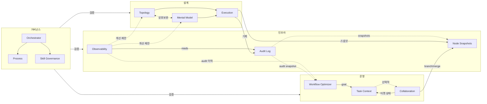

# Multi-Swarm Orchestrator (v0.0.7)

복잡한 AI 에이전트 작업의 **비재현성·비가시성·반복 실패**를 해결하기 위해 설계된 오케스트레이션 시스템.
워크플로우를 JSON 스키마로 정의하고, 실행을 티켓·감사 로그로 추적하며, 스킬 간 데이터 흐름을 계약(CC-01~09)으로 검증한다.


```mermaid
graph LR
    subgraph Design ["설계"]
        S00["Topology"] <-.->|상호보완| S01["Mental Model"]
        S00 & S01 --> S02["Execution"]
    end
    subgraph Ops ["운영"]
        S03["Task Context"] -.->|선택적| S04["Collaboration"]
        S10["Workflow Optimizer"] -->|goal| S03
    end
    subgraph Infra ["인프라"]
        S06["Observability"] -->|reads| S05["Audit Log"]
        S05 -.->|snapshots| SNAP["Node Snapshots"]
    end
    subgraph Gov ["거버넌스"]
        S07["Orchestrator"] --> S08["Process"]
        S07 --> S09["Skill Governance"]
    end
    S02 -->|기록| S05
    S02 -->|스냅샷| SNAP
    S06 -.->|개선 제안| S00
    S06 -.->|개선 제안| S01
    S06 -.->|audit 이력| S10
    S05 -.->|audit snapshot| S10
    S04 -->|티켓 상태| S03
    S04 -->|branch/merge| SNAP
    Gov -->|검증| Design
    Gov -->|검증| Ops
    Gov -->|검증| Infra
```

---

## 문서

| 문서 | 설명 |
|------|------|
| [아키텍처](docs/architecture.md) | Git-Metaphor 상태 모델, 전체 아키텍처, 업무/관제 공간, 버전별 주요 변경 |
| [3대 파이프라인 & 계약](docs/pipelines.md) | 설계·운영·인프라 파이프라인, CC-01~09, 티켓 생명주기, Hand-off Templates |
| [시작하기](docs/getting-started.md) | 디렉토리 구조, 설계·운영·검증 명령어 |
| [스킬 사용 매트릭스](docs/usage_matrix.md) | Phase × Swarm × Role 매트릭스, 실행 흐름 시퀀스 |
| [변경 이력](docs/changelog.md) | v0.0.3~v0.0.6 변경 이력 및 하위 호환 노트 |

---

## 변경 이력

### v0.0.7 — mso-workflow-optimizer: Agent Teams + Jewels

**mso-workflow-optimizer** 스킬에 Claude Code **Agent Teams** 아키텍처와 **Jewels 패턴**을 도입.

#### 핵심 변경

**Proactive Async + Jewels 패턴**: 백그라운드 에이전트(`jewel-producer`)가 `audit_global.db`를 상시 모니터링하며 작은 인사이트 단위(Jewel)를 자율 생성한다. 이 Jewels는 이후 Automation Level 판단(Signal C)에 반영된다.

```
optimizer-lead (delegate mode)
    ├── jewel-producer   [background] — audit_global.db 상시 모니터링 + Jewel 생성
    ├── decision-agent   [on-demand]  — 3-Signal + Jewels → Automation Level 결정
    ├── level-executor   [on-demand]  — Level 10/20/30 실행 + audit 기록
    └── hitl-coordinator [on-demand]  — HITL 피드백 + goal.json 생성
```

**Jewel 타입 4종**: `kpi_drift` / `level_escalation` / `pattern_alert` / `sampling_adjust`

**Signal C 확장**: Jewels를 HITL 피드백 보정에 추가 반영.
```
total_C_delta = clip(hitl_delta + jewel_delta, -10, +10)
```

#### 변경 파일

| 파일 | 변경 유형 |
|------|----------|
| `skills/mso-workflow-optimizer/modules/module.agent-team.md` | 신규 — Agent Teams 전체 아키텍처 |
| `skills/mso-workflow-optimizer/modules/module.agent-decision.md` | 수정 — Signal C에 Jewels 입력 추가 |
| `skills/mso-workflow-optimizer/modules/modules_index.md` | 수정 — Agent Teams Module 항목 추가 |
| `skills/mso-workflow-optimizer/SKILL.md` | 수정 — v0.0.7, 실행 모드 테이블, Phase 0 추가 |

#### 의존성 영향

- `mso-agent-audit-log`: jewels 소비 시 `jewels_consumed` 필드가 audit payload에 추가됨
- `mso-observability`: 변경 없음 (audit DB 패턴 분석 경로 동일)
- Jewel 저장 경로 신규: `{workspace}/.mso-context/jewels/opt/JWL-opt-{id}.json`

---

## Roadmap

### v0.0.8 — mso-model-optimizer

프로세스 모듈에 필요한 pre-trained model의 fine-tuning 워크플로우를 제공하는 스킬.

`mso-workflow-optimizer`가 **프로세스 수준**의 automation-level 측정과 escalation을 담당한다면, `mso-model-optimizer`는 **모델 수준**의 성능 평가와 fine-tuning lifecycle을 담당한다.

| 스킬 | 평가 대상 | 핵심 역할 |
|------|-----------|-----------|
| `mso-workflow-optimizer` (v0.0.7) | 프로세스 구조 | Automation Level 측정 + Agent Teams 최적화 |
| `mso-model-optimizer` (v0.0.8) | 프로세스 내부 모델 | Pre-trained model fine-tuning 워크플로우 제공 |

> **배경**: AI Model·AI Agent·Physical AI를 관통하는 평가 관점으로, 복잡도가 인지 수준을 초과한 AI System은 **멱등성**(동일 입력 → 동일 결과)과 **설명력**(왜 그 결과인가)으로 측정해야 하는 블랙박스에 수렴한다. 두 optimizer 스킬은 이 평가 축의 프로세스 레이어와 모델 레이어를 각각 커버한다.

### v0.1.0 — mso-workflow-optimizer: Processing Tier 최적화 환경

> 모든 워크플로우는 처음에 Agentic으로 시작한다.
> 패턴이 쌓일수록 Light Model로, 그리고 Logical로 내려간다.
> v0.1.0은 이 하강을 자동으로 감지하고 환경을 설정하는 시스템이다.

```
Agentic processing    ← 패턴 미확립. LLM 전체 판단 필요. (Level 30)
        ↓ 최적화 방향
Light Model processing ← 패턴 부분 확립. 경량 모델 + 최소 프롬프트. (Level 20)
        ↓
Logical processing    ← 패턴 완전 확립. 규칙·스크립트만으로 처리. (Level 10)
```

**Level 30이 높다고 좋은 것이 아니다.** 목표는 Level 30 → 10으로의 이동이다. `jewel-producer`가 `tier_downgrade` jewel을 생성하여 다운그레이드 시점을 자율 감지한다.

---

## 의존성

- Python 3.10+

## License

[MIT](LICENSE)
