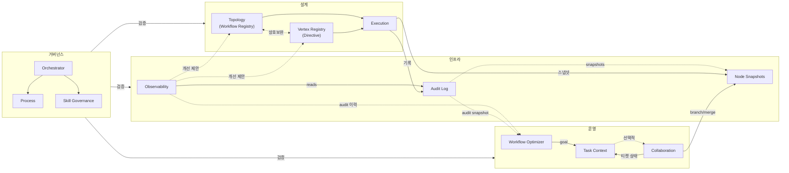

# Multi-Swarm Orchestrator (v0.0.7)

복잡한 AI 에이전트 작업의 **비재현성·비가시성·반복 실패**를 해결하기 위해 설계된 오케스트레이션 시스템.
워크플로우를 JSON 스키마로 정의하고, 실행을 티켓·감사 로그로 추적하며, 스킬 간 데이터 흐름을 계약(CC-01~10)으로 검증한다.


```mermaid
graph LR
    subgraph Design ["설계"]
        S00["Topology<br/>(Workflow Registry)"] <-.->|상호보완| S01["Vertex Registry<br/>(Directive)"]
        S00 & S01 --> S02["Execution"]
    end
    subgraph Ops ["운영"]
        S03["Task Context"] -.->|선택적| S04["Collaboration"]
        S10["Workflow Optimizer"] -->|goal| S03
    end
    subgraph Infra ["인프라"]
        S06["Observability"] -->|reads| S05["Audit Log"]
        S05 -.->|snapshots| SNAP["Node Snapshots"]
    end
    subgraph Gov ["거버넌스"]
        S07["Orchestrator"] --> S08["Process"]
        S07 --> S09["Skill Governance"]
    end
    S02 -->|기록| S05
    S02 -->|스냅샷| SNAP
    S06 -.->|개선 제안| S00
    S06 -.->|개선 제안| S01
    S06 -.->|audit 이력| S10
    S05 -.->|audit snapshot| S10
    S04 -->|티켓 상태| S03
    S04 -->|branch/merge| SNAP
    Gov -->|검증| Design
    Gov -->|검증| Ops
    Gov -->|검증| Infra
```

---

## 문서

| 문서 | 설명 |
|------|------|
| [아키텍처](docs/architecture.md) | Git-Metaphor 상태 모델, 전체 아키텍처, 업무/관제 공간, 버전별 주요 변경 |
| [3대 파이프라인 & 계약](docs/pipelines.md) | 설계·운영·인프라 파이프라인, CC-01~10, 티켓 생명주기, Hand-off Templates |
| [시작하기](docs/getting-started.md) | 디렉토리 구조, 설계·운영·검증 명령어 |
| [스킬 사용 매트릭스](docs/usage_matrix.md) | Phase × Swarm × Role 매트릭스, 실행 흐름 시퀀스 |
| [변경 이력](docs/changelog.md) | v0.0.3~v0.0.7 변경 이력 및 하위 호환 노트 |

---

## 변경 이력

### v0.0.7 — Agent Teams + Topology Motif + Graph Search Loader

> **한 줄 요약**: 사용자가 하는 작업(user-workflow)이 아니라, 그 작업을 **조립·실행·개선하는 시스템의 작업**(workspace-workflow)을 자동화한 버전.

지금까지 MSO는 목표를 받으면 매번 처음부터 워크플로우를 설계했다. 비슷한 작업을 반복해도 이전 경험을 활용하지 못했고, 모든 단계에서 LLM이 풀파워로 동작했다. v0.0.7은 "워크플로우를 어떻게 만들고, 어떻게 재사용하고, 어떻게 더 효율적으로 돌릴 것인가"를 개선했다.

1. **워크플로우를 패턴으로 분류**: 복잡한 워크플로우도 결국 6가지 기본 패턴(순차, 분기, 병합, 반복, 조건 분기, 허브)의 조합이다. 이 패턴을 "Topology Motif"라 부르고, 각 패턴 안의 실행 단위를 "Vertex"(에이전트/스킬/도구/모델)로 타입을 구분한다.
2. **한 번 만든 워크플로우를 저장하고, 다음에 검색해서 재사용**: "시장 조사 보고서 작성"이라는 요청이 들어오면, 이전에 성공한 비슷한 워크플로우를 레지스트리에서 찾아 즉시 로딩한다(Graph Search Loader). 각 Vertex에 바인딩할 도메인 지식(분석 프레임워크, 실행 지침, 프롬프트)도 별도 레지스트리(Vertex Registry)에서 검색한다. 처음부터 설계하는 것은 검색 결과가 없을 때만 한다.
3. **반복할수록 실행 비용을 자동으로 최적화**: 같은 워크플로우가 여러 번 성공하면 시스템이 이를 감지하고, LLM 전체 추론(Level 30) → 경량 모델(Level 20) → 규칙 기반 스크립트(Level 10)로 자동 전환한다(Tier Escalation). 목표는 "처음엔 비싸게, 나중엔 거의 공짜로" 돌리는 것이다.

| 개선 영역    | Before (v0.0.6)           | After (v0.0.7)                          |
| -------- | ------------------------- | --------------------------------------- |
| 워크플로우 설계 | 매번 Goal→DQ→Topology 전체 수행 | 레지스트리 검색 → 즉시 로딩 (Mode B)               |
| 도메인 지식   | 노드별 chart 자동 생성 (범용)      | Directive 택소노미에서 검색·바인딩 (MD, 사람이 편집 가능) |
| 실행 비용    | 항상 LLM 풀파워 (Level 30)     | 반복 시 자동 경량화 (Level 30→20→10)            |
| 재사용성     | 없음 (매 Run 독립)             | 두 레지스트리에 패턴·지식 누적                       |

---

#### Part 1: Agent Teams + Jewels

**mso-workflow-optimizer** 스킬에 Agent Teams 아키텍처와 Jewels 패턴 도입.

```
optimizer-lead (delegate mode)
    ├── jewel-producer   [background] — audit_global.db 상시 모니터링 + Jewel 생성
    ├── decision-agent   [on-demand]  — 3-Signal + Jewels → Automation Level 결정
    ├── level-executor   [on-demand]  — Level 10/20/30 실행 + audit 기록
    └── hitl-coordinator [on-demand]  — HITL 피드백 + goal.json 생성
```

#### Part 2: Topology Motif + Graph Search Loader + Tier Escalation

워크플로우를 그래프 패턴으로 학습하고, 반복 패턴이 쌓이면 더 단순한 실행 계층으로 자동 이동하는 구조.

- **Topology Motif**: 6가지 표준 구조 패턴(Chain/Star/Fork-Join/Loop/Diamond/Switch) + 기존 `topology_type` 매핑
- **Vertex Composition**: Task Node에 실행 단위 유형(`vertex_type`: agent/skill/tool/model) 지정
- **Graph Search Loader** (Mode B): 레지스트리 검색으로 기존 워크플로우 자동 로딩
- **Tier Escalation**: `pattern_stability = frequency × success_rate` 기반 Level 30→20→10 자동 이동

#### Part 3: Vertex Registry (mso-mental-model-design 재설계)

`mso-mental-model-design`을 **Vertex Registry**로 전면 재설계. 도메인별 **directive**(framework/instruction/prompt)를 택소노미로 관리하고 topology vertex에 바인딩한다.

- **Directive**: Vertex에 바인딩되는 도메인 지식 단위 (MD 파일, 사람이 편집 가능)
- **Vertex Registry**: Directive를 택소노미로 분류·검색·관리하는 저장소
- **Workflow Registry**(topology-design Mode B)와 상호보완: 구조는 Workflow, 지식은 Vertex

```
Workflow Registry (Topology)     Vertex Registry (Directive)
─────────────────────────────    ─────────────────────────────
Motif + Vertex 구조 저장          framework / instruction / prompt 저장
Intent → 워크플로우 검색           vertex_type + motif → directive 검색
workflow_topology_spec.json      directive_binding.json
```

#### Part 4: 스킬 표준화

전체 10개 스킬 frontmatter를 skill-creator 표준(`name` + `description`만)으로 통일.

상세: [docs/changelog.md](docs/changelog.md)

---

## Roadmap

### v0.1.0 — Processing Tier 최적화 최소 환경

v0.0.7에서 Tier Escalation 메커니즘(`pattern_stability` 공식, Level 30→20→10 자동 이동 규칙)과 Graph Search Loader(워크플로우 레지스트리 검색)를 도입했다. v0.1.0은 이를 기반으로 **각 Tier에서 실행 가능한 최소 환경을 자동 구성**하는 시스템을 완성한다.

| 스킬 | 역할 | 비고 |
|------|------|------|
| `mso-workflow-optimizer` | Tier 전환 자율 감지 + Logical/Light 환경 구성 지시 | v0.0.7: Tier Escalation + `pattern_stability` 구현 완료 |
| `mso-model-optimizer` | 모델 수준 성능 평가 + fine-tuning lifecycle | v0.1.0에서 신규 개발 |

`mso-workflow-optimizer`가 **프로세스 수준**의 tier 최적화를, `mso-model-optimizer`는 **모델 수준**의 평가와 fine-tuning을 담당한다.

---

## 의존성

- Python 3.10+

## License

[MIT](LICENSE)
