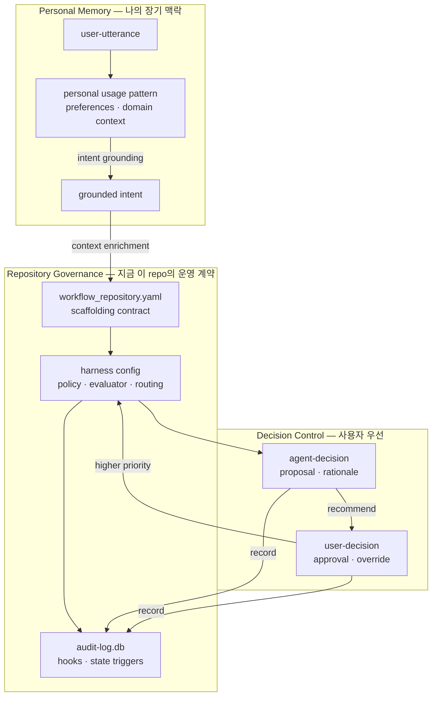
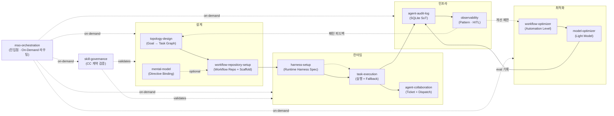
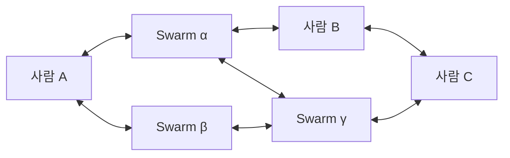

# Multi-Swarm Orchestrator (v0.2.2)

MSO는 **Repository Environment Operating을 위한 provider-free 플러그인형 스킬셋**이다.

Claude Code, Codex, OpenClaw, Hermes 같은 provider runtime을 대체하지 않는다. 대신 그 위에서 workflow repository, scaffolding, memory boundary, audit hook, optimizer trigger, runtime harness를 표준화한다. 목표는 또 하나의 agent framework가 아니라, 여러 provider runtime이 같은 repository 운영 계약 아래에서 일하게 만드는 것이다.

v0.2.2의 핵심 변화는 `workflow-design`을 실행 계획 생성 단계가 아니라 **workflow repository setup**으로 승격한 것이다. `mso-workflow-repository-setup`은 workflow-design과 scaffolding-design을 결합해 repository contract와 memory boundary를 만들고, `mso-harness-setup`은 이를 provider-free runtime governance 계약으로 변환한다.

MSO가 추구하는 것은 블랙박스 자동화가 아니다. 사용자가 repository 운영 계약을 직접 승인하고, 실행 결과를 audit log로 남기며, 반복 실행에서 나온 state signal로 workflow를 점진적으로 개선하는 구조다.

현재 구조는 `mso-orchestration`을 진입점으로 두고, `mso-workflow-repository-setup`, `mso-harness-setup`, `mso-agent-audit-log`, `mso-observability`, `mso-workflow-optimizer` 같은 서브스킬을 on-demand로 로드한다. MSM 스킬셋과의 수렴은 별도 검토 대상이다.

이 구성 전체를 실제 운영 가능한 수준으로 갖추는 것이 **v0.3.0의 목표**다. v0.2.2는 방향 전환과 계약면을 고정하는 단계이고, v0.3.0은 Personal Memory, Repository Governance, Decision Control, Runtime Harness, Audit/Optimizer loop를 하나의 작동 가능한 repository operating system으로 연결하는 단계다.

---

## 설계 철학: Perfect Architecture Later. Working System First.

MSO v0.2.2의 우선순위는 완벽한 agent architecture를 먼저 정의하는 것이 아니다. 먼저 repository environment에서 실제로 돌아가는 운영 계약을 만들고, 반복 실행에서 얻은 audit/state signal로 구조를 개선한다.

|                 | Architecture-first 접근      | MSO v0.2.2 접근                                      |
| --------------- | ---------------------------- | ---------------------------------------------------- |
| **출발점**      | 이상적인 agent framework 설계 | 동작하는 repository operating contract               |
| **Agent 역할**  | LLM이 전체 구조를 소유        | Agent는 provider runtime 위에서 관측 가능한 일을 수행 |
| **Tool 역할**   | 단순 API wrapper             | workflow repository, harness, audit, optimizer를 가진 운영 모듈 |
| **설계 방식**   | 실행 전 완전한 DAG 확정       | workflow-design + scaffolding-design을 먼저 repository setup으로 고정 |
| **거버넌스**    | 사후 로그 확인               | SessionStart · PreCompact · SessionEnd hook과 audit-log state-trigger를 운영 계약에 포함 |
| **최적화 방식** | 처음부터 완전 자동화 시도     | 작동하는 흐름 → 관측 → 제안 → HITL 승인 → 점진적 자동화 |
| **재사용**      | 플랫폼 종속                  | Provider-free plugin layer로 repository 단위 재사용 |

`Thin Agent, Thick Smart Tools`는 여전히 유효하지만, v0.2.2에서는 더 구체적으로 **Thin Provider Runtime, Thick Repository Environment**에 가깝다. 핵심은 agent 내부를 더 똑똑하게 만드는 것이 아니라, repository 환경이 workflow·memory·audit·harness·optimizer 계약을 안정적으로 제공하게 만드는 것이다.

---

## 두 가지 운영 축: Personal Memory, Repository Governance

MSO v0.2.2에서는 **Global Workflow**와 **Workspace Workflow** 개념을 폐지한다. 대신 개인의 장기 맥락을 다루는 **Personal Memory**와, repository 안에서 실행·감사·최적화를 통제하는 **Repository Governance**를 분리한다.

Personal Memory는 단순 작업 기억이 아니다. 사용자의 발화(`user-utterance`)를 개인 사용 패턴과 과거 결정 맥락에 비추어 더 명확한 intent로 grounding하는 레이어다. Agent는 사람의 인지적 한계를 보조하는 역할을 하며, 스스로 결정을 대체하지 않는다. 또한 agent가 데이터를 해석할 때 생기는 `semantic-bias`가 사용자의 `decision-bias`를 강화하지 않도록, 해석·제안·사용자 결정을 분리해서 기록해야 한다.


```mermaid
graph TB
    subgraph PersonalMemory ["Personal Memory — 나의 장기 맥락"]
        direction LR
        UU["user-utterance"]
        PM["personal usage pattern<br/>preferences · domain context"]
        GI["grounded intent"]
    end
    subgraph RepositoryGovernance ["Repository Governance — 지금 이 repo의 운영 계약"]
        direction LR
        WR["workflow_repository.yaml<br/>scaffolding contract"]
        HG["harness config<br/>policy · evaluator · routing"]
        AL["audit-log.db<br/>hooks · state triggers"]
    end
    subgraph DecisionControl ["Decision Control — 사용자 우선"]
        direction TB
        AD["agent-decision<br/>proposal · rationale"]
        UD["user-decision<br/>approval · override"]
    end

    UU --> PM
    PM -->|"intent grounding"| GI
    GI -->|"context enrichment"| WR
    WR --> HG
    HG --> AL
    HG --> AD
    AD -->|"recommend"| UD
    UD -->|"higher priority"| HG
    AD -->|"record"| AL
    UD -->|"record"| AL
```

| 축 | 범위 | 역할 | 예시 |
| --- | --- | --- | --- |
| **Personal Memory** | 사용자 개인의 장기 맥락 | user-utterance를 personal usage pattern 기반의 grounded intent로 변환 | 업무 스타일, 반복 판단 기준, 도메인 용어, 선호 |
| **Repository Governance** | 특정 repository의 운영 계약 | workflow repository, scaffolding, memory boundary, runtime harness, audit hook, optimizer trigger를 통제 | `workflow_repository.yaml`, `runtime-harness.yaml`, `audit-log.db` |
| **Decision Control** | agent와 user의 결정 경계 | `agent-decision`과 `user-decision`을 모두 기록하고, 충돌 시 user-decision을 우선. agent semantic-bias와 user decision-bias를 분리해 검토 | 제안, 승인, 반려, override, HITL 기록 |

Personal Memory는 repo를 넘나드는 사용자 맥락이고, Repository Governance는 repo 내부에서 재현 가능해야 하는 운영 규약이다. Decision Control은 두 레이어 위에서 작동한다. Agent는 판단 후보와 근거, 해석상의 불확실성을 남기고, 사용자는 승인·수정·거부·override를 남긴다. 같은 사건에 `agent-decision`과 `user-decision`이 모두 있으면 `user-decision`이 우선한다. 단, user-decision도 무조건 정답으로 취급하지 않고, 반복되는 편향 신호는 audit/optimizer가 다시 검토할 수 있어야 한다.

---

## 점진적 최적화: Automation Escalation

워크플로우를 처음 실행할 때는 LLM이 대부분을 처리한다(Lv30). 반복 실행으로 패턴이 안정되면, 시스템이 자동으로 더 효율적인 처리 방식을 제안한다.

```
첫 실행                  패턴 안정화              완전 자동화
──────                  ──────────              ──────────
Lv30: LLM reasoning   → Lv20: 경량 모델 추론   → Lv10: 규칙 기반 처리
(비용 높음, 유연)         (비용 절감, 빠름)         (비용 최소, 결정론적)
```

이 전환은 자동으로 일어나지 않는다. **사용자가 HITL(Human-in-the-Loop) 게이트에서 승인**해야 다음 단계로 넘어간다. "이 정도면 경량 모델로 대체해도 되겠다"는 판단은 시스템이 제안하고, 사용자가 결정한다.

| 단계             | 처리 방식            | 비용 | 통제 수준              |
| ---------------- | -------------------- | ---- | ---------------------- |
| Lv30 Agentic     | LLM reasoning        | 높음 | 유연하지만 예측 어려움 |
| Lv20 Light Model | 파인튜닝된 경량 모델 | 중간 | 도메인 특화, 빠름      |
| Lv10 Logical     | 규칙/스크립트        | 최소 | 완전 결정론적          |

`mso-workflow-optimizer`가 언제 전환할지 판단하고, `mso-model-optimizer`가 전환에 필요한 경량 모델을 학습·배포한다.

---

## 스킬 아키텍처

12개 스킬이 설계·런타임·인프라·최적화·거버넌스 5개 레이어에서 협업한다. `mso-orchestration`이 진입점이며, 서브스킬은 on-demand로 로드된다.


```mermaid
graph LR
    ORCH["mso-orchestration<br/>(진입점 · On-Demand 라우팅)"]

    subgraph Design["설계"]
        WT["topology-design<br/>(Goal → Task Graph)"]
        MM["mental-model<br/>(Directive Binding)"]
        WR["workflow-repository-setup<br/>(Workflow Repo + Scaffold)"]
        WT --> WR
        MM -. optional .-> WR
    end
    subgraph Runtime["런타임"]
        TE["task-execution<br/>(실행 + Fallback)"]
        AC["agent-collaboration<br/>(Ticket + Dispatch)"]
        HS["harness-setup<br/>(Runtime Harness Spec)"]
        TE --> AC
        WR --> HS
        HS -.-> TE
    end
    subgraph Infra["인프라"]
        AAL["agent-audit-log<br/>(SQLite SoT)"]
        OBS["observability<br/>(Pattern · HITL)"]
        AAL --> OBS
    end
    subgraph Optimize["최적화"]
        WO["workflow-optimizer<br/>(Automation Level)"]
        MO["model-optimizer<br/>(Light Model)"]
        WO --> MO
    end
    GOV["skill-governance<br/>(CC 계약 검증)"]

    ORCH -.->|on-demand| Design
    ORCH -.->|on-demand| Runtime
    ORCH -.->|on-demand| Infra
    ORCH -.->|on-demand| Optimize
    ORCH -.->|on-demand| GOV
    HS --> TE
    TE --> AAL
    OBS -.->|개선 제안| WO
    OBS -.->|패턴 피드백| WT
    MO -->|eval 기록| AAL
    GOV -.->|validates| Design
    GOV -.->|validates| Runtime
```

| 레이어 | 스킬 | 하는 일 |
| ------ | ---- | ------- |
| **설계** | topology-design · workflow-repository-setup · mental-model(optional) | Goal → Workflow Repository → Scaffold/Memory Contract |
| **런타임** | harness-setup · task-execution · agent-collaboration | provider-free runtime harness 설계, 실행 조율 + Fallback Policy, 티켓 관리 + 멀티에이전트 Dispatch |
| **인프라** | agent-audit-log · observability | 감사 인프라 SoT (DB + 세션 훅 설정 + 실행 로그), 패턴 분석·이상 감지·HITL 체크포인트 |
| **최적화** | workflow-optimizer · model-optimizer | Automation Level 10/20/30 판단, 경량 모델 학습·배포 |
| **거버넌스** | skill-governance | CC-01~14 계약 검증, 스킬 구조 검사, 레거시 참조 탐지 |

---

## 문서

| 문서                                       | 설명                                                         |
| ------------------------------------------ | ------------------------------------------------------------ |
| [아키텍처](docs/architecture.md)           | Git-Metaphor 상태 모델, 전체 아키텍처, Automation Escalation |
| [3대 파이프라인 & 계약](docs/pipelines.md) | 설계·운영·인프라 파이프라인, CC-01~15, 티켓 생명주기         |
| [시작하기](docs/getting-started.md)        | 디렉토리 구조, 설계·운영·검증 명령어                         |
| [스킬 사용 매트릭스](docs/usage_matrix.md) | Phase × Swarm × Role 매트릭스                                |
| [KO 매핑](docs/knowledge-object-mapping.md) | 기존 산출물의 명시지 분류 매핑표                             |
| [변경 이력](docs/changelog.md)             | v0.0.3~v0.2.2 변경 이력 및 하위 호환 노트                    |

---

## 설치

```bash
git clone https://github.com/WMJOON/multi-swarm-orchestrator.git
cd multi-swarm-orchestrator
./install.sh          # Claude Code만
./install.sh --codex  # Codex만
./install.sh --all    # Claude Code + Codex
```

`install.sh`는 두 가지를 생성한다:

| 생성 경로 | 내용 |
|----------|------|
| `~/.claude/skills/mso-orchestration` | 진입점 스킬 심링크 |
| `~/.skill-modules/mso-skills/` | 서브스킬 디렉토리 심링크 |

이미 같은 경로가 존재하면 건너뛰고 출력한다.

### 감사 인프라 초기화 (새 프로젝트 레포 1회)

```bash
python3 ~/.skill-modules/mso-skills/mso-agent-audit-log/scripts/setup.py \
  --project-root <repository_root> \
  --target claude   # claude | codex | all
```

DB 생성 + worklog 디렉터리 생성 + 세션 훅 주입을 한 번에 처리한다. `--target all`을 사용하면 `.codex/hooks.json`에도 `SessionStart` 훅을 등록한다.

### 서브스킬 On-Demand 로딩

서브스킬은 `~/.skill-modules/mso-skills/`에 위치한다. 필요할 때 아래 경로를 Read 도구로 직접 읽으면 로드된다:

```
~/.skill-modules/mso-skills/SKILL_NAME/SKILL.md
```

`SKILL_NAME`을 아래 라우팅 테이블의 스킬명으로 교체한다.

### 스킬 라우팅

| 요청 유형 | 담당 스킬 |
|----------|----------|
| Goal → Task Graph 설계 | `mso-workflow-topology-design` |
| Mental Model · Directive 바인딩 | `mso-mental-model` (선택) |
| Workflow Repository Setup · Scaffolding · Memory Layer | `mso-workflow-repository-setup` |
| 티켓 관리 · 멀티에이전트 Dispatch | `mso-agent-collaboration` |
| 멀티 프로바이더 실행 (Codex·Claude·Gemini) | `mso-agent-collaboration` → `collaborate.py` |
| Runtime Harness 설계 · 실행 조율 · Fallback Policy | `mso-harness-setup` |
| 감사 인프라 초기화 · 실행 로그 · SQLite SoT | `mso-agent-audit-log` |
| 패턴 분석 · HITL 체크포인트 | `mso-observability` |
| Automation Level 판단 · 최적화 | `mso-workflow-optimizer` |
| 경량 모델 학습 · 배포 | `mso-model-optimizer` |
| 스킬 구조 · CC 계약 검증 | `mso-skill-governance` |

**설치 확인**

```bash
python3 skills/mso-skill-governance/scripts/validate_gov.py \
  --pack-root ~/.claude \
  --pack mso \
  --json
```

`"status": "ok"`, `"findings": []`이면 정상.

---

## v0.2.2 변경 이력 — Runtime Harness + Audit 인프라 재설계

> **provider-free runtime harness 설계 추가 + 감사 인프라 완전 재설계.**
> `mso-harness-setup` 스킬로 canonical event ontology를 고정하고,
> `mso-agent-audit-log`를 DB 생성·세션 훅 설정·실행 로그 기록의 단일 소유자로 재정의했다.
> 세션 훅은 스크립트 직접 파싱 방식으로 전환해 Claude 호출 없이 worklog를 기록한다.

| 개선 영역 | v0.2.1 | v0.2.2 |
|-----------|--------|--------|
| **런타임 관측** | provider별 실행 로그 중심 | canonical runtime event ontology 설계 |
| **거버넌스 적용** | 스킬/감사 로그 중심 | capability/risk/lifecycle 기반 policy injection |
| **프로바이더 이식성** | 멀티 프로바이더 CLI 실행 | provider-native event adapter layer 설계 |
| **Workflow Repository** | execution-design alias 잔존 | workflow-repository-setup으로 승격, scaffolding/memory/harness input 분리 |
| **세션 훅** | Stop hook (토큰 소비, 의미 약함) | SessionStart · PreCompact · SessionEnd (스크립트 직접 파싱, 토큰 0) |
| **감사 인프라 소유권** | DB 생성·훅 분산 | mso-agent-audit-log 단일 소유. setup.py로 일괄 초기화 |
| **Codex 지원** | Claude Code 전용 | .codex/hooks.json에 SessionStart 등록, 런타임 자동 감지 |

상세: [docs/changelog.md](docs/changelog.md)

---

## v0.2.1 변경 이력 — ai-collaborator 완전 흡수

> **멀티 프로바이더 CLI 통합.** 별도 스킬로 운영되던 ai-collaborator(Codex·Claude·Gemini)를 `mso-agent-collaboration`으로 완전 흡수. `collaborate.py`와 `ai_collaborator` 패키지가 이제 `~/.skill-modules/mso-skills/mso-agent-collaboration/scripts/`에 위치한다.

| 개선 영역 | v0.2.0 | v0.2.1 |
|-----------|--------|--------|
| **멀티 프로바이더 실행** | ai-collaborator 별도 스킬 | **`mso-agent-collaboration`** 흡수 — `collaborate.py` + `ai_collaborator` 패키지 통합 |
| **파이프라인** | [A]~[D] 4개 | **[E] 멀티 프로바이더 실행** 추가 |
| **swarm 실행** | dispatch_mode enum만 | 티켓 `swarm_db`+`swarm_agents` 필드로 tmux swarm 직접 실행 |

상세: [docs/changelog.md](docs/changelog.md)

---

## Roadmap

```
v0.1.x  Perfect architecture later. Working system first.                                ✓ 완료
v0.2.x  스킬 통합 재편 — 굵게 적게, 워크플로우 완결성 강화                              ← 현재
v0.3.x  Repository Environment Operating 완성 — Personal Memory · Governance · Harness · Optimizer loop
v1.0.0  A Companion of Agent Swarm
```

---

### v0.2.x — 스킬 통합 재편

> **얇게 많이 → 굵게 적게.** 각 스킬의 워크플로우 완결성을 높이고, 프로세스 규약과 티켓 관리를 소유자 스킬로 흡수. Runtime 구현 완성(`wrapper.otel`/`wrapper.guardrails`·NHI Attestation)까지를 이 선상에서 진행한다.

| 방법론 | 한 줄 정의 |
|--------|-----------|
| ***Thick Skill*** | 컨텍스트 전환 없이 하나의 스킬이 더 넓은 범위를 스스로 해결한다 |
| ***Ownership over Reference*** | 정책·규약·템플릿은 실제로 사용하는 스킬이 직접 소유한다 |

| 작업 영역                     | 내용                                                                       |
| ------------------------- | ------------------------------------------------------------------------ |
| 스킬 통합 (완료)                | 13개 → 10개 재편, 크로스 레퍼런스 전체 정합                                             |
| ai-collaborator 흡수 (완료)   | Codex·Claude·Gemini 멀티 프로바이더 CLI → `mso-agent-collaboration`             |
| Runtime 구현                | `wrapper.otel`·`wrapper.guardrails` 실구현 `[spec-only → impl]`             |
| Workflow Repository Setup | `workflow-design + scaffolding-design → harness-setup` 경로 고정             |
| Runtime Harness Toolkit   | `mso-harness-setup` 기반 canonical event · adapter · policy · evaluator 설계 |
| NHI Attestation           | `nhi_policy.json` 기반 fail-closed 전환 `[spec-only → impl]`                 |

---

### v0.1.0 — Perfect architecture later. Working system first.

> 완벽한 구조보다 작동하는 시스템이 먼저다.
> **v0.1.x는 개인 업무 환경에서의 검증 단계이며, 외부 사용은 권장하지 않는다.**

| 방법론                                                             | 한 줄 정의                                                                                    |
| ------------------------------------------------------------------ | --------------------------------------------------------------------------------------------- |
| ***Thin Agent, Thick Smart Tools***                                | Agent는 흐름만 제어하고, 실행은 자체 workflow를 가진 Smart Tool이 맡는다                      |
| ***Automation Escalation and Label-Lean Training, Progressively*** | Lv30(LLM) → Lv20(경량 모델) → Lv10(규칙)을 점진적으로 대체하되, 라벨이 부족해도 멈추지 않는다 |

---

### v0.3.0 — Explicit Knowledge Architecture: Better Outcomes from the Same AI

> 개인적인 업무 도구에서 벗어나, **다른 사람들도 실질적인 도구로 활용할 수 있는 상태**를 목표로 한다.
> 기록된 것과 이해할 수 있는 것은 다르다. 협업 가능한 지식만이 명시지다.
> v0.3.0의 직접 목표는 v0.2.2에서 정의한 Personal Memory, Repository Governance, Decision Control, Runtime Harness, Audit/Optimizer loop를 모두 갖춘 repository operating 구성을 완성하는 것이다.

| 방법론                            | 한 줄 정의                                                                           |
| --------------------------------- | ------------------------------------------------------------------------------------ |
| ***Contract Surface Design***     | 명시지는 인간과 AI 사이의 계약면이다. 결과뿐 아니라 선택 근거와 전제를 고정한다      |
| ***Gate as Knowledge Projector*** | Gate는 멈춤 지점이 아니라, 내부의 복잡한 상태를 협업 가능한 단위로 투영하는 변환기다 |
| ***Semantic Handoff Protocol***   | 다음 주체가 행동할 수 있는 최소 충분 조건을 구조화하여 전달한다                      |

**핵심 테제**: Agent 내부의 repository는 로그로 저장되어 있어도, 인간이 재구성할 수 없다면 사실상 암묵지로 작동한다. 명시지는 단지 저장된 정보가 아니라, handoff 가능하도록 구조화된 지식이어야 한다.

| 작업 영역             | 내용                                                                    |
| --------------------- | ----------------------------------------------------------------------- |
| 명시지 분류 체계      | 모든 산출물을 결정형/실행형/연결형으로 분류 + 품질 기준 적용            |
| Gate 재설계           | HITL Gate를 Knowledge Projector로 재정의, drill-down 구조 설계          |
| 시각화 체계           | reasoning skeleton, 비교 테이블, dependency map 등 시각적 명시지 표준화 |
| 저장 데이터 승격 정책 | audit log, training log에서 명시지로 승격할 항목 기준 수립              |
| Tool Lifecycle 자동화 | `tool_registry.json` + symlink 규약 공식화                              |
| Observability 연동    | rolling_f1 모니터링 + 승격 후보 자동 제안                               |
| Repository Operating 구성 완성 | Personal Memory → grounded intent → Repository Governance → Runtime Harness → Audit/Optimizer loop 연결 |

---

### v1.0.0 — A Companion of Agent Swarm

> Agent는 뒤에서 일하는 도구가 아니라, **믿을 수 있는 동료**다.
> 그리고 그 동료는 단일 Instance가 아니라 **Swarm**이다.

| 방법론                          | 한 줄 정의                                                                                                   |
| ------------------------------- | ------------------------------------------------------------------------------------------------------------ |
| ***Two Layers Workflow Space*** | Global(나의 업무 방식) + Workspace(지금 이 프로젝트) — 지식과 도구가 자연스럽게 승격된다                     |
| ***Trust-Level Collaboration*** | 핵심은 자동화 수준이 아니라 신뢰 수준이다. 맡기면 되는 상태를 만든다                                         |
| ***Swarm-Native Teamwork***     | 사람이 팀원의 뉴런을 공유하지 않듯, Swarm도 내부 reasoning을 드러낼 필요 없다. 대신 팀원이 해야 할 것을 한다 |

사람이 팀에서 일할 때 개별 사고 과정을 공유하지 않듯, Agent Swarm도 내부 reasoning을 낱낱이 드러낼 필요는 없다. 대신 팀원이 해야 할 것을 한다 — 맡은 일의 결과를 명확히 전달하고, 판단 근거를 물으면 설명하고, 문제가 생기면 스스로 알리고, 동료의 작업을 이어받을 수 있다.


```mermaid
graph LR
    A["사람 A"] <--> SA["Swarm α"]
    SA <--> B["사람 B"]
    A <--> SB["Swarm β"]
    SA <--> SG["Swarm γ"]
    SB <--> SG
    SG <--> C["사람 C"]
    B <--> C
```

#### v1.0.0의 조건

| 조건                 | 의미                                                                                  |
| -------------------- | ------------------------------------------------------------------------------------- |
| **안전성**           | Swarm의 행동이 예측 가능하고, 실패 시 안전하게 복귀하며, 사람이 언제든 개입할 수 있다 |
| **이해 가능성**      | Swarm이 왜 이 결정을 했는지, 무엇을 근거로 삼았는지 사람이 파악할 수 있다             |
| **다자간 협업**      | 사람 × 사람, 사람 × Swarm, Swarm × Swarm 간의 handoff가 동일한 계약 구조로 작동한다   |
| **동료 수준의 신뢰** | Swarm에게 일을 맡겼을 때 "확인해봐야 안심이 된다"가 아니라 "맡기면 된다"의 상태       |

이것은 기술적 마일스톤이 아니라 **협업 경험의 마일스톤**이다. 여러 사람과 여러 Swarm이 하나의 워크플로우 안에서 동료로서 함께 일할 수 있는 최소 상태를 달성하는 것이 v1.0.0이다.

---

## 의존성

- Python 3.10+

## License

[MIT](LICENSE)
