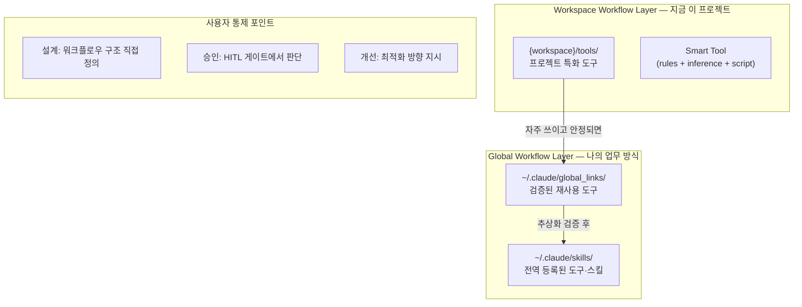
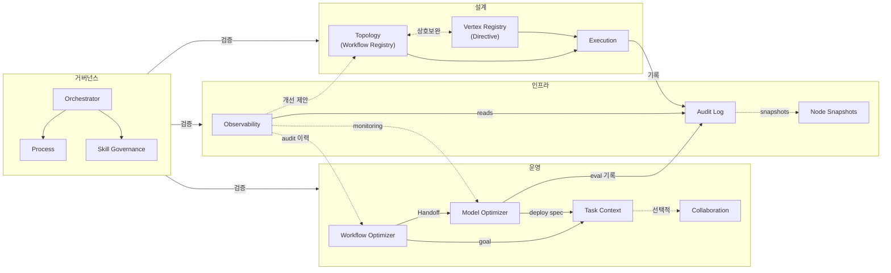

# Multi-Swarm Orchestrator (v0.0.10)

**내게 맞는 Agentic AI OS**를 향한 오케스트레이션 시스템.

기존 AIOS라 불리는 서비스들은 사용자에게 자동화를 약속하지만, 정작 "내 업무 방식대로 흐름을 통제할 수 있는가"라는 질문에는 답하지 못한다. 워크플로우가 블랙박스 안에서 돌아가고, 무엇이 왜 실패했는지 알 수 없으며, 같은 실수가 반복된다. MSO는 이 **사용자 통제력**의 부재를 핵심 문제로 보고, 다른 접근을 택한다.

**"빠른 설계, 점진적 최적화"** — 처음부터 완벽한 자동화를 목표로 하지 않는다. 사용자가 직접 워크플로우를 설계하고, 실행하고, 결과를 보면서 점진적으로 최적화해 나간다. 반복되는 패턴이 확인되면 LLM 호출을 경량 모델로, 경량 모델을 규칙으로 단계적으로 대체한다. 이 과정에서 사용자는 항상 결정권을 가진다.

궁극적으로는 **여러 사람이 여러 에이전트 스웜과 협업하는 환경**을 구성한다. 이를 위한 전제 조건은 사용자가 에이전트의 존재를 의식하지 않아도 되는 **Agent UX** — 에이전트가 뒤에서 일하되, 사용자는 자신의 업무 흐름 안에서 자연스럽게 협업하는 것이다.

---

## 설계 철학: Thin Agent, Thick Smart Tools

```
기존 접근                              MSO 접근
─────────                              ─────────
LLM이 모든 것을 처리                    Agent는 흐름만 제어 (Thin)
Tool = 단순 API wrapper                 Tool = 자체 workflow를 가진 실행 모듈 (Thick)
사용자 통제 불가                        사용자가 설계·승인·개선을 주도
```

Agent는 가능한 한 간결한 orchestration 계층으로 유지하고, 실제 기능은 **Smart Tool** 내부로 이동시킨다. Smart Tool은 규칙 처리, 경량 모델 추론, 스크립트 실행 등 자체 워크플로우를 가진 실행 모듈이다. 이렇게 하면 LLM 호출을 줄이면서도 도메인 특화 로직을 정밀하게 통제할 수 있다.

---

## 두 가지 워크플로우 레이어

MSO는 사용자의 업무를 **Global Workflow**와 **Workspace Workflow** 두 레이어로 나누어 관리한다.


```mermaid
graph TB
    subgraph GlobalLayer ["Global Workflow Layer — 나의 업무 방식"]
        direction LR
        GR["~/.claude/skills/<br/>전역 등록된 도구·스킬"]
        GL["~/.claude/global_links/<br/>검증된 재사용 도구"]
    end
    subgraph WorkspaceLayer ["Workspace Workflow Layer — 지금 이 프로젝트"]
        direction LR
        WT["{workspace}/tools/<br/>프로젝트 특화 도구"]
        ST["Smart Tool<br/>(rules + inference + script)"]
    end

    WT -->|"자주 쓰이고 안정되면"| GL
    GL -->|"추상화 검증 후"| GR

    subgraph UserControl ["사용자 통제 포인트"]
        direction TB
        H1["설계: 워크플로우 구조 직접 정의"]
        H2["승인: HITL 게이트에서 판단"]
        H3["개선: 최적화 방향 지시"]
    end
```

| 레이어 | 범위 | 역할 | 예시 |
|--------|------|------|------|
| **Global Workflow** | 전체 프로젝트 공통 | 나의 업무 방식·도구·스킬을 정의 | 반복 사용하는 분석 프레임워크, 검증된 분류 모델 |
| **Workspace Workflow** | 특정 프로젝트 한정 | 지금 이 프로젝트의 실행 흐름 관리 | 프로젝트별 데이터 파이프라인, 도메인 특화 규칙 |

프로젝트에서 만든 도구(Local Tool)가 반복적으로 잘 동작하면, symlink를 통해 다른 프로젝트에서도 재사용(Symlinked)하고, 충분히 추상화되면 전역 등록(Global)한다. 처음부터 전역으로 설계할 수도 있다.

---

## 점진적 최적화: Automation Escalation

워크플로우를 처음 실행할 때는 LLM이 대부분을 처리한다(Lv30). 반복 실행으로 패턴이 안정되면, 시스템이 자동으로 더 효율적인 처리 방식을 제안한다.

```
첫 실행                  패턴 안정화              완전 자동화
──────                  ──────────              ──────────
Lv30: LLM reasoning   → Lv20: 경량 모델 추론   → Lv10: 규칙 기반 처리
(비용 높음, 유연)         (비용 절감, 빠름)         (비용 최소, 결정론적)
```

이 전환은 자동으로 일어나지 않는다. **사용자가 HITL(Human-in-the-Loop) 게이트에서 승인**해야 다음 단계로 넘어간다. "이 정도면 경량 모델로 대체해도 되겠다"는 판단은 시스템이 제안하고, 사용자가 결정한다.

| 단계 | 처리 방식 | 비용 | 통제 수준 |
|------|-----------|------|-----------|
| Lv30 Agentic | LLM reasoning | 높음 | 유연하지만 예측 어려움 |
| Lv20 Light Model | 파인튜닝된 경량 모델 | 중간 | 도메인 특화, 빠름 |
| Lv10 Logical | 규칙/스크립트 | 최소 | 완전 결정론적 |

`mso-workflow-optimizer`가 언제 전환할지 판단하고, `mso-model-optimizer`가 전환에 필요한 경량 모델을 학습·배포한다.

---

## 스킬 아키텍처

12개 스킬이 설계·운영·인프라·거버넌스 4개 영역에서 협업한다.


```mermaid
graph LR
    subgraph Design ["설계"]
        S00["Topology<br/>(Workflow Registry)"] <-.->|상호보완| S01["Vertex Registry<br/>(Directive)"]
        S00 & S01 --> S02["Execution"]
    end
    subgraph Ops ["운영"]
        S03["Task Context"] -.->|선택적| S04["Collaboration"]
        S10["Workflow Optimizer"] -->|goal| S03
        S10 -->|Handoff| S11["Model Optimizer"]
        S11 -->|deploy spec| S03
    end
    subgraph Infra ["인프라"]
        S06["Observability"] -->|reads| S05["Audit Log"]
        S05 -.->|snapshots| SNAP["Node Snapshots"]
    end
    subgraph Gov ["거버넌스"]
        S07["Orchestrator"] --> S08["Process"]
        S07 --> S09["Skill Governance"]
    end
    S02 -->|기록| S05
    S06 -.->|개선 제안| S00
    S06 -.->|audit 이력| S10
    S06 -.->|monitoring| S11
    S11 -->|eval 기록| S05
    Gov -->|검증| Design
    Gov -->|검증| Ops
    Gov -->|검증| Infra
```

| 영역 | 스킬 | 하는 일 |
|------|------|---------|
| **설계** | topology-design, mental-model-design, execution-design | 목표를 실행 가능한 워크플로우 구조로 변환 |
| **운영** | task-context, collaboration, workflow-optimizer, model-optimizer | 티켓 관리, 에이전트 협업, 성과 평가, 모델 학습 |
| **인프라** | audit-log, observability | 실행 기록, 패턴 분석, 피드백 루프 |
| **거버넌스** | process-template, skill-governance | 프로세스 규약, CC-01~14 계약 검증 |

---

## 문서

| 문서 | 설명 |
|------|------|
| [아키텍처](docs/architecture.md) | Git-Metaphor 상태 모델, 전체 아키텍처, Automation Escalation |
| [3대 파이프라인 & 계약](docs/pipelines.md) | 설계·운영·인프라 파이프라인, CC-01~14, 티켓 생명주기 |
| [시작하기](docs/getting-started.md) | 디렉토리 구조, 설계·운영·검증 명령어 |
| [스킬 사용 매트릭스](docs/usage_matrix.md) | Phase × Swarm × Role 매트릭스 |
| [변경 이력](docs/changelog.md) | v0.0.3~v0.0.10 변경 이력 및 하위 호환 노트 |

---

## v0.0.10 변경 이력

> `mso-model-optimizer` 스킬을 신설하고 Smart Tool 구조를 표준화하여, Automation Escalation 테스트 환경을 구성했다.

| 개선 영역 | Before | After |
|----------|--------|-------|
| 경량 모델 생산 | 없음 | `mso-model-optimizer` 5-Phase (TL-10/20/30) |
| Tool 구조 | 비공식 | `manifest.json` + `slots/` 4-slot 아키텍처 |
| Tool 재사용 | workspace 고착 | Local → Symlinked → Global 승격 |
| 모델 모니터링 | 없음 | rolling_f1 + 3가지 fallback |
| CC 계약 | CC-01~10 | CC-01~14 |

상세: [docs/changelog.md](docs/changelog.md)

---

## Roadmap

### v0.1.0 — 실운용 검증 → Tool Lifecycle 자동화

v0.0.10의 Automation Escalation이 실운용에서 검증되면 승격한다.

| 영역 | 작업 | 승격 조건 |
|------|------|-----------|
| Tool Lifecycle 자동화 | `tool_registry.json` + symlink 규약 공식화 | Escalation 2회 이상 성공 |
| Observability 연동 | rolling_f1 모니터링 + 승격 후보 자동 제안 | CC-14 실행 경로 검증 |
| Processing Tier 최소 환경 | Tier 전환 시 artifact 자동 구성 | TL-20 파인튜닝 1회 이상 성공 |

### 장기 비전 — Agent UX

여러 사람이 여러 에이전트 스웜과 협업하되, 사용자가 에이전트의 존재를 의식하지 않아도 되는 환경. 에이전트가 뒤에서 일하고, 사용자는 자신의 업무 흐름 안에서 자연스럽게 결과를 받는다.

---

## 의존성

- Python 3.10+

## License

[MIT](LICENSE)
