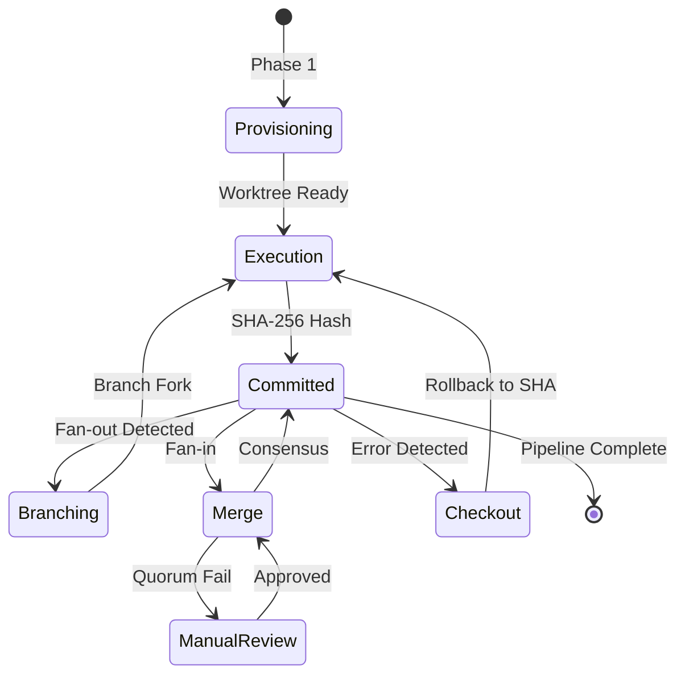
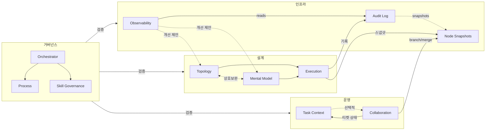
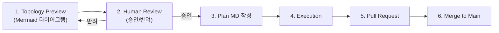

# 아키텍처

## Git-Metaphor 상태 모델

v0.0.3부터 단순 DAG 실행을 넘어 **버전화된 상태 전이 그래프**를 도입한다.
각 노드의 실행 결과를 불변 스냅샷(Commit) 단위로 캡처하고, 에러 복구나 병렬 실험 시 Branch·Merge 개념을 활용하여 자기 치유적(Self-healing) 오케스트레이션을 구현한다.



| Git 개념 | MSO 런타임 | 설명 |
|----------|-----------|------|
| Worktree | Run Workspace | 매 실행마다 격리된 디렉토리 |
| Commit | Node Snapshot | 노드 완료 시점의 불변 DB 기록 |
| Branch | Dynamic 분기 | 병렬 실험 경로 |
| Merge | Fan-in Consensus | 브랜치 결과 합의 |
| Checkout | Fallback/Rollback | 절대 SHA로 안정 상태 복원 |

> **인프라 노트**: 실제 Git CLI에 의존하지 않는다. 파일시스템 분리 + SQLite DB 해싱 에뮬레이션 방식.

---

## 전체 아키텍처



세 가지 핵심 파이프라인이 유기적으로 순환하는 구조다. `설계(Design)`가 목표를 실행 가능한 구조로 변환하고, `운영(Ops)`이 티켓을 발행하여 실제 작업을 수행하며, `인프라(Infra)`가 결과를 기록하고 분석하여 피드백을 제공한다. `Governance`는 스킬 간 계약(Contract)이 준수되는지 지속적으로 검증한다.

---

## 업무 공간과 관제 공간

MSO는 _다수의 사람과 다수의 에이전트가 동시에 협업하는 환경_ 을 전제로, _일하는 곳과 보는 곳을 명시적으로 분리_ 한다.

```
workspace/                              ← 업무 공간: 에이전트가 실행하고 기록하는 곳
├── .mso-context/
│   ├── audit_global.db                 ← v0.0.4: 전체 감사 데이터 SoT (WAL)
│   ├── active/<Run ID>/                ← Run 단위 실행 산출물
│   │   ├── worktree/                   ← v0.0.3: 격리된 실행 워크트리
│   │   └── 50_audit/snapshots/         ← v0.0.3: 스냅샷 아티팩트
│   ├── archive/                        ← 완료된 Run 보관
│   ├── registry/manifest-index.jsonl   ← 전체 Run 인덱스
│   └── config/policy.yaml              ← 운영 정책 (lifecycle_policy 포함)

mso-observation-workspace/              ← 관제 공간: 사람이 현황을 확인하는 곳
├── <observer-id>/
│   ├── <Run ID>/
│   ├── readme.md                       ← 상태, 진행률, 다음 액션
│   ├── 01_summary/ ~ 05_delivery/      ← 의사결정·산출물·리뷰
```

|           | 업무 공간 (`workspace`)       | 관제 공간 (`observation-workspace`) |
|-----------|------------------------------|--------------------------------------|
| **주 사용자** | 에이전트, 스크립트               | 사람, 팀                              |
| **권한**    | 읽기 + 쓰기                   | 읽기 전용                             |
| **단위**    | Run (phase별 산출물)          | Run (요약·의사결정·전달물)              |
| **식별**    | `.anchor.json`의 `workspace_id` | `.anchor.json`의 `workspace_id`   |

---

## v0.0.5 주요 변경

| 변경 | 내용 |
|------|------|
| **Worktree 용어 도입** | branch, pull request(PR), merge를 명시적 운영 개념으로 정의 |
| **Workspace Main 사용 원칙** | 핵심 변경은 반드시 worktree branch process를 통해서만 진행 |
| **Worktree Branch Process** | "생각 → 미리보기 → 실행" 단계 분리. Mermaid topology preview 필수 |
| **Work Process 정의** | Planning Process(2-depth) + Discussion Process(Critique) 표준화 |



## v0.0.4 주요 변경

| 변경 | 내용 |
|------|------|
| **Global Audit DB** | Run-local DB → `audit_global.db`로 통합. Cross-Run 패턴 분석 기반 마련 |
| **스키마 v1.5.0** | `audit_logs`에 8개 work tracking 컬럼 추가. `suggestion_history` 테이블, 분석 뷰 3개 |
| **패턴 분석 시그널** | work_type imbalance, pattern_tag candidate, error hotspot 탐지 추가 |

## v0.0.3 주요 변경

| 변경 | 내용 |
|------|------|
| **execution_graph 도입** | flat 구조 → execution_graph DAG로 전면 교체. branch/merge/commit 노드 타입 포함 |
| **node_snapshots 테이블** | Audit DB v1.4.0에 불변 스냅샷 기록용 테이블 추가 |
| **6개 에이전트 역할** | Provisioning, Execution, Handoff, Branching, Critic/Judge, Sentinel |
| **에러 분류 체계** | 4가지 에러 유형 × severity/action/max_retry 매핑 |
