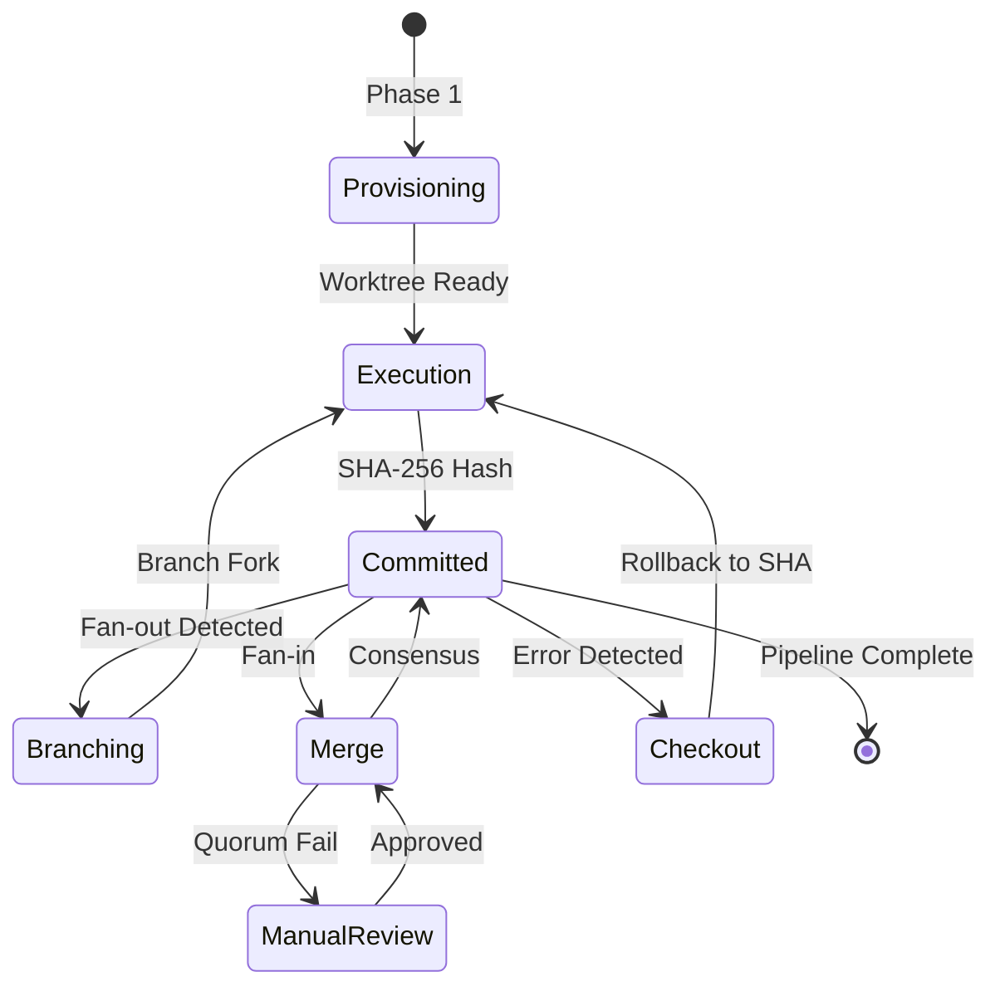
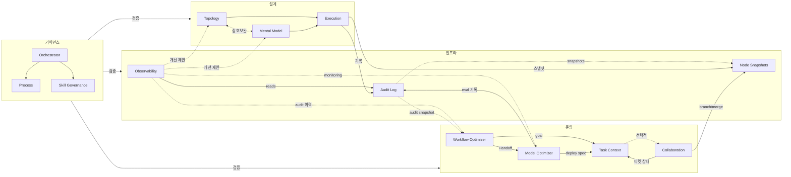
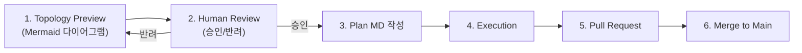

# 아키텍처

## Git-Metaphor 상태 모델

v0.0.3부터 단순 DAG 실행을 넘어 **버전화된 상태 전이 그래프**를 도입한다.
각 노드의 실행 결과를 불변 스냅샷(Commit) 단위로 캡처하고, 에러 복구나 병렬 실험 시 Branch·Merge 개념을 활용하여 자기 치유적(Self-healing) 오케스트레이션을 구현한다.


```mermaid
stateDiagram-v2
    [*] --> Provisioning: Phase 1
    Provisioning --> Execution: Worktree Ready
    Execution --> Committed: SHA-256 Hash
    Committed --> Branching: Fan-out Detected
    Branching --> Execution: Branch Fork
    Committed --> Merge: Fan-in
    Merge --> Committed: Consensus
    Merge --> ManualReview: Quorum Fail
    Committed --> Checkout: Error Detected
    Checkout --> Execution: Rollback to SHA
    Committed --> [*]: Pipeline Complete
    ManualReview --> Merge: Approved
```

| Git 개념 | MSO 런타임 | 설명 |
|----------|-----------|------|
| Worktree | Run Workspace | 매 실행마다 격리된 디렉토리 |
| Commit | Node Snapshot | 노드 완료 시점의 불변 DB 기록 |
| Branch | Dynamic 분기 | 병렬 실험 경로 |
| Merge | Fan-in Consensus | 브랜치 결과 합의 |
| Checkout | Fallback/Rollback | 절대 SHA로 안정 상태 복원 |

> **인프라 노트**: 실제 Git CLI에 의존하지 않는다. 파일시스템 분리 + SQLite DB 해싱 에뮬레이션 방식.

---

## 전체 아키텍처


```mermaid
graph LR
    subgraph Design ["설계"]
        S00["Topology"] <-.->|상호보완| S01["Mental Model"]
        S00 & S01 --> S02["Execution"]
    end

    subgraph Ops ["운영"]
        S03["Task Context"] -.->|선택적| S04["Collaboration"]
        S10["Workflow Optimizer"] -->|goal| S03
        S10 -->|Handoff| S11["Model Optimizer"]
        S11 -->|deploy spec| S03
    end

    subgraph Infra ["인프라"]
        S06["Observability"] -->|reads| S05["Audit Log"]
        S05 -.->|snapshots| SNAP["Node Snapshots"]
    end
    subgraph Gov ["거버넌스"]
        S07["Orchestrator"] --> S08["Process"]
        S07 --> S09["Skill Governance"]
    end

    S02 -->|기록| S05
    S02 -->|스냅샷| SNAP
    S06 -.->|개선 제안| S00
    S06 -.->|개선 제안| S01
    S06 -.->|audit 이력| S10
    S06 -.->|monitoring| S11
    S05 -.->|audit snapshot| S10
    S11 -->|eval 기록| S05
    S04 -->|티켓 상태| S03
    S04 -->|branch/merge| SNAP

    Gov -->|검증| Design
    Gov -->|검증| Ops
    Gov -->|검증| Infra
```

세 가지 핵심 파이프라인이 유기적으로 순환하는 구조다. `설계(Design)`가 목표를 실행 가능한 구조로 변환하고, `운영(Ops)`이 티켓을 발행하여 실제 작업을 수행하며, `인프라(Infra)`가 결과를 기록하고 분석하여 피드백을 제공한다. `Governance`는 스킬 간 계약(Contract)이 준수되는지 지속적으로 검증한다.

---

## 업무 공간과 관제 공간

MSO는 _다수의 사람과 다수의 에이전트가 동시에 협업하는 환경_ 을 전제로, _일하는 곳과 보는 곳을 명시적으로 분리_ 한다.

```
workspace/                              ← 업무 공간: 에이전트가 실행하고 기록하는 곳
├── .mso-context/
│   ├── audit_global.db                 ← v0.0.4: 전체 감사 데이터 SoT (WAL)
│   ├── active/<run_id>/                ← Run 단위 실행 산출물
│   │   ├── worktree/                   ← v0.0.3: 격리된 실행 워크트리
│   │   └── 50_audit/snapshots/         ← v0.0.3: 스냅샷 아티팩트
│   ├── archive/                        ← 완료된 Run 보관
│   ├── registry/manifest-index.jsonl   ← 전체 Run 인덱스
│   └── config/policy.yaml              ← 운영 정책 (lifecycle_policy 포함)

mso-observation-workspace/              ← 관제 공간: 사람이 현황을 확인하는 곳
├── <observer-id>/
│   ├── <run_id>/
│   ├── readme.md                       ← 상태, 진행률, 다음 액션
│   ├── 01_summary/ ~ 05_delivery/      ← 의사결정·산출물·리뷰
```

|           | 업무 공간 (`workspace`)       | 관제 공간 (`observation-workspace`) |
|-----------|------------------------------|--------------------------------------|
| **주 사용자** | 에이전트, 스크립트               | 사람, 팀                              |
| **권한**    | 읽기 + 쓰기                   | 읽기 전용                             |
| **단위**    | Run (phase별 산출물)          | Run (요약·의사결정·전달물)              |
| **식별**    | `.anchor.json`의 `workspace_id` | `.anchor.json`의 `workspace_id`   |

---

## v0.1.2 주요 변경 (Harness Convention — 에이전트 런타임 협업 규약)

| 변경 | 내용 |
|------|------|
| **Execution Model** | 노드 실행 전략 3종 표준화: `single_instance`(순차 의존), `bus`(fan-out+병렬 worker), `direct_spawn`(완전 독립) |
| **compression_event** | 에이전트 context 압축 감지 시 기록 스키마 확정. 감지해도 실행 중단하지 않음(MUST NOT) |
| **audit_ref 포인터** | 에이전트 context에 원문 대신 `{run_id}#{step}` 포인터만 유지. 전체 기록은 `audit_global.db`에 보관 |
| **optimization_proposal** | optimizer의 표준 출력 포맷. `requires_human_approval: true` 항상(MUST). 자동 topology 변경 금지 |
| **initial/handoff context** | 에이전트 소환·완료 시 표준 포맷 확정. 전체 히스토리 포함 금지(MUST NOT) |

```
에이전트 소환               실행 중                      완료
──────────────              ──────────────               ──────────────
initial_context   →   compression 감지 → audit_ref   →  handoff_context
(role/objective/          (실행 계속 + 기록)              (summary/artifacts/
 policy/state)                                            next_phase)
```

---

## v0.0.10 주요 변경 (Automation Escalation 테스트 환경)

| 변경 | 내용 |
|------|------|
| **mso-model-optimizer** | Smart Tool의 `slots/inference/` 슬롯에 경량 모델을 학습·배포하는 스킬 신설. 5-Phase + TL-10/20/30 |
| **Smart Tool 구조 표준** | `manifest.json` + `slots/`(input_norm/rules/inference/script) 4-slot 아키텍처 |
| **Tool Lifecycle** | Local → Symlinked → Global 3단계 승격 (pattern_stability + abstraction_score 기반) |
| **Tier Escalation ↔ Tool Lifecycle 직교** | 처리 전략(Lv30→10)과 배치 scope(Local→Global)는 별개의 축 |
| **Rollback/Degradation** | rolling_f1 모니터링 → 경고 → Fallback(llm_passthrough/previous_version/rule_fallback) |
| **CC-11~14** | workflow-optimizer→model-optimizer, model-optimizer→audit-log, model-optimizer→task-context, observability→model-optimizer |

```
Tier Escalation (workflow-optimizer)        Model Production (model-optimizer)
Lv30 → Lv20 → Lv10                         TL-30 → TL-20 → TL-10
  ↓ Handoff Payload                           ↓ deploy_spec.json
  → model-optimizer 트리거                     → Smart Tool slots/inference/ 배포
```

---

## v0.0.7 주요 변경 (Topology Motif + Tier Escalation)

| 변경 | 내용 |
|------|------|
| **Topology Motif** | 6가지 표준 구조 패턴(Chain/Star/Fork-Join/Loop/Diamond/Switch). 기존 `topology_type`(linear/fan_out/fan_in/dag/loop)과 매핑 |
| **Vertex Composition** | Task Node에 실행 단위 유형(agent/skill/tool/model) 지정. `Workflow Graph = Topology Motif + Vertex Mapping` |
| **Graph Search Loader** | mso-workflow-topology-design에 Mode B 추가. Intent 기반 레지스트리 검색 → 기존 워크플로우 로딩 |
| **Tier Escalation** | `pattern_stability = frequency × success_rate` 기반 L30(Agentic)→L20(Light Model)→L10(Logical) 자동 에스컬레이션 |

```
Intent
 ↓
Graph Workflow Retrieval (Mode B) or 신규 설계 (Mode A)
 ↓
Agentic Execution (Level 30)
 ↓
Pattern Mining (frequency, success_rate, topology_stability, cost_efficiency)
 ↓
Tier Optimization → Level 20 → Level 10
 ↓
Deterministic Workflow
```

---

## v0.0.5 주요 변경

| 변경 | 내용 |
|------|------|
| **Worktree 용어 도입** | branch, pull request(PR), merge를 명시적 운영 개념으로 정의 |
| **Workspace Main 사용 원칙** | 핵심 변경은 반드시 worktree branch process를 통해서만 진행 |
| **Worktree Branch Process** | "생각 → 미리보기 → 실행" 단계 분리. Mermaid topology preview 필수 |
| **Work Process 정의** | Planning Process(2-depth) + Discussion Process(Critique) 표준화 |


```mermaid
flowchart LR
    Preview["1. Topology Preview<br/>(Mermaid 다이어그램)"] --> HITL["2. Human Review<br/>(승인/반려)"]
    HITL -->|승인| Plan["3. Plan MD 작성"]
    HITL -->|반려| Preview
    Plan --> Execute["4. Execution"]
    Execute --> PR["5. Pull Request"]
    PR --> Merge["6. Merge to Main"]
```

## v0.0.4 주요 변경

| 변경 | 내용 |
|------|------|
| **Global Audit DB** | Run-local DB → `audit_global.db`로 통합. Cross-Run 패턴 분석 기반 마련 |
| **스키마 v1.5.0** | `audit_logs`에 8개 work tracking 컬럼 추가. `suggestion_history` 테이블, 분석 뷰 3개 |
| **패턴 분석 시그널** | work_type imbalance, pattern_tag candidate, error hotspot 탐지 추가 |

## v0.0.3 주요 변경

| 변경 | 내용 |
|------|------|
| **execution_graph 도입** | flat 구조 → execution_graph DAG로 전면 교체. branch/merge/commit 노드 타입 포함 |
| **node_snapshots 테이블** | Audit DB v1.4.0에 불변 스냅샷 기록용 테이블 추가 |
| **6개 에이전트 역할** | Provisioning, Execution, Handoff, Branching, Critic/Judge, Sentinel |
| **에러 분류 체계** | 4가지 에러 유형 × severity/action/max_retry 매핑 |
