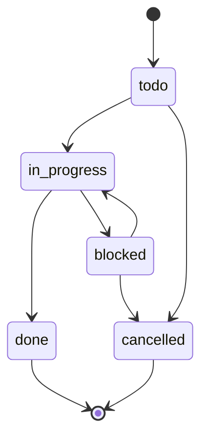
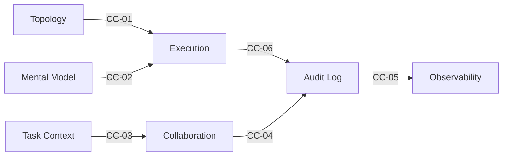

# 3대 핵심 파이프라인

## 설계 (Design)

목표(Goal)가 입력되면, 다음의 세 단계를 거쳐 실행 가능한 워크플로우 명세(Spec)로 구체화된다.

1. **Topology Design** — 목표를 노드(Node)와 엣지(Edge)로 구조화한다. 작업 단위와 실행 순서를 정의한다.
2. **Mental Model Design** — 각 노드에 적절한 사고 모델(Mental Model)을 부여한다.
3. **Execution Design** — 두 가지를 통합하여 최종 실행 계획(execution_graph DAG)을 수립한다. 브랜칭/머지 정책, 에러 분류 기반 폴백 전략, 라이프사이클 정책을 포함한다.

Topology와 Mental Model은 상호보완적이다. 어느 쪽에서 시작하든, 서로의 출력이 상대방을 정제하고 보완한다.

---

## 운영 (Ops)

`Task Context Management`가 티켓을 발행하고 상태를 관리한다. `todo → in_progress → done`으로 이어지는 상태 전이는 상태 머신에 의해 엄격하게 관리되며, 완료된 티켓은 로그에 기록된 후 정리된다.

멀티에이전트 협업이 필요한 경우 `Agent Collaboration`으로 작업을 분배(Dispatch)한다. 브랜치 노드의 포크와 머지 노드의 집계가 6개 에이전트 역할(Provisioning/Execution/Handoff/Branching/Critic-Judge/Sentinel)에 의해 수행된다.

### 티켓 생명주기

`done`과 `cancelled`는 터미널 상태(Terminal State)다. 동일한 상태로의 전이를 중복 요청하더라도 오류 없이 무시된다(Idempotent).

---

## 인프라 (Infra)

`Audit Log`가 모든 실행 기록을 SQLite DB에 남긴다(v0.0.4: Global DB, `node_snapshots` + `suggestion_history` 테이블 포함). `Observability`가 저장된 로그를 분석하여 패턴을 도출한다.

반복적인 실패, 비정상적인 비용 발생, 병목 구간, work_type 편중, 에러 핫스팟 등이 감지되면, 개선 제안을 설계 파이프라인으로 다시 전달한다. 이 피드백 루프(Feedback Loop)가 동일한 실패의 반복을 끊어내는 핵심 메커니즘이다.

---

## 스킬 간 계약 (CC-01~06)

스킬 간 데이터 교환은 6가지 핵심 계약(CC-01~CC-06)을 통해 필수 필드와 포맷을 명시적으로 정의한다.

`Governance`가 이 계약을 자동으로 검증한다. 필수 필드가 누락되거나 스키마가 일치하지 않으면 파이프라인 진입 전에 즉시 차단한다.

---

## Hand-off Templates

| 템플릿 | 소속 스킬 | 용도 |
|--------|----------|------|
| **PRD** | mso-task-context-management | "왜 지금 이 방식이어야 하는가"를 설명. Scenarios 단위로 SPEC과 1:1 또는 1:N 매핑 |
| **SPEC** | mso-task-context-management | 실행 계획 + Execution Policy + Ticket List + Check List |
| **ADR** | mso-task-context-management | 아키텍처 의사결정 기록. 결정·대안·기각 사유·영향을 독립 문서로 추적 |
| **HITL Escalation Brief** | mso-observability | H1/H2 Gate 에스컬레이션 시 사람에게 전달하는 구조화된 판단 요청서 |
| **Run Retrospective** | mso-observability | Run 완료 후 메트릭·교훈·이월 항목을 종합하는 회고 문서 |
| **Design Handoff Summary** | mso-execution-design | Design Swarm 산출물을 Ops Swarm에 전달하는 요약 문서 |
