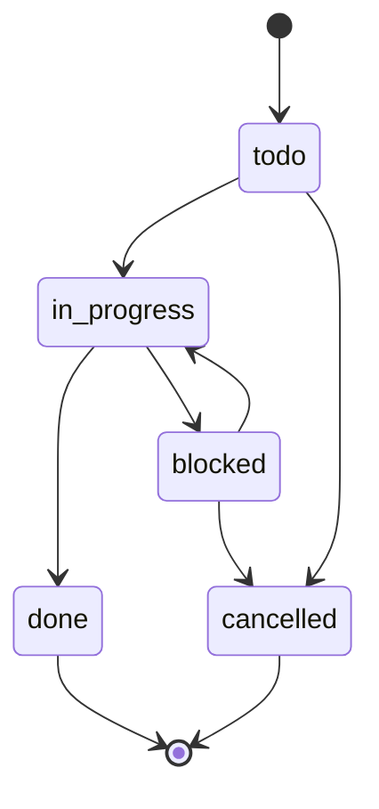
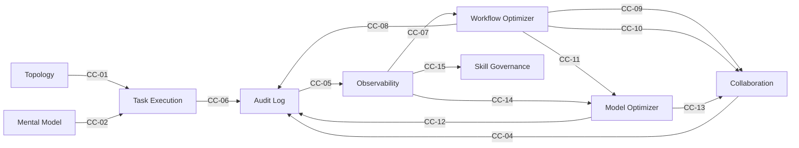
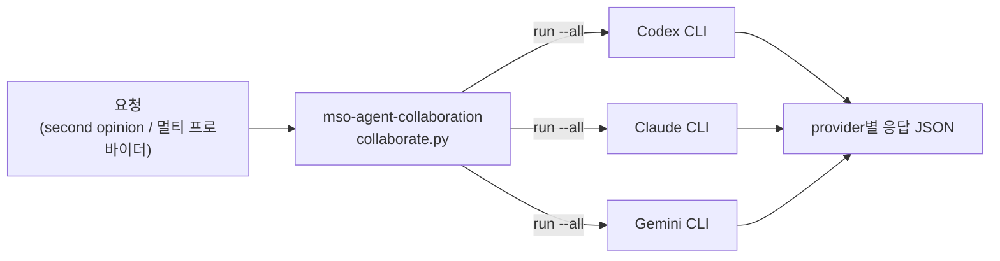

# 3대 핵심 파이프라인

## 설계 (Design)

목표(Goal)가 입력되면, 두 가지 경로 중 하나로 실행 가능한 워크플로우 명세(Spec)가 생성된다.

**Mode B (Graph Search Loader)**: 레지스트리에 유사 워크플로우가 있으면 Intent 기반 검색으로 기존 Topology를 로딩한다. 6가지 Topology Motif(Chain/Star/Fork-Join/Loop/Diamond/Switch)와 Vertex(agent/skill/tool/model) 바인딩을 통해 즉시 실행 가능한 워크플로우를 반환한다.

**Mode A (신규 설계)**: 레지스트리에 유사 워크플로우가 없으면 다음의 네 단계로 설계한다.

1. **Topology Design** — 목표를 노드(Node)와 엣지(Edge)로 구조화. Motif 식별 → `topology_type` 선택 → Vertex Composition.
2. **Mental Model Design (Vertex Registry)** — 각 노드에 적절한 directive(framework/instruction/prompt)를 바인딩한다.
3. **Workflow Repository Setup** — 두 결과를 repository contract로 변환. `workflow_repository.yaml`, `scaffolding_contract.md`, `memory_layer.md` 생성.
4. **Harness Setup** — runtime harness spec 생성. canonical event 정규화, policy/evaluator/escalation 설계.

Topology와 Mental Model은 상호보완적이다. 어느 쪽에서 시작하든, 서로의 출력이 상대방을 정제하고 보완한다.

---

## 운영 (Ops)

`Agent Collaboration`이 티켓을 발행하고 상태를 관리한다. `todo → in_progress → done`으로 이어지는 상태 전이는 상태 머신에 의해 엄격하게 관리되며, 완료된 티켓은 로그에 기록된 후 정리된다.

멀티에이전트 협업이 필요한 경우 `Agent Collaboration`으로 작업을 분배(Dispatch)한다. 브랜치 노드의 포크와 머지 노드의 집계가 6개 에이전트 역할(Provisioning/Execution/Handoff/Branching/Critic-Judge/Sentinel)에 의해 수행된다.

`Workflow Optimizer`가 반복 패턴이 안정된 워크플로우에 Tier Escalation(Lv30→20→10)을 적용하면, `Model Optimizer`가 경량 모델을 학습·배포하여 Smart Tool의 inference 슬롯을 채운다. 이 Automation Escalation 루프가 LLM 비용과 latency를 점진적으로 줄이는 핵심 메커니즘이다.

### 티켓 생명주기

```mermaid
stateDiagram-v2
    [*] --> todo
    todo --> in_progress
    todo --> cancelled
    in_progress --> done
    in_progress --> blocked
    blocked --> in_progress
    blocked --> cancelled
    done --> [*]
    cancelled --> [*]
```

`done`과 `cancelled`는 터미널 상태(Terminal State)다. 동일한 상태로의 전이를 중복 요청하더라도 오류 없이 무시된다(Idempotent).

---

## 인프라 (Infra)

`Audit Log`가 모든 실행 기록을 SQLite DB에 남긴다(v0.0.4: Global DB, `node_snapshots` + `suggestion_history` 테이블 포함). `Observability`가 저장된 로그를 분석하여 패턴을 도출한다.

`mso-agent-audit-log`는 DB 생성, 세션 훅 주입, 실행 로그 기록 세 가지를 단독으로 소유한다. 세션 훅은 `SessionStart · PreCompact · SessionEnd` 3-hook 체계로 운영되며, 스크립트가 transcript를 직접 파싱해 worklog에 기록한다(Claude 호출 없음). 프로젝트 초기화는 `setup.py --project-root <path>`로 한 번에 처리한다.

반복적인 실패, 비정상적인 비용 발생, 병목 구간, work_type 편중, 에러 핫스팟 등이 감지되면, 개선 제안을 설계 파이프라인으로 다시 전달한다. 이 피드백 루프(Feedback Loop)가 동일한 실패의 반복을 끊어내는 핵심 메커니즘이다.

---

## 스킬 간 계약 (CC-01~15)

스킬 간 데이터 교환은 15가지 핵심 계약(CC-01~CC-15)을 통해 필수 필드와 포맷을 명시적으로 정의한다.

```mermaid
flowchart LR
    Topology -- CC-01 --> TaskExec["Task Execution"]
    MentalModel["Mental Model"] -- CC-02 --> TaskExec
    TaskExec -- CC-06 --> AuditLog["Audit Log"]

    Collaboration -- CC-04 --> AuditLog
    AuditLog -- CC-05 --> Observability

    Observability -- CC-07 --> Optimizer["Workflow Optimizer"]
    Optimizer -- CC-08 --> AuditLog
    Optimizer -- CC-09 --> Collaboration
    Optimizer -- CC-10 --> Collaboration

    Optimizer -- CC-11 --> ModelOpt["Model Optimizer"]
    ModelOpt -- CC-12 --> AuditLog
    ModelOpt -- CC-13 --> Collaboration
    Observability -- CC-14 --> ModelOpt
    Observability -- CC-15 --> Governance["Skill Governance"]
```

> **CC-03 비고**: 티켓 관리(`create_ticket.py` / `archive_tasks.py`)는 `mso-agent-collaboration` 내부 흐름으로 통합되었다. 외부 스킬 간 계약이 아니므로 다이어그램에서 제거함.

`Governance`가 이 계약을 자동으로 검증한다. 필수 필드가 누락되거나 스키마가 일치하지 않으면 파이프라인 진입 전에 즉시 차단한다.

### CC-07: mso-observability → mso-workflow-optimizer

| 항목 | 내용 |
|------|------|
| **생산자** | `mso-observability` |
| **소비자** | `mso-workflow-optimizer` (Phase 1, Signal C) |
| **전달 데이터** | `audit_global.db`의 `user_feedback` 테이블(workflow_name 기준 최근 3건) + `60_observability/callback-*.json`의 `improvement_proposal` 이벤트 |
| **필수 키** | `user_feedback.feedback_text` (JSON), `callback.event_type`, `callback.payload.severity` |
| **전달 방식** | DB 읽기(user_feedback) + 파일시스템 읽기(callback JSON) |

### CC-08: mso-workflow-optimizer → mso-agent-audit-log

| 항목 | 내용 |
|------|------|
| **생산자** | `mso-workflow-optimizer` (Phase 4: decision-reporting-logging, Phase 5: human-feedback-logging) |
| **소비자** | `mso-agent-audit-log` |
| **전달 데이터** | Phase 4: decision_output + 실행 요약 (`audit_logs` 행). Phase 5: HITL 피드백 (`user_feedback` 행) |
| **필수 키** | Phase 4: `run_id`, `artifact_uri`, `status`, `work_type="workflow_optimization"`. Phase 5: `feedback_text`(JSON), `impact_domain="workflow_optimization"`, `related_audit_id` |
| **전달 방식** | `append_from_payload.py` 스크립트 호출 |

### CC-09: mso-workflow-optimizer → mso-agent-collaboration

| 항목 | 내용 |
|------|------|
| **생산자** | `mso-workflow-optimizer` (Phase 5: goal 산출 후) |
| **소비자** | `mso-agent-collaboration` |
| **전달 데이터** | `goal.json`의 `optimization_directives[]` → 개별 TKT 티켓으로 등록 |
| **필수 키** | 티켓: `id`(TKT-xxxx), `status`(todo), `priority`, `owner`, `tags`(workflow_optimization 포함) |
| **전달 방식** | `create_ticket.py` CLI 호출 또는 티켓 Markdown frontmatter 직접 생성 |

### CC-10: mso-workflow-optimizer → mso-agent-collaboration

| 항목 | 내용 |
|------|------|
| **생산자** | `mso-workflow-optimizer` (Phase 0: 멀티 에이전트 초기화) |
| **소비자** | `mso-agent-collaboration` (Ticket ingestion → dispatch) |
| **전달 데이터** | teammate 티켓 4종 (jewel-producer/decision-agent/level-executor/hitl-coordinator) + handoff_payload |
| **필수 키** | 티켓: `id`, `status`(todo), `owner_agent`, `dispatch_mode`, `tags`(workflow_optimization), `task_id`. payload: `run_id`, `task_id`, `owner_agent`, `role`, `objective`, `workflow_name` |
| **전달 방식** | 티켓 Markdown 생성 → `dispatch.py --ticket <ticket.md>` 호출 |
| **적용 조건** | mso-agent-collaboration 모드 활성화 시에만. 단일 세션 모드에서는 해당 없음 (governance: warn) |

### CC-11: mso-workflow-optimizer → mso-model-optimizer

| 항목 | 내용 |
|------|------|
| **생산자** | `mso-workflow-optimizer` (Tier Escalation 발생 + Phase 5 goal에 `model_replacement_needed: true`) |
| **소비자** | `mso-model-optimizer` (Phase 0: 트리거 수신) |
| **전달 데이터** | Handoff Payload: `trigger_type`, `escalation`(from_level/to_level), `target`(tool_name/inference_pattern/sample_io_ref) |
| **필수 키** | `trigger_type`, `target.tool_name`, `target.inference_pattern` |
| **전달 방식** | `handoff_payload.json` 생성 → model-optimizer Phase 0 진입 |
| **적용 조건** | Tier Escalation 발생 + `model_replacement_needed=true` 시에만. 미발생 시 warn |

### CC-12: mso-model-optimizer → mso-agent-audit-log

| 항목 | 내용 |
|------|------|
| **생산자** | `mso-model-optimizer` (Phase 4: 평가 완료 / Phase 5: HITL 피드백) |
| **소비자** | `mso-agent-audit-log` |
| **전달 데이터** | audit payload: `run_id`, `artifact_uri`, `status`, `work_type`(`model_optimization` 또는 `model_retraining` 또는 `model_rollback`) |
| **필수 키** | `run_id`, `artifact_uri`, `status`, `work_type` |
| **전달 방식** | `mso-agent-audit-log` 스킬 표준 인터페이스 |

### CC-13: mso-model-optimizer → mso-agent-collaboration

| 항목 | 내용 |
|------|------|
| **생산자** | `mso-model-optimizer` (Phase 5: deploy_spec 생성 후) |
| **소비자** | `mso-agent-collaboration` |
| **전달 데이터** | `deploy_spec.json`의 배포 지시 → TKT 티켓 등록 |
| **필수 키** | 티켓: `id`(TKT-xxxx), `status`(todo), `priority`, `owner`, `tags`(model_deployment 포함) |
| **전달 방식** | deploy_spec 기반 티켓 Markdown 생성 |

### CC-14: mso-observability → mso-model-optimizer

| 항목 | 내용 |
|------|------|
| **생산자** | `mso-observability` (배포된 모델의 rolling_f1 모니터링) |
| **소비자** | `mso-model-optimizer` (module.model-retraining 트리거) |
| **전달 데이터** | `tool_name`, `rolling_f1`, `drift_detected` |
| **필수 키** | `tool_name`, `rolling_f1`, `drift_detected` |
| **전달 방식** | audit_global.db monitoring 이벤트 → model-optimizer Phase 0 트리거 |
| **적용 조건** | 배포된 모델이 존재하고 rolling_f1 모니터링이 활성화된 경우에만 |

### CC-15: mso-observability → mso-skill-governance

| 항목 | 내용 |
|------|------|
| **생산자** | `mso-observability` (module.model-monitoring — 승격 후보 탐지) |
| **소비자** | `mso-skill-governance` (module.tool-lifecycle — 승격 절차 실행) |
| **전달 데이터** | `tool_name`, `current_state`, `proposed_state`, `metrics` |
| **필수 키** | `tool_name`, `proposed_state`, `metrics.pattern_stability` |
| **전달 방식** | `promotion_suggestion` callback event → tool-lifecycle 모듈의 승격 절차 Step 2 진입 |
| **적용 조건** | `pattern_stability ≥ 0.4`인 Smart Tool이 감지된 경우에만 |

---

## 멀티 프로바이더 실행 (E)

`mso-agent-collaboration`의 `collaborate.py`를 통해 Codex·Claude·Gemini CLI를 직접 실행한다.
워크플로우 내 second opinion이 필요하거나 프로바이더별 역할을 분리할 때 사용한다.

```mermaid
flowchart LR
    REQ["요청<br/>(second opinion / 멀티 프로바이더)"]
    COLLAB["mso-agent-collaboration<br/>collaborate.py"]
    CODEX["Codex CLI"]
    CLAUDE["Claude CLI"]
    GEMINI["Gemini CLI"]
    OUT["provider별 응답 JSON"]

    REQ --> COLLAB
    COLLAB -->|run --all| CODEX & CLAUDE & GEMINI
    CODEX & CLAUDE & GEMINI --> OUT
```

| 실행 방식 | 명령 | 용도 |
|----------|------|------|
| `run --all` | 전체 프로바이더 동시 전송 | second opinion, 결과 비교 |
| `run --tasks` | 프로바이더별 역할 분리 | arch/risk/feasibility 분업 |
| `swarm start` | tmux 장기 실행 세션 | bus 기반 멀티 에이전트 |

Provider 설정: `~/.skill-modules/mso-skills/mso-agent-collaboration/config/providers.yaml`

---

## Hand-off Templates

| 템플릿 | 소속 스킬 | 용도 |
|--------|----------|------|
| **PRD** | mso-agent-collaboration | "왜 지금 이 방식이어야 하는가"를 설명. Scenarios 단위로 SPEC과 1:1 또는 1:N 매핑 |
| **SPEC** | mso-agent-collaboration | 실행 계획 + Execution Policy + Ticket List + Check List |
| **ADR** | mso-agent-collaboration | 아키텍처 의사결정 기록. 결정·대안·기각 사유·영향을 독립 문서로 추적 |
| **HITL Escalation Brief** | mso-observability | H1/H2 Gate 에스컬레이션 시 사람에게 전달하는 구조화된 판단 요청서 |
| **Run Retrospective** | mso-observability | Run 완료 후 메트릭·교훈·이월 항목을 종합하는 회고 문서 |
| **Design Handoff Summary** | mso-harness-setup | Design Swarm 산출물을 Ops Swarm에 전달하는 요약 문서 |
