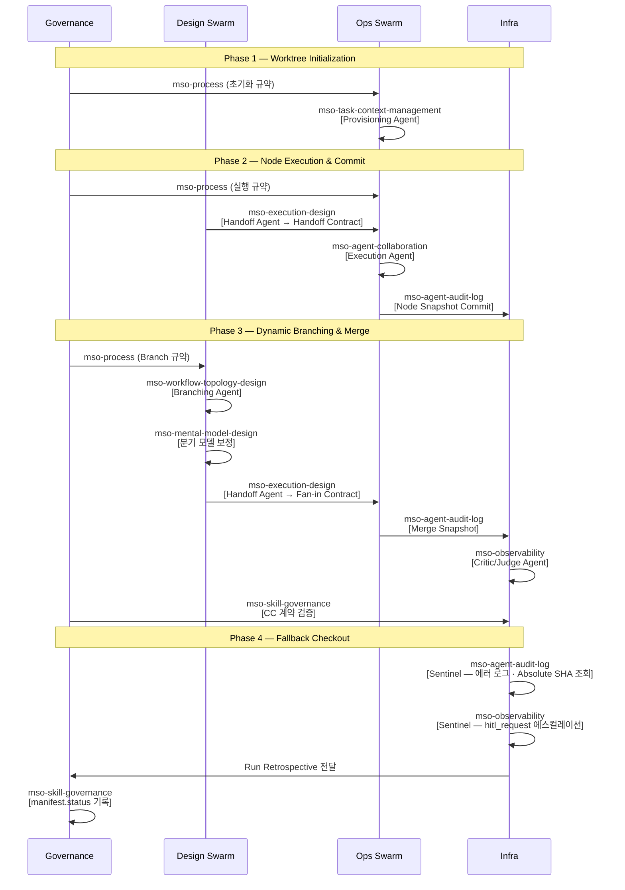

# MSO Skills 사용 매트릭스 (Phase × Swarm × Role)

이 문서는 MSO(Multi-Swarm Orchestrator)의 각 스킬을 실행 방식, Phase, Swarm 기준으로 분류한다.
ORCHESTRATOR.md의 Role-Skill 바인딩 정책을 테이블 형식으로 재표현한 참조 문서다.

---

## 1) 실행 방식별 매트릭스

| Skill | 권장 실행 방식 | 스킬 타입 | 주 사용 대상 |
|---|---|---|---|
| mso-workflow-topology-design | `single` | 설계 | Run 초기 노드·엣지 토폴로지 정의 |
| mso-mental-model-design | `single` | 설계 | 에이전트 역할·목표·멘탈 모델링 |
| mso-execution-design | `single`, `parallel`(복수 Handoff 분기 시) | 설계 | Node 실행 계획 + Handoff Contract 생성 |
| mso-task-context-management | `single` | 운영 | 티켓 생성 · 상태 전이 관리 |
| mso-agent-collaboration | `single`(run), `parallel`(batch/swarm) | 실행 | 에이전트 협업 실행 레이어 (run/batch/swarm) |
| mso-agent-audit-log | `single` | 인프라 | 감사 로그 기록 · SQLite DB 삽입 |
| mso-observability | `single`, `parallel`(복수 Run 동시 점검) | 인프라 | 관측 / 피드백 / HITL 에스컬레이션 |
| mso-skill-governance | `single` | 거버넌스 | CC 계약 검증 · 스킬 정합성 감사 |
| mso-process | `cross-swarm` | 거버넌스 | 전 Swarm 공통 프로세스 규약 · 템플릿 기준 |

### 실행 방식 가이드

- `single`: 단일 산출물이 명확한 태스크. Run 1개 기준.
- `parallel`: 복수 Branch · 복수 경쟁사 · 복수 Run을 동시에 처리하는 팬-아웃 패턴.
- `cross-swarm`: 특정 Swarm에 귀속되지 않고 모든 Swarm에 걸쳐 적용되는 기준 역할.

---

## 2) Phase 기반 매트릭스

4-Phase 런타임(v0.0.5)에서 각 스킬이 어느 Phase에 개입하는지를 나타낸다.
(중복 배정 허용, MECE 정합성 가정 없음)

| Skill | Ph 1: Provisioning | Ph 2: Execution | Ph 2: Handoff | Ph 3: Branching | Ph 3: Handoff | Ph 3: Critic/Judge | Ph 4: Sentinel |
|---|---|---|---|---|---|---|---|
| mso-workflow-topology-design | ⚪ | ⚪ | ⚪ | ✅ | ⚪ | ⚪ | ⚪ |
| mso-mental-model-design | ⚪ | ⚪ | ⚪ | ✅(분기 모델 기반) | ⚪ | ⚪ | ⚪ |
| mso-execution-design | ⚪ | ⚪ | ✅ | ⚪ | ✅ | ⚪ | ⚪ |
| mso-task-context-management | ✅ | ⚪ | ⚪ | ⚪ | ⚪ | ⚪ | ⚪ |
| mso-agent-collaboration | ⚪ | ✅ | ⚪ | ⚪ | ⚪ | ⚪ | ⚪ |
| mso-agent-audit-log | ⚪ | ✅(Snapshot 기록) | ⚪ | ⚪ | ⚪ | ⚪ | ✅(에러 로그) |
| mso-observability | ⚪ | ⚪ | ⚪ | ⚪ | ⚪ | ✅ | ✅ |
| mso-skill-governance | ⚪ | ⚪ | ⚪ | ⚪ | ⚪ | ✅(CC 검증) | ⚪ |
| mso-process | ✅(초기화 규약) | ✅(실행 규약) | ✅(Handoff 템플릿) | ✅(Branch 규약) | ✅(Handoff 템플릿) | ✅(검토 규약) | ✅(복구 규약) |

> `✅` : 해당 Phase/Role에서 직접 실행 · 필수 로드 / `⚪` : 보조 또는 비개입

### Phase × Role 요약 (ORCHESTRATOR.md 기준)

| Phase | Role | Swarm | Required Skills |
|---|---|---|---|
| 1 | Provisioning Agent | Ops | `mso-task-context-management` |
| 2 | Execution Agent | Ops | `mso-agent-collaboration`, `mso-agent-audit-log` |
| 2 | Handoff Agent | Ops | `mso-execution-design` |
| 3 | Branching Agent | Design | `mso-workflow-topology-design` |
| 3 | Handoff Agent | Ops | `mso-execution-design` |
| 3 | Critic/Judge Agent | Infra | `mso-observability` |
| 4 | Sentinel Agent | Infra | `mso-agent-audit-log`, `mso-observability` |

> 동일 Role이 복수 Phase에 등장할 경우 스킬 집합은 합산된다.
> Swarm 기준과 Phase×Role 기준이 충돌하면 Phase×Role 기준을 우선한다.

---

## 3) Swarm 기반 매트릭스

각 스킬의 1차 소속 Swarm을 기준으로 분류한다.

| Skill | Design Swarm | Ops Swarm | Infra | Governance |
|---|---|---|---|---|
| mso-workflow-topology-design | ✅ | ⚪ | ⚪ | ⚪ |
| mso-mental-model-design | ✅ | ⚪ | ⚪ | ⚪ |
| mso-execution-design | ✅ | ⚪ | ⚪ | ⚪ |
| mso-task-context-management | ⚪ | ✅ | ⚪ | ⚪ |
| mso-agent-collaboration | ⚪ | ✅ | ⚪ | ⚪ |
| mso-agent-audit-log | ⚪ | ⚪ | ✅ | ⚪ |
| mso-observability | ⚪ | ⚪ | ✅ | ⚪ |
| mso-skill-governance | ⚪ | ⚪ | ⚪ | ✅ |
| mso-process | ⚪ | ⚪ | ⚪ | ✅ |

> `✅` = 1차 소속 Swarm (1개), `⚪` = 비핵심 / 간접 지원

### Swarm 경로 요약

| Swarm | 경로 |
|---|---|
| Design | `10_topology → 20_mental-model → 30_execution` |
| Ops | `40_collaboration/task-context/tickets/` → agent-collaboration 실행 |
| Infra | `audit_global.db → 60_observability/*.json` |
| Governance | `70_governance/` → `manifest.status` 기록 |

---

## 4) 운영 권장 순서

- **Run 시작 시**: `mso-process` → `mso-workflow-topology-design` → `mso-mental-model-design` → `mso-execution-design`
- **실행 단계**: `mso-task-context-management` → `mso-agent-collaboration` + `mso-agent-audit-log`
- **분기/합류 시**: `mso-workflow-topology-design` + `mso-execution-design` + `mso-observability`
- **이상 탐지 / Fallback**: `mso-agent-audit-log` + `mso-observability` + `mso-skill-governance`
- **Run 완료 후**: `mso-observability`(Run Retrospective) + `mso-skill-governance`(CC 검증)

---

## 5) 실행 파이프라인 (Sequence)

