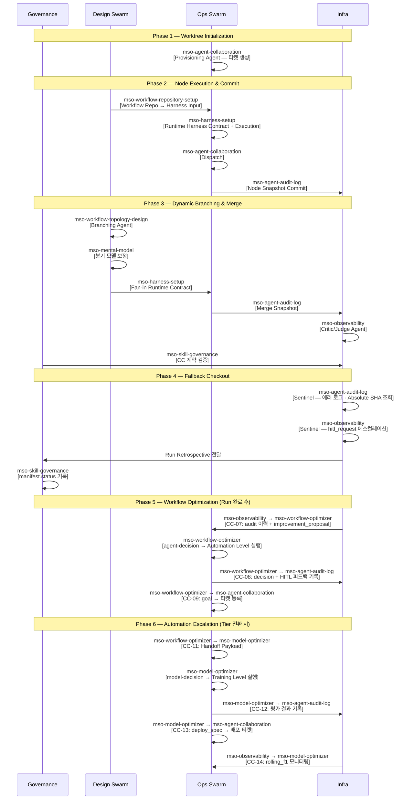

# MSO Skills 사용 매트릭스 (Phase × Swarm × Role)

이 문서는 MSO(Multi-Swarm Orchestrator)의 각 스킬을 실행 방식, Phase, Swarm 기준으로 분류한다.
ORCHESTRATOR.md의 Role-Skill 바인딩 정책을 테이블 형식으로 재표현한 참조 문서다.

---

## 1) 실행 방식별 매트릭스

| Skill | 권장 실행 방식 | 스킬 타입 | 주 사용 대상 |
|---|---|---|---|
| mso-workflow-topology-design | `single` | 설계 | Mode A: 신규 설계 (Goal→DQ→Motif→Vertex→Graph), Mode B: Graph Search (레지스트리 검색) |
| mso-mental-model | `single` | 설계 | Vertex Registry: directive 택소노미 관리·검색·바인딩 |
| mso-workflow-repository-setup | `single` | 설계 | workflow-design + scaffolding-design을 repository setup, memory layer, harness input 계약으로 승격 |
| mso-harness-setup | `single` | 런타임 설계 + 실행 | Runtime Harness Toolkit: canonical event ontology, YAML runtime spec, provider adapter, policy/evaluator/escalation 계약 + execution_graph 실행 조율 + Fallback Policy 적용 |
| mso-agent-collaboration | `single`(run), `parallel`(batch/swarm) | 런타임 | 티켓 관리(생성·상태 전이) + Dispatch + 멀티 프로바이더 CLI 실행 (Codex·Claude·Gemini). `collaborate.py`로 run·batch·swarm 모드 직접 실행 가능 |
| mso-agent-audit-log | `single` | 인프라 | 감사 인프라 SoT — DB 생성, 세션 훅(SessionStart·PreCompact·SessionEnd) 설정, 실행 로그 기록 |
| mso-observability | `single`, `parallel`(복수 Run 동시 점검) | 인프라 | 관측 / 피드백 / HITL 에스컬레이션 |
| mso-workflow-optimizer | `single`, `loop`(HITL 포함) | 최적화 | 워크플로우 성과 평가 → Automation Level 판단 → 최적화 리포트 + goal 생성 |
| mso-model-optimizer | `single`, `loop`(재학습 포함) | 최적화 | Smart Tool 경량 모델 학습·평가·배포 → deploy_spec + model artifact 생성 |
| mso-skill-governance | `single` | 거버넌스 | CC 계약 검증 · 스킬 정합성 감사 |

### 실행 방식 가이드

- `single`: 단일 산출물이 명확한 태스크. Run 1개 기준.
- `parallel`: 복수 Branch · 복수 경쟁사 · 복수 Run을 동시에 처리하는 팬-아웃 패턴.
- `loop`: HITL 피드백을 포함하는 반복 실행 패턴. human-decision에 의해 종료/재진입이 결정되며, samplingRatio 조정 등 파라미터 변경을 수반한다.

---

## 2) Phase 기반 매트릭스

4-Phase 런타임에서 각 스킬이 어느 Phase에 개입하는지를 나타낸다.
(중복 배정 허용, MECE 정합성 가정 없음)

| Skill                         | Ph 1: Provisioning | Ph 2: Execution  | Ph 2: Handoff    | Ph 3: Branching | Ph 3: Handoff  | Ph 3: Critic/Judge  | Ph 4: Sentinel |
| ----------------------------- | ------------------ | ---------------- | ---------------- | --------------- | -------------- | ------------------- | -------------- |
| mso-workflow-topology-design  | ⚪                  | ⚪                | ⚪                | ✅               | ⚪              | ⚪                   | ⚪              |
| mso-mental-model              | ⚪                  | ⚪                | ⚪                | ✅(분기 모델 기반)     | ⚪              | ⚪                   | ⚪              |
| mso-workflow-repository-setup | ✅                  | ⚪                | ✅(harness input) | ⚪               | ⚪              | ⚪                   | ⚪              |
| mso-harness-setup             | ✅(harness config)  | ✅(실행 조율)       | ⚪                | ⚪               | ⚪              | ✅(policy/evaluator) | ✅(escalation)  |
| mso-agent-collaboration       | ✅(티켓 프로비저닝)       | ✅(dispatch)      | ⚪                | ⚪               | ⚪              | ⚪                   | ⚪              |
| mso-agent-audit-log           | ⚪                  | ✅(Snapshot 기록)   | ⚪                | ⚪               | ⚪              | ⚪                   | ✅(에러 로그)       |
| mso-observability             | ⚪                  | ⚪                | ⚪                | ⚪               | ⚪              | ✅                   | ✅              |
| mso-skill-governance          | ⚪                  | ⚪                | ⚪                | ⚪               | ⚪              | ✅(CC 검증)            | ⚪              |
| mso-workflow-optimizer        | ⚪                  | ⚪                | ⚪                | ⚪               | ⚪              | ✅(성과 평가)            | ✅(최적화 goal)    |
| mso-model-optimizer           | ⚪                  | ⚪                | ⚪                | ⚪               | ⚪              | ✅(모델 평가)            | ✅(deploy spec) |

> `✅` : 해당 Phase/Role에서 직접 실행 · 필수 로드 / `⚪` : 보조 또는 비개입

### Phase × Role 요약

| Phase | Role | Swarm | Required Skills |
|---|---|---|---|
| 1 | Provisioning Agent | Ops | `mso-agent-collaboration` (티켓 생성) |
| 2 | Execution Agent | Ops | `mso-harness-setup`, `mso-agent-collaboration`, `mso-agent-audit-log` |
| 2 | Handoff Agent | Ops | `mso-workflow-repository-setup` → `mso-harness-setup` |
| 3 | Branching Agent | Design | `mso-workflow-topology-design` |
| 3 | Handoff Agent | Ops | `mso-harness-setup` |
| 3 | Critic/Judge Agent | Infra | `mso-observability` |
| 4 | Sentinel Agent | Infra | `mso-agent-audit-log`, `mso-observability` |

> 동일 Role이 복수 Phase에 등장할 경우 스킬 집합은 합산된다.
> Swarm 기준과 Phase×Role 기준이 충돌하면 Phase×Role 기준을 우선한다.

---

## 3) Swarm 기반 매트릭스

각 스킬의 1차 소속 Swarm을 기준으로 분류한다.

| Skill | Design Swarm | Ops Swarm | Infra | Governance |
|---|---|---|---|---|
| mso-workflow-topology-design | ✅ | ⚪ | ⚪ | ⚪ |
| mso-mental-model | ✅ | ⚪ | ⚪ | ⚪ |
| mso-workflow-repository-setup | ✅ | ✅ | ⚪ | ✅ |
| mso-harness-setup | ⚪ | ✅ | ✅ | ✅ |
| mso-agent-collaboration | ⚪ | ✅ | ⚪ | ⚪ |
| mso-workflow-optimizer | ⚪ | ✅ | ⚪ | ⚪ |
| mso-model-optimizer | ⚪ | ✅ | ⚪ | ⚪ |
| mso-agent-audit-log | ⚪ | ⚪ | ✅ | ⚪ |
| mso-observability | ⚪ | ⚪ | ✅ | ⚪ |
| mso-skill-governance | ⚪ | ⚪ | ⚪ | ✅ |

> `✅` = 1차 소속 Swarm (1개), `⚪` = 비핵심 / 간접 지원

### Swarm 경로 요약

| Swarm | 경로 |
|---|---|
| Design | `10_topology → workflow_repository.yaml → harness_setup_input.yaml` |
| Ops | `40_collaboration/task-context/tickets/` → agent-collaboration 실행 |
| Infra | `audit_global.db → 60_observability/*.json` |
| Governance | `70_governance/` → `manifest.status` 기록 |

---

## 4) 운영 권장 순서

- **Run 시작 시**: `mso-workflow-topology-design` → `mso-workflow-repository-setup` → `mso-harness-setup`
- **실행 단계**: `mso-agent-collaboration`(티켓 프로비저닝) → `mso-harness-setup`(실행 조율) + `mso-agent-audit-log`
- **Runtime Harness 설계**: `mso-harness-setup` → `mso-agent-audit-log` / `mso-observability` 연결면 반영
- **분기/합류 시**: `mso-workflow-topology-design` + `mso-harness-setup` + `mso-observability`
- **이상 탐지 / Fallback**: `mso-agent-audit-log` + `mso-observability` + `mso-skill-governance`
- **Run 완료 후**: `mso-observability`(Run Retrospective) + `mso-skill-governance`(CC 검증) + `mso-workflow-optimizer`(성과 평가 → 최적화 goal)
- **Automation Escalation**: `mso-workflow-optimizer`(Tier Escalation 신호) → `mso-model-optimizer`(경량 모델 학습 → deploy_spec) → Smart Tool 배포

---

## 5) 실행 파이프라인 (Sequence)

```mermaid
sequenceDiagram
    participant Gov as Governance
    participant DS as Design Swarm
    participant Ops as Ops Swarm
    participant Infra as Infra

    Note over Gov,Infra: Phase 1 — Worktree Initialization
    Ops->>Ops: mso-agent-collaboration<br/>[Provisioning Agent — 티켓 생성]

    Note over Gov,Infra: Phase 2 — Node Execution & Commit
    DS->>Ops: mso-workflow-repository-setup<br/>[Workflow Repo → Harness Input]
    Ops->>Ops: mso-harness-setup<br/>[Runtime Harness Contract + Execution]
    Ops->>Ops: mso-agent-collaboration<br/>[Dispatch]
    Ops->>Infra: mso-agent-audit-log<br/>[Node Snapshot Commit]

    Note over Gov,Infra: Phase 3 — Dynamic Branching & Merge
    DS->>DS: mso-workflow-topology-design<br/>[Branching Agent]
    DS->>DS: mso-mental-model<br/>[분기 모델 보정]
    DS->>Ops: mso-harness-setup<br/>[Fan-in Runtime Contract]
    Ops->>Infra: mso-agent-audit-log<br/>[Merge Snapshot]
    Infra->>Infra: mso-observability<br/>[Critic/Judge Agent]
    Gov->>Infra: mso-skill-governance<br/>[CC 계약 검증]

    Note over Gov,Infra: Phase 4 — Fallback Checkout
    Infra->>Infra: mso-agent-audit-log<br/>[Sentinel — 에러 로그 · Absolute SHA 조회]
    Infra->>Infra: mso-observability<br/>[Sentinel — hitl_request 에스컬레이션]
    Infra->>Gov: Run Retrospective 전달
    Gov->>Gov: mso-skill-governance<br/>[manifest.status 기록]

    Note over Gov,Infra: Phase 5 — Workflow Optimization (Run 완료 후)
    Infra->>Ops: mso-observability → mso-workflow-optimizer<br/>[CC-07: audit 이력 + improvement_proposal]
    Ops->>Ops: mso-workflow-optimizer<br/>[agent-decision → Automation Level 실행]
    Ops->>Infra: mso-workflow-optimizer → mso-agent-audit-log<br/>[CC-08: decision + HITL 피드백 기록]
    Ops->>Ops: mso-workflow-optimizer → mso-agent-collaboration<br/>[CC-09: goal → 티켓 등록]

    Note over Gov,Infra: Phase 6 — Automation Escalation (Tier 전환 시)
    Ops->>Ops: mso-workflow-optimizer → mso-model-optimizer<br/>[CC-11: Handoff Payload]
    Ops->>Ops: mso-model-optimizer<br/>[model-decision → Training Level 실행]
    Ops->>Infra: mso-model-optimizer → mso-agent-audit-log<br/>[CC-12: 평가 결과 기록]
    Ops->>Ops: mso-model-optimizer → mso-agent-collaboration<br/>[CC-13: deploy_spec → 배포 티켓]
    Infra->>Ops: mso-observability → mso-model-optimizer<br/>[CC-14: rolling_f1 모니터링]
```
