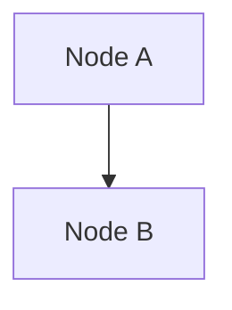

# {work name} Design Handoff Summary

## Topology Overview
workflow_topology_spec.json(CC-01)의 핵심 내용을 사람이 읽을 수 있는 형태로 요약한다.

- Topology Type: {linear|fan_out|fan_in|dag}
- 총 노드 수:
- 총 엣지 수:
- RSV Total:

### Node Summary
| Node ID | 역할 | 설명 |
|---------|------|------|
|         |      |      |

### Topology Diagram
Mermaid 다이어그램으로 노드/엣지 구조를 시각화한다.

---

## Mental Model Mapping
mental_model_bundle.json(CC-02)에서 각 노드에 할당된 chart를 요약한다.

| Node ID | chart_ids | model_selection | 비고 |
|---------|-----------|-----------------|------|
|         |           |                 |      |

- Bundle Ref: {bundle-ref}

---

## Execution Strategy
execution_plan.json(CC-06)의 DAG 구조를 요약한다.

### Critical Path
전체 실행 시간을 결정하는 최장 경로를 명시한다.

1. {node-id} → {node-id} → ...

### Parallel Segments
병렬 실행 가능한 구간을 나열한다.

| 구간 | 병렬 노드들 | 선행 조건 |
|------|-----------|----------|
|      |           |          |

### Branch / Merge Points
fan-out/fan-in 지점을 명시한다.

| 유형 | Node ID | 연결 노드 | merge_policy (해당 시) |
|------|---------|----------|----------------------|
| branch | | | - |
| merge  | | | {strategy, quorum} |

---

## Risk Flags
Design 단계에서 식별한 리스크와 fallback_rules를 요약한다.

| error_type | severity | action | max_retry | requires_human |
|-----------|----------|--------|-----------|----------------|
|           |          |        |           |                |

### Design 단계 미결 사항
- {topology 또는 mental model 설계 시 남겨진 open question}

---

## Handoff Checklist
Ops Swarm이 티켓 생성 전에 확인해야 할 전제조건을 나열한다.

- [] CC-01 검증 통과 (topology → execution node ID 정합)
- [] CC-02 검증 통과 (chart_ids → bundle 정합)
- [] CC-06 검증 통과 (execution_graph → snapshot 기록 가능)
- [] fallback_rules에 모든 노드의 에러 시나리오 포함
- [] branch 노드의 merge_policy 정의 완료
- [] HITL override point 식별 완료
