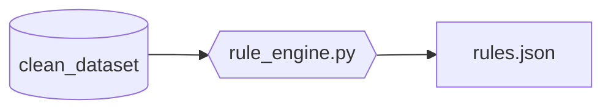
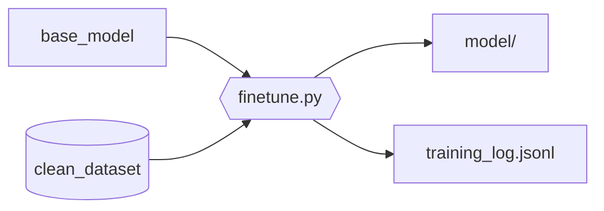
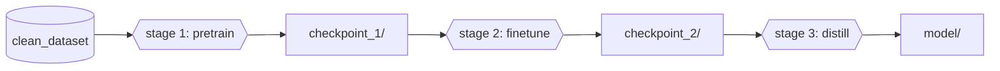
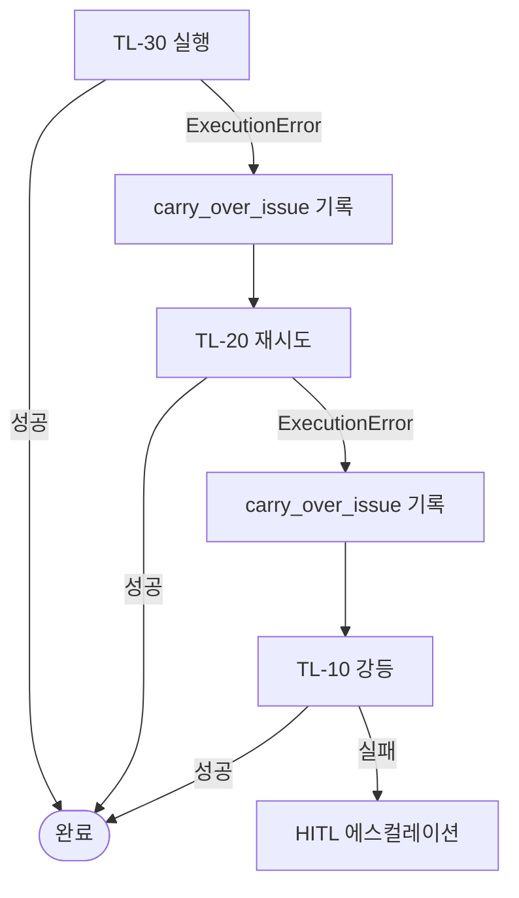

# module.training-level

> Phase 3 전용. Training Level TL-10/20/30 각각의 실행 흐름 상세.

---

## TL-10 — Rule/Heuristic 생성



### 적합 상황

- 데이터 < 100건 또는 태스크가 결정론적
- regex, 키워드 매칭, 임계값 기반으로 해결 가능
- LLM 호출을 완전히 제거하고 deterministic 처리로 전환

### 실행 단계

1. **패턴 분석**: `clean_dataset.jsonl`에서 input→output 매핑의 결정론적 패턴을 추출한다
   - 동일 입력 → 동일 출력 비율 계산
   - 고빈도 패턴 클러스터링
2. **규칙 생성**: `rule_engine.py` 실행
   - 키워드 기반 규칙 추출
   - 정규표현식 패턴 도출
   - 임계값 기반 분기 조건 생성
3. **규칙 검증**: validation split으로 규칙 커버리지 측정
   - 커버리지 < 80% → warning 기록 + HITL에 수동 규칙 보완 요청
4. **rules.json 저장**: `{workspace}/.mso-context/active/<run_id>/model-optimizer/tl10_model/rules.json`

### rules.json 형식

```json
{
  "version": "1.0",
  "task_type": "classification",
  "rules": [
    {
      "id": "r001",
      "condition": { "type": "keyword", "pattern": "환불|반품|취소", "field": "input" },
      "output": { "label": "refund_request", "confidence": 0.95 },
      "priority": 1
    },
    {
      "id": "r002",
      "condition": { "type": "regex", "pattern": "^[0-9]{10,13}$", "field": "order_id" },
      "output": { "label": "order_lookup", "confidence": 0.99 },
      "priority": 2
    }
  ],
  "fallback": {
    "action": "escalate_to_llm",
    "note": "규칙 미매칭 시 LLM fallback"
  },
  "coverage": 0.87,
  "generated_from": "<dataset_stats hash>"
}
```

### 산출물

| 파일 | 경로 |
|------|------|
| rules.json | `tl10_model/rules.json` |
| coverage_report.md | `tl10_model/coverage_report.md` |
| training_log.jsonl | `tl10_model/training_log.jsonl` |

---

## TL-20 — 경량 모델 파인튜닝



### 적합 상황

- 데이터 100~10K건 + 패턴 반복성 확인
- 사전 학습된 base model이 있고, 도메인 적응이 필요한 경우
- classification, NER 등 표준 NLP 태스크

### 실행 단계

1. **base_model 로드**: model-decision에서 결정된 `base_model`을 다운로드/로드
2. **데이터 전처리**: `clean_dataset.jsonl` → 모델별 토크나이저 형식으로 변환
   - train/validation split 적용 (Phase 1에서 준비된 splits/)
3. **파인튜닝 실행**: `finetune.py`
   - 기본 하이퍼파라미터:
     - learning_rate: 2e-5
     - batch_size: 16
     - epochs: 3~5 (early stopping with patience=2)
     - warmup_ratio: 0.1
   - 사용자가 하이퍼파라미터를 지정하면 그 값을 사용
4. **validation 평가**: epoch마다 validation loss + f1 측정
   - early stopping 조건: validation f1이 2 epoch 연속 하락
5. **모델 저장**: best checkpoint를 `model/`로 저장
6. **ONNX 변환** (선택): runtime이 `onnx`이면 변환 실행

### 산출물

| 파일 | 경로 |
|------|------|
| model/ | `tl20_model/model/` (PyTorch 또는 ONNX) |
| tokenizer/ | `tl20_model/tokenizer/` |
| training_log.jsonl | `tl20_model/training_log.jsonl` |
| config.json | `tl20_model/config.json` (하이퍼파라미터 기록) |

### training_log.jsonl 형식

```jsonl
{"epoch": 1, "train_loss": 0.42, "val_loss": 0.38, "val_f1": 0.84, "lr": 2e-5}
{"epoch": 2, "train_loss": 0.28, "val_loss": 0.31, "val_f1": 0.89, "lr": 1.8e-5}
{"epoch": 3, "train_loss": 0.19, "val_loss": 0.29, "val_f1": 0.91, "lr": 1.6e-5}
```

---

## TL-30 — 전체 학습 / 다단계 파인튜닝



### 적합 상황

- 데이터 > 10K건 + 복잡한 태스크
- base model 없이 처음부터 학습하거나, 다단계 적응이 필요한 경우
- multi-class (≥ 20), 복합 NER, 복잡한 sequence tagging

### 실행 단계

1. **Stage 1 — Domain Pretrain** (선택)
   - 도메인 텍스트로 MLM(Masked Language Model) 추가 사전 학습
   - 도메인 텍스트 미제공 시 건너뜀
2. **Stage 2 — Task-specific Finetune**
   - Stage 1 checkpoint (또는 base_model)에서 태스크별 파인튜닝
   - TL-20과 동일한 프로세스, 단 epoch 수 확대 (5~10)
   - 하이퍼파라미터 탐색: grid search 또는 사용자 지정
3. **Stage 3 — Knowledge Distillation** (선택)
   - 큰 모델 → 작은 모델로 증류하여 inference 속도 향상
   - model_size_mb > 500MB일 때 자동 트리거
   - 증류 후 f1 하락이 5% 이내면 증류 모델 채택
4. **checkpoint 관리**: 각 stage의 best checkpoint를 보존

### 산출물

| 파일 | 경로 |
|------|------|
| model/ | `tl30_model/model/` (최종 모델) |
| tokenizer/ | `tl30_model/tokenizer/` |
| checkpoints/ | `tl30_model/checkpoints/stage{N}_best/` |
| training_log.jsonl | `tl30_model/training_log.jsonl` |
| distill_log.jsonl | `tl30_model/distill_log.jsonl` (Stage 3 실행 시) |
| config.json | `tl30_model/config.json` |

---

## TL 강등 정책

학습 실패 시 자동으로 낮은 TL로 강등하여 재시도한다.



### 강등 시 carry_over_issues 기록

```json
{
  "original_tl": "TL-30",
  "demoted_to": "TL-20",
  "reason": "OOM: GPU 메모리 부족으로 Stage 2 실패",
  "timestamp": "2026-03-18T14:30:00Z"
}
```

---

## runtime 선택 가이드

| runtime | 적합 상황 | 비고 |
|---------|-----------|------|
| `rules` | TL-10 산출물 | rules.json 기반 결정론적 추론 |
| `onnx` | TL-20/30 + latency 최적화 | CPU 추론 최적, 크로스플랫폼 |
| `pytorch` | TL-20/30 + GPU 가용 | 유연성 높음, GPU 필요 |

Phase 5에서 `deploy_spec.json`의 `runtime` 필드에 기록한다. 사용자가 명시하지 않으면 TL-10은 `rules`, TL-20/30은 `onnx`를 기본값으로 사용한다.
