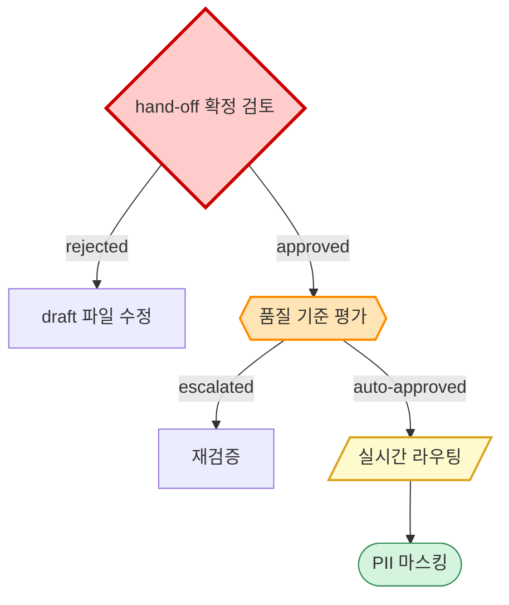

# Gate Levels — Decision Node Judge

`type: decision` 노드의 `judge` 필드로 인간 개입 수준을 지정한다.  
이 값은 운영 비용, 위험도, SLA를 결정하는 1차 정보다.

## Table of Contents

1. [4-Level Taxonomy](#1-4-level-taxonomy)
2. [Decision Matrix](#2-decision-matrix)
3. [YAML Field Spec](#3-yaml-field-spec)
4. [Mermaid Visualization](#4-mermaid-visualization)
5. [Anti-Patterns](#5-anti-patterns)
6. [Project Examples](#6-project-examples)

---

## 1. 4-Level Taxonomy

| Level | Full Name | 정의 | 인간 개입 시점 |
|-------|-----------|------|--------------|
| **HITL** | Human-In-The-Loop | 모든 의사결정에 사람이 명시적으로 승인/실행 | Pre-execution (필수) |
| **HITLFE** | Human-In-The-Loop For Exceptions | 정상 경로는 자동, 예외/임계치 초과 시만 에스컬레이션 | Conditional (예외 시) |
| **HOTL** | Human-On-The-Loop | 시스템 자율 실행, 사람은 감독·중단 권한 | Concurrent (모니터링) |
| **HOOTL** | Human-Out-Of-The-Loop | 완전 자율, 사람 개입 없음 (사후 감사만) | None (또는 사후) |

자동화 수준: **HITL → HITLFE → HOTL → HOOTL** 순으로 인간 개입 감소.

| Level | 인건비 | 처리 속도 | 리스크 |
|-------|-------|---------|--------|
| HITL | 매우 높음 | 매우 느림 | 매우 낮음 |
| HITLFE | 중간 | 빠름 | 낮음 |
| HOTL | 낮음 | 매우 빠름 | 중간 |
| HOOTL | 거의 없음 | 최대 | 높음 (사후 발견) |

---

## 2. Decision Matrix

새 decision 노드의 judge를 결정할 때 다음 질문을 순서대로 답한다.

```
Q1. 잘못된 결정의 비용이 회복 불가능한가 (법적·재무·운영 위협)?
    → YES: HITL
    → NO: Q2

Q2. 의사결정 신뢰도가 95% 이상 측정 가능한가?
    → NO: HITL
    → YES: Q3

Q3. 예외 케이스를 사후가 아닌 실시간으로 차단해야 하는가?
    → YES: HITLFE
    → NO: Q4

Q4. 실시간 모니터링·중단이 사업적으로 필요한가?
    → YES: HOTL
    → NO: HOOTL
```

### Quick Heuristics

- **정책 변경 / 골든셋 라벨링** → HITL
- **고위험 거래 / 정책 위반 의심** → HITLFE
- **실시간 챗봇 응답 / 라우팅** → HOTL
- **ETL / 배치 마스킹 / 계산** → HOOTL

---

## 3. YAML Field Spec

decision 노드의 `judge`별 추가 필드.

### HITL

```yaml
- type: decision
  id: acp-d-001
  label: "정책 변경 확정 검토"
  judge: HITL
  owner: owner@example.com          # 필수
  sla: "24시간 이내"               # optional
  branches:
    - on: rejected
      goto: acp-s-007             # 거절 시 복귀 step
```

### HITLFE

```yaml
- type: decision
  id: acp-d-002
  label: "품질 기준 달성 여부 평가"
  judge: HITLFE
  owner: owner@example.com          # 필수
  threshold: "F1 < 0.87"          # 필수 — 에스컬레이션 조건
  sla: "24시간 이내"               # optional
  branches:
    - on: escalated
      goto: acp-s-010
```

### HOTL / HOOTL

`owner`, `threshold` 불필요. branches만 정의하면 된다.

```yaml
- type: decision
  id: sdm-d-001
  label: "마스킹 결과 품질 확인"
  judge: HOTL
  branches:
    - on: flagged
      goto: sdm-s-005
```

### Field Reference

| Field | Judge | Required | 설명 |
|-------|-------|----------|------|
| `judge` | 전체 | **필수** | HITL / HITLFE / HOTL / HOOTL |
| `owner` | HITL, HITLFE | **필수** | 의사결정 책임자 (이메일) |
| `threshold` | HITLFE | **필수** | 에스컬레이션 발동 조건 |
| `sla` | HITL, HITLFE | optional | 인간 응답 SLA |
| `branches` | 전체 | optional | 조건별 분기. 생략 시 sequential next |

**branches.on 허용 값:**

| judge | 허용 조건 |
|-------|---------|
| HITL | `approved` · `rejected` · `escalated` |
| HITLFE | `auto-approved` · `escalated` · `rejected` |
| HOTL | `passed` · `flagged` |
| HOOTL | `completed` · `failed` |

---

## 4. Mermaid Visualization

`workflow_to_mermaid.py`가 decision 노드를 judge별 shape·color로 렌더링한다.

| Judge | Shape | Color | Mermaid Class |
|-------|-------|-------|--------------|
| HITL | `{ }` (마름모) | 🔴 Red | `classDef hitl fill:#ffcccc,stroke:#cc0000,stroke-width:3px` |
| HITLFE | `{{hexagon}}` | 🟠 Orange | `classDef hitlfe fill:#ffe4b5,stroke:#ff8c00,stroke-width:2px` |
| HOTL | `[/parallelogram/]` | 🟡 Yellow | `classDef hotl fill:#fffacd,stroke:#daa520,stroke-width:2px` |
| HOOTL | `([rounded])` | 🟢 Green | `classDef hootl fill:#d4f4dd,stroke:#2e8b57,stroke-width:1px` |



---

## 5. Anti-Patterns

### ❌ HOOTL Drift

고위험 단계를 HOOTL로 표시. 인시던트 시 책임 소재 불명확.

```yaml
# Bad — 회복 불가, HITL이어야 함
- type: decision
  id: x-d-001
  judge: HOOTL  # 정책 변경인데?

# Good
- type: decision
  id: x-d-001
  judge: HITLFE
  threshold: "amount > $10,000 or risk_score > 0.7"
```

### ❌ Missing Owner on HITL

`owner` 누락. 에스컬레이션 발생 시 책임자를 알 수 없음.

```yaml
# Bad
- type: decision
  judge: HITL  # owner 없음

# Good
- type: decision
  judge: HITL
  owner: owner@example.com
```

### ❌ HOTL without Monitoring Channel

HOTL인데 모니터링 채널 미정의. 사실상 HOOTL.

```yaml
# Good
- type: step
  id: x-s-010
  label: "실시간 챗봇 응답 생성"
  # HOTL decision 노드가 이 step 뒤에 분리 정의됨
  # → decision 노드에 monitoring 필드 추가 가능
```

---

## 6. Project Examples

| Module | Decision Label | Recommended Judge | 이유 |
|--------|---------------|-----------------|------|
| 02.AI-Chatbot-Policy | 정책 변경 확정 검토 | HITL | 운영 영향, 롤백 비용 큼 |
| 02.AI-Chatbot-Policy | 품질 기준 달성 여부 | HITLFE | F1 임계치 기반 에스컬레이션 |
| 03.sensitive-data-masking | PII 신뢰도 검증 | HITLFE | 재식별 위험 차단 |
| 04.AIKON7 | Faithfulness 검토 | HITLFE | 환각 의심 케이스 수동 검토 |
| 10.RAG-Corpus-Dataset | QA 골든셋 라벨 확인 | HITL | 평가 기준 정본 |

---

## Related

- [yaml-schema.md](yaml-schema.md) — decision 노드 전체 문법 스펙
- [motif-patterns.md](motif-patterns.md) — Decision Node Motif
