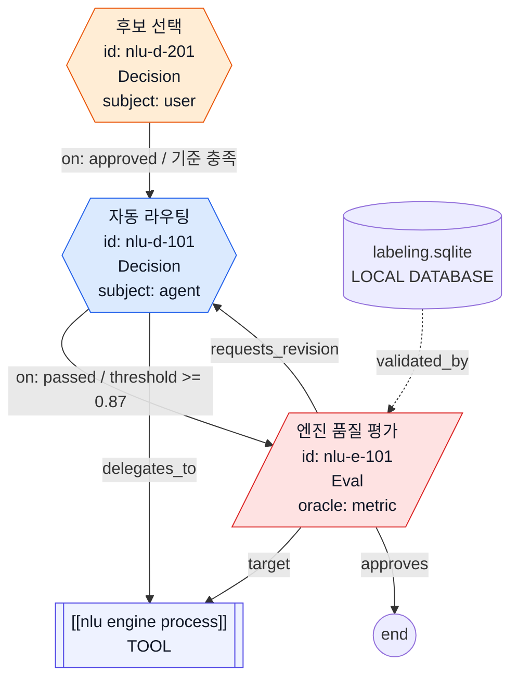

# Intervention Levels — Derived Repository Classification

`type: decision` 노드는 단일 `Decision` class를 사용한다. 판단 주체는
`decision_subject` property로 표현하며 값은 `user` 또는 `agent`뿐이다.

`HITL/HITLFE/HOTL/HOOTL`은 decision 노드의 필드가 아니라, workflow 경로 안에
`decision_subject=user` decision 또는 `oracle_type=user` eval이 있는지로 파생하는
repository 운영 분류다.

## 1. Decision Subject

| Subject | 의미 | Mermaid |
|---------|------|---------|
| `user` | 사용자/사람/운영자가 process branch를 판단 | `decision` class + 주황 node-level style |
| `agent` | agent가 process branch를 판단 | `decision` class + 파랑 node-level style |

agent decision은 사람이 매번 판단하지 않으므로 `decision_criteria`, `threshold`,
`pass_criteria`, `success_criteria` 중 하나로 판단 기준을 남긴다. 관측 그래프에서는
이 기준을 node label이 아니라 branch edge label에 붙인다.

```yaml
- type: decision
  id: nlu-d-201
  label: "골든 후보 선별·목표 판단"
  decision_subject: user
  decision_criteria: "승격 후보가 골든셋 기준을 충족하는지 확인"
  branches:
    - on: approved
      goto: nlu-s-203
    - on: target_met
```

## 2. Eval Boundary

`Eval`은 artifact/process 자체의 품질·정합성을 판정할 때만 사용한다.
예: `[[nlu engine process]]`, evaluator, corpus, 배포 가능성, metric gate.
여기서 `[[process]]`/`[[processing artifact]]`는 workflow control node가 아니라
agentTask의 tool use를 가리키는 artifact-like target으로 취급한다. 관측 그래프에서는
`Eval --target--> [[tool]]`, `tool-produced artifact --validated_by--> Eval`,
`Eval --requests_revision--> remediation agentTask`, `Eval --approves--> next agentTask/end`,
`remediation agentTask --target--> [[tool]]` 형태로 표현한다. 실행 도구 위임은 별도로
`agentTask --delegates_to--> [[tool]]` 로 표시한다.
artifact stream에서는 tool 위임의 효율을 확인해야 하므로 `artifact --consumes--> tool --produces--> artifact`
를 optimization spine으로 둔다.

`check`보다 `validated_by`를 표준 edge label로 쓴다. `check`는 실행 행위처럼 보이지만,
`validated_by`는 artifact가 어떤 Eval에 의해 검증되는지 나타내므로 workflow 최적화 그래프에서
책임 경계가 더 분명하다. Eval target이 tool이면 tool 자체가 아니라 그 tool이 생산한 artifact가
`validated_by` 대상이다.

단순히 여러 후보 artifact 중 하나를 고르거나 재생산 여부를 판단하는 경우는
`Eval`이 아니라 `decision_subject=user`인 `Decision`이다.

```yaml
- type: eval
  id: nlu-d-102
  label: "HITL 리뷰 수행"
  oracle_type: user
  target_artifact: "04.modules/conversational-nlu-classifier-v2/data/"
  criteria:
    - "intent_final 확정 가능성과 tool 재실행 필요성"
```

## 3. Derived Intervention Levels

| Level | 파생 조건 | 의미 |
|-------|-----------|------|
| HITL | 모든 주요 경로에 user decision 또는 user eval이 있음 | 사람 판단이 실행 경로에 필수 |
| HITLFE | 예외/임계치 경로에만 user decision 또는 user eval이 있음 | 조건부 사람 판단 |
| HOTL | 실행은 agent가 판단하지만 결과가 사람에게 노출·알림됨 | 사람 모니터링 필수 |
| HOOTL | user decision/user eval/필수 노출 없이 agent가 판단 | 완전 위임 |

이 분류는 repository나 workflow path 수준에서 계산한다. 개별 node의 표준 TTL에는
`decision_subject`와 `oracle_type`만 기록한다.

## 4. Mermaid Semantics

모든 decision은 Mermaid class `decision`을 사용한다. 사용자 판단이면 주황색,
agent 판단이면 파란색 node-level style을 적용한다. `Eval`은 빨간색이고,
`Validation`은 자동 검증이므로 eval과 구분되는 파란색 계열을 사용한다.



## 5. Anti-Patterns

### `judge`를 신규 Decision 필드로 쓰기

```yaml
# Bad
- type: decision
  id: x-d-001
  judge: HITL

# Good
- type: decision
  id: x-d-001
  decision_subject: user
```

### 후보 선택을 Eval로 모델링하기

```yaml
# Bad — 후보 artifact 중 선택/재생산 판단은 process branch다.
- type: eval
  id: x-e-001
  label: "후보 산출물 선택"

# Good
- type: decision
  id: x-d-001
  label: "후보 산출물 선택"
  decision_subject: user
```
