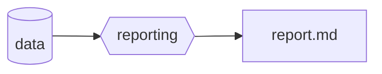
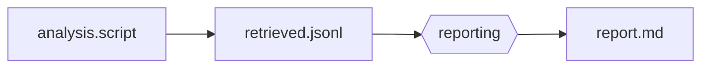
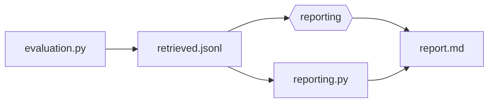
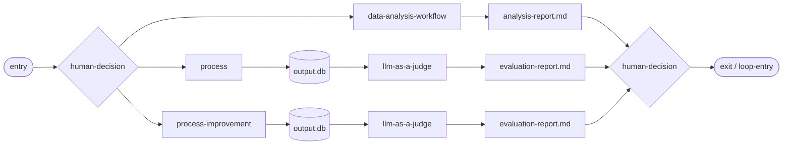
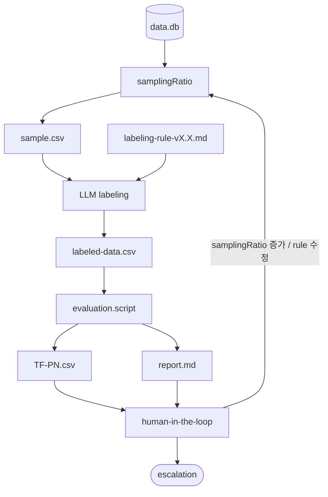

# mso-workflow-optimizer

> 이 스킬은 리포트를 직접 생성하지 않는다.
> **Automation Level을 판단하고 해당 레벨의 실행 흐름을 지시**하여 최적화 산출물(`report.md`)과 감사 로그를 생성한다.

---

## 핵심 정의

| 개념                           | 정의                                                                                   |
| ------------------------------ | -------------------------------------------------------------------------------------- |
| **agent-decision**             | 워크플로우 현황과 docs/usage/{}.md를 종합해 Automation Level을 결정하는 중심 판단 노드 |
| **Automation Level**           | 최적화 실행 깊이. 10=단순 리포팅, 20=스크립트 분석, 30=자동화 평가                     |
| **operation-agent**            | agent-decision의 지시를 받아 automation-level 에스컬레이션과 실제 작업을 수행          |
| **decision-reporting-logging** | 의사결정 결과와 실행 요약을 audit-log.db 및 human-in-the-loop으로 전달하는 노드        |
| **human-feedback-logging**     | HITL 피드백을 수렴하여 goal 산출물 및 audit-log.db에 기록                              |

---

## LLM API 키 설정 (ENV)

`llm-as-a-judge`는 API 호출 시 아래 환경변수 규칙을 따른다.

**스킬 내부 ENV 파일 위치**
- 템플릿: `{mso-workflow-optimizer}/.env.example`
- 실사용(권장): `{mso-workflow-optimizer}/.env.local`
- 대안: `{mso-workflow-optimizer}/.env`
- 모델 카탈로그: `{mso-workflow-optimizer}/configs/llm-model-catalog.yaml`
- 모델 선택 도우미: `python3 {mso-workflow-optimizer}/scripts/select_llm_model.py --provider <openai|anthropic|google>`

| 변수명              | 필수 여부 | 설명                                                          |
| ------------------- | --------- | ------------------------------------------------------------- |
| `LLM_API_PROVIDER`  | 선택      | `openai` \| `anthropic` \| `google` (기본값: `openai`)        |
| `LLM_API_KEY`       | 권장      | 공통 API 키. 설정 시 provider별 키보다 우선 사용              |
| `OPENAI_API_KEY`    | 조건부    | `LLM_API_PROVIDER=openai`이고 `LLM_API_KEY` 미설정 시 사용    |
| `ANTHROPIC_API_KEY` | 조건부    | `LLM_API_PROVIDER=anthropic`이고 `LLM_API_KEY` 미설정 시 사용 |
| `GOOGLE_API_KEY`    | 조건부    | `LLM_API_PROVIDER=google`이고 `LLM_API_KEY` 미설정 시 사용    |
| `LLM_API_BASE_URL`  | 선택      | 사내 게이트웨이/프록시 사용 시 override endpoint              |
| `LLM_MODEL`         | 선택      | 모델 식별자 (예: `gpt-5.2`)                                   |

**키 조회 우선순위**
1. `LLM_API_KEY`
2. provider별 키 (`OPENAI_API_KEY` / `ANTHROPIC_API_KEY` / `GOOGLE_API_KEY`)

**실패 정책**
- 유효한 API 키가 없으면 `llm-as-a-judge` 단계에서 즉시 중단(fail-fast)하고, 원문 키 값은 로그에 남기지 않는다.

---

## 실행 프로세스

### Phase 1: 트리거 수신 + 컨텍스트 로드

1. 트리거 유형을 확인한다: 외부 트리거(operation-agent 경유) 또는 직접 트리거(workflow/analysis 재평가 요청)
2. `docs/usage/{workflow_name}.md` 또는 지정된 문서를 읽어 현재 워크플로우 설계 의도를 파악한다
3. `{workspace}/.mso-context/audit_global.db`에서 해당 워크플로우의 최근 실행 이력을 조회한다
4. 입력 컨텍스트 확정: `workflow_name`, `current_metrics`, `last_run_id`, `optimization_goal`

**when_unsure**: 트리거 유형이 불명확하면 최근 audit-log의 `work_type` 필드로 유추하고 사용자에게 확인 요청.

**산출물**: `trigger_context { trigger_type, workflow_name, current_metrics, audit_snapshot }`

---

### Phase 2: agent-decision — Automation Level 판단

agent-decision은 3가지 신호를 종합하여 Automation Level을 결정한다.
상세 판단 규칙은 [modules/module.agent-decision.md](modules/module.agent-decision.md) 참조.

**decision 출력:**
```json
{
  "automation_level": 10 | 20 | 30,
  "rationale": ["Signal A: ...", "Signal B: ...", "Signal C: ..."],
  "escalation_needed": true | false
}
```

**when_unsure**: Signal 간 충돌 시 보수적으로 낮은 레벨 선택 후 `escalation_needed: true`로 operation-agent에 위임.

**산출물**: `decision_output { automation_level, rationale[], escalation_needed }`

---

### Phase 3: Automation Level 실행

레벨별 실행 상세는 [modules/module.automation-level.md](modules/module.automation-level.md) 참조.

#### Level 10 — 단순 데이터 리포팅



**산출물 경로**: `{workspace}/.mso-context/active/<run_id>/optimizer/level10_report.md`

#### Level 20 — 스크립트 기반 분석 리포팅



**산출물 경로**: `{workspace}/.mso-context/active/<run_id>/optimizer/level20_report.md`

#### Level 30 — 자동화 평가 리포팅



**산출물 경로**: `{workspace}/.mso-context/active/<run_id>/optimizer/level30_report.md`

---

### Phase 4: decision-reporting-logging

1. Phase 2 decision 결과와 Phase 3 실행 요약을 수집한다
2. `mso-agent-audit-log` 스킬을 통해 `audit_global.db`에 기록한다
3. human-in-the-loop 노드로 리포트 경로와 decision 요약을 전달한다

**audit payload 형식:**
```json
{
  "run_id": "<run_id>",
  "artifact_uri": "{workspace}/.mso-context/active/<run_id>/optimizer/levelXX_report.md",
  "status": "completed",
  "work_type": "workflow_optimization",
  "metadata": {
    "automation_level": 10 | 20 | 30,
    "workflow_name": "<name>",
    "rationale": []
  }
}
```

---

### Phase 5: human-in-the-loop + human-feedback-logging → goal

HITL 운영 상세는 [modules/module.hitl-feedback.md](modules/module.hitl-feedback.md) 참조.

1. 사용자에게 `report.md`를 제시하고 Automation Level 적절성·개선 우선순위를 확인한다
2. 피드백을 `user_feedback` 테이블(`mso-agent-audit-log`)에 기록한다
3. 피드백과 report.md를 종합하여 **goal** 산출물을 생성한다

**goal 형식:**
```json
{
  "next_automation_level": 10 | 20 | 30,
  "optimization_directives": ["지시 1", "지시 2"],
  "carry_over_issues": ["이슈 1"],
  "approved_by": "human_feedback"
}
```

**when_unsure**: HITL 응답 없음(타임아웃) → 현재 automation_level 유지 + `carry_over_issues`에 "HITL 미응답" 기록.

---

## operation-agent escalation 처리

| 상황                           | operation-agent 역할                             |
| ------------------------------ | ------------------------------------------------ |
| Level 결정 충돌                | 상위 레벨 선택 후 재실행 요청                    |
| 실행 실패                      | 실패 원인 기록 후 Level 하향 재시도              |
| 외부 트리거 (신규 데이터 도착) | agent-audit-log.db에 트리거 기록 후 Phase 1 진입 |

---

## Operational Modules

기존 5-Phase 흐름 외에, 반복적 프로세스 개선을 위한 운영 모듈:

| 모듈                                                       | 설명                                                           | 호출 관계                           |
| ---------------------------------------------------------- | -------------------------------------------------------------- | ----------------------------------- |
| [process-optimizing](modules/module.process-optimizing.md) | 프로세스 실행·분석·평가를 반복하며 워크플로우 구조를 개선      | → llm-as-a-judge 서브프로세스 호출  |
| [llm-as-a-judge](modules/module.llm-as-a-judge.md)         | LLM 기반 데이터 라벨링 + TF-PN 정량 검증 + HITL 규칙 개선 루프 | ← process-optimizing 또는 독립 실행 |

### process-optimizing 흐름



### llm-as-a-judge 흐름



---

## Pack 내 관계

| 연결 | 스킬                           | 설명                                                           |
| ---- | ------------------------------ | -------------------------------------------------------------- |
| →    | `mso-agent-audit-log`          | Phase 4: decision 결과 및 HITL 피드백을 audit_global.db에 기록 |
| ←    | `mso-observability`            | audit DB 패턴 분석 결과를 Signal C (피드백 이력)로 소비        |
| ←    | `mso-workflow-topology-design` | topology 변경 후 최적화 재평가 트리거 발생 시 Phase 1 진입     |
| →    | `mso-task-context-management`  | goal 산출 후 다음 주기 최적화 작업을 티켓으로 등록             |
| ←    | `mso-execution-design`         | execution_graph 실행 완료 신호 수신 시 트리거                  |

---

## 상세 파일 참조 (필요 시에만)

| 상황                         | 파일                                                                           |
| ---------------------------- | ------------------------------------------------------------------------------ |
| 5-Phase 전체 오케스트레이션  | [modules/module.analysis-optimizing.md](modules/module.analysis-optimizing.md) |
| agent-decision 3-Signal 판단 | [modules/module.agent-decision.md](modules/module.agent-decision.md)           |
| Automation Level 실행 상세   | [modules/module.automation-level.md](modules/module.automation-level.md)       |
| HITL 피드백 운영             | [modules/module.hitl-feedback.md](modules/module.hitl-feedback.md)             |
| 프로세스 반복 최적화         | [modules/module.process-optimizing.md](modules/module.process-optimizing.md)   |
| LLM 기반 라벨링·평가         | [modules/module.llm-as-a-judge.md](modules/module.llm-as-a-judge.md)           |
| 출력 스키마 검증             | [schemas/optimizer_result.schema.json](schemas/optimizer_result.schema.json)   |
| goal 산출물 저장             | `{workspace}/.mso-context/active/<run_id>/optimizer/goal.json`                   |

---

## Quick Example

**Input**: "sop-masking-engine 워크플로우 최적화 검토해줘"

**Phase 1** → trigger_type: direct, workflow_name: sop-masking-engine, audit_snapshot: 최근 precision=90.3%
**Phase 2** → Signal A: evaluation.py 존재 → Level 30 후보 / Signal B: KPI 충족 → Level 10 충분 / Signal C: 이전 HITL 없음 → **Level 20** 결정
**Phase 3** → analysis.script 실행 → retrieved.jsonl → reporting → level20_report.md 생성
**Phase 4** → audit_global.db 기록 (automation_level=20, status=completed)
**Phase 5** → 사용자 검토 → "Level 30 평가도 병행해달라" → goal.json: next_automation_level=30
