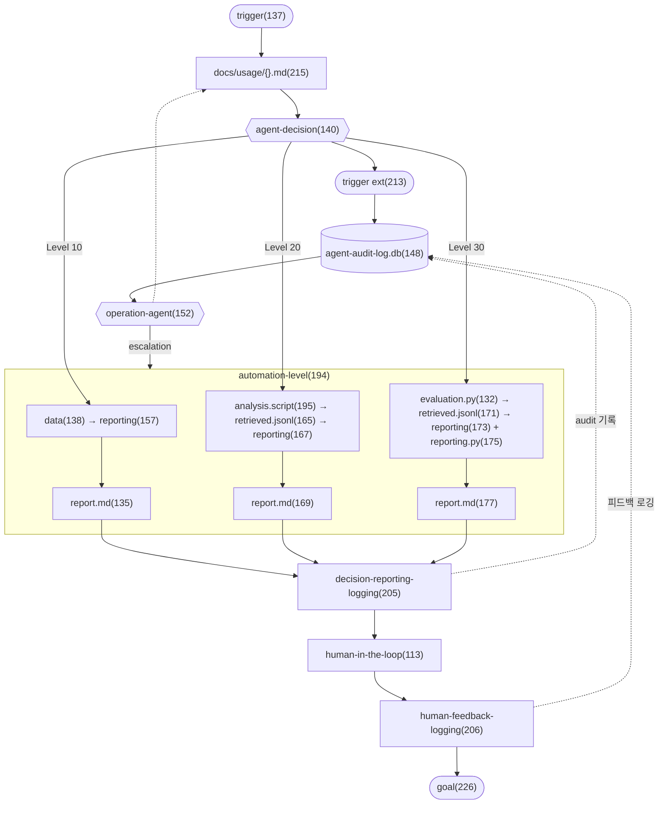
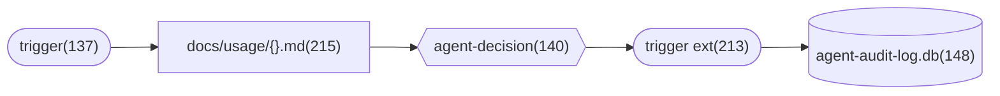
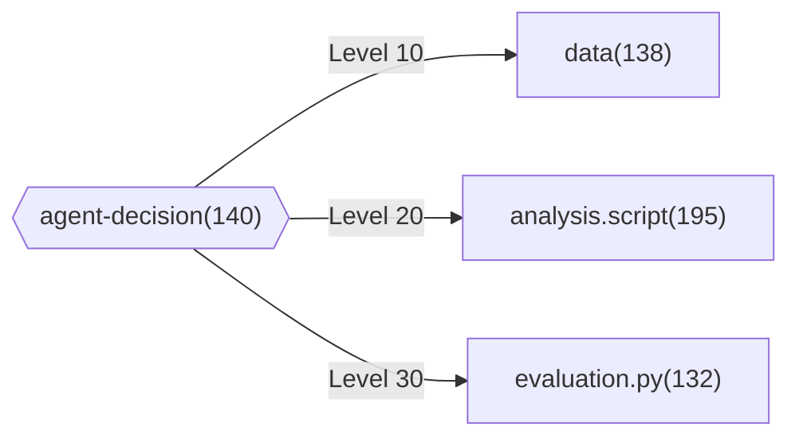
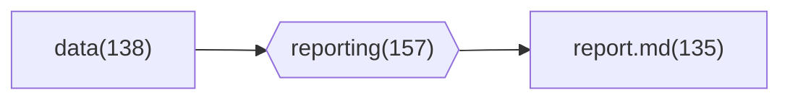
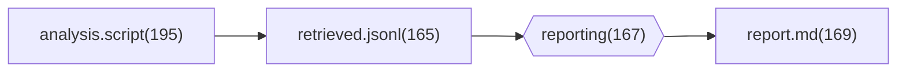
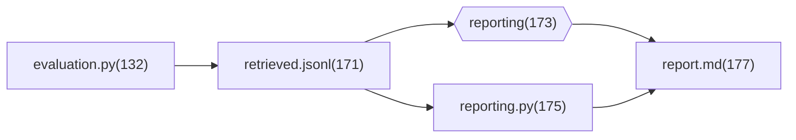
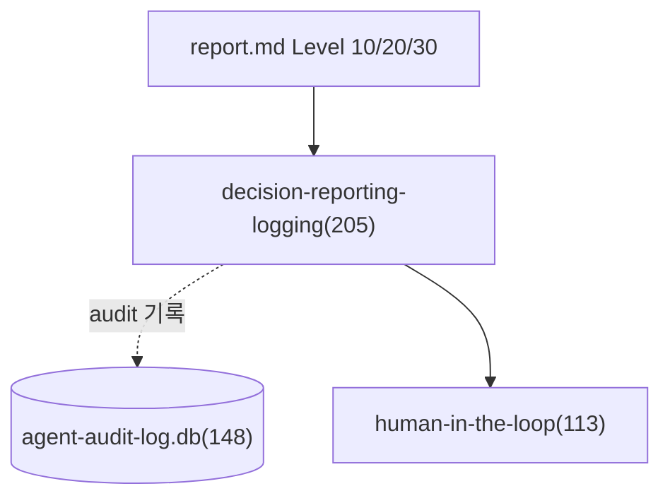
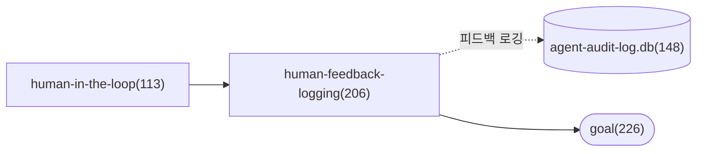
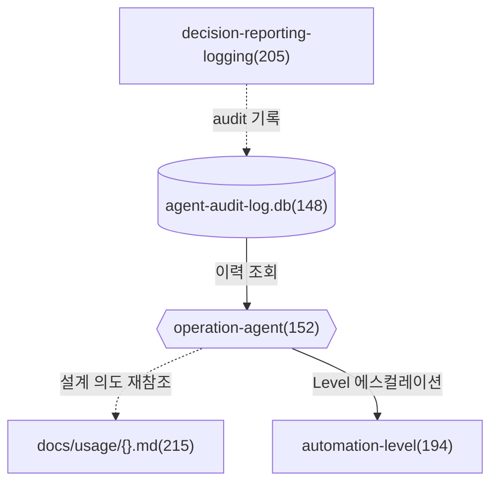

# module.analysis-optimizing

> 5-Phase 실행 프로세스의 전체 오케스트레이션 모듈.
> agent-decision → automation-level → decision-reporting-logging → HITL → goal 흐름을 통합 관리하며,
> operation-agent 에스컬레이션 루프와 외부 트리거 경로를 포함한다.

---

## 개요

analysis-optimizing은 mso-workflow-optimizer의 **핵심 워크플로우**다.
SKILL.md의 Phase 1~5를 drawio 노드 단위로 매핑하고,
기존 Core Module(agent-decision, automation-level, hitl-feedback)이 다루지 않는
**operation-agent 루프**와 **외부 트리거 → audit-log 경로**를 명시적으로 기술한다.

---

## 워크플로우

**점선(-.->)**: audit-log 쓰기 (mso-agent-audit-log 스킬 경유)

---

## 노드 정의

### 진입 노드

| 노드 | drawio ID | 유형 | 설명 |
|------|-----------|------|------|
| `trigger` | 137 | 시작점 | 직접 트리거. 워크플로우 최적화 요청 수신 |
| `docs/usage/{}.md` | 215 | 문서 | 워크플로우 설계 의도를 담은 참조 문서 |
| `trigger` (ext) | 213 | 시작점 | 외부 트리거. operation-agent 경유 또는 신규 데이터 도착 |

### 판단 노드

| 노드 | drawio ID | 유형 | 설명 | 상세 모듈 |
|------|-----------|------|------|-----------|
| `agent-decision` | 140 | 헥사곤 | 3-Signal 종합하여 Automation Level 결정 | [module.agent-decision.md](module.agent-decision.md) |
| `operation-agent` | 152 | 헥사곤 | agent-decision 지시를 수행하고 에스컬레이션 처리 | — |

### 실행 노드 (automation-level 그룹)

| 노드 | drawio ID | 유형 | 설명 | 상세 모듈 |
|------|-----------|------|------|-----------|
| `automation-level` | 194 | 그룹 | Level 10/20/30을 포함하는 실행 그룹 | [module.automation-level.md](module.automation-level.md) |
| `automation-level.10` | 181 | 서브그룹 | `data` → `reporting` → `report.md` | 〃 |
| `automation-level.20` | 182 | 서브그룹 | `analysis.script` → `retrieved.jsonl` → `reporting` → `report.md` | 〃 |
| `automation-level.30` | 180 | 서브그룹 | `evaluation.py` → `retrieved.jsonl` → (`reporting` + `reporting.py`) → `report.md` | 〃 |

### 후처리 노드

| 노드 | drawio ID | 유형 | 설명 | 상세 모듈 |
|------|-----------|------|------|-----------|
| `agent-audit-log.db` | 148 | 데이터 저장소 | 감사 로그 DB (mso-agent-audit-log 스킬 관리) | — |
| `decision-reporting-logging` | 205 | 프로세스 | 의사결정 + 실행 결과를 audit-log와 HITL로 라우팅 | — |
| `human-in-the-loop` | 113 | 프로세스 | 사용자에게 리포트를 제시하고 피드백 수렴 | [module.hitl-feedback.md](module.hitl-feedback.md) |
| `human-feedback-logging` | 206 | 프로세스 | HITL 피드백을 audit-log에 기록하고 goal 생성 | 〃 |
| `goal` | 226 | 종료점 | 최종 산출물. 다음 주기 최적화 지시 포함 | — |

---

## 실행 단계

### Phase 1: 트리거 수신 + 컨텍스트 로드

**직접 트리거 경로:**
1. `trigger`(137)로 워크플로우 최적화 요청을 수신한다
2. `docs/usage/{workflow_name}.md`(215)를 읽어 설계 의도를 파악한다
3. `agent-decision`(140)으로 전달한다

**외부 트리거 경로:**
1. `agent-decision`(140)이 외부 트리거가 필요하다고 판단하면 `trigger(ext)`(213)로 전달한다
2. `trigger(ext)`(213)는 `agent-audit-log.db`(148)에 트리거를 기록한다
3. `agent-audit-log.db`(148)에서 `operation-agent`(152)가 실행 이력을 조회한다

**산출물**: `trigger_context { trigger_type, workflow_name, current_metrics, audit_snapshot }`

---

### Phase 2: agent-decision → Automation Level 판단

3-Signal(A: 데이터 가용성, B: KPI 지표, C: HITL 피드백 이력)을 종합하여 Automation Level을 결정한다.
상세 판단 규칙은 [module.agent-decision.md](module.agent-decision.md) 참조.

**산출물**: `decision_output { automation_level, rationale[], escalation_needed }`

---

### Phase 3: Automation Level 실행

상세 실행 흐름은 [module.automation-level.md](module.automation-level.md) 참조.

#### Level 10 — 단순 데이터 리포팅

#### Level 20 — 스크립트 기반 분석 리포팅

#### Level 30 — 자동화 평가 리포팅

`reporting`(173)과 `reporting.py`(175)가 `report.md`(177)에 **이중 입력**한다:
- `reporting`(173): LLM 기반 의미 해석
- `reporting.py`(175): 자동화 수치 집계, KPI 달성 판정

---

### Phase 4: decision-reporting-logging

1. 실행된 Level의 `report.md`가 `decision-reporting-logging`(205)으로 수렴한다
2. `agent-audit-log.db`(148)에 decision 결과와 실행 요약을 기록한다 (점선: mso-agent-audit-log 경유)
3. `human-in-the-loop`(113)으로 리포트 경로와 decision 요약을 전달한다

---

### Phase 5: HITL + human-feedback-logging → goal

상세 운영 규칙은 [module.hitl-feedback.md](module.hitl-feedback.md) 참조.

1. `human-in-the-loop`(113)이 사용자에게 리포트를 제시하고 피드백을 수렴한다
2. `human-feedback-logging`(206)이 피드백을 `agent-audit-log.db`(148)에 기록한다
3. `goal`(226)을 생성한다

---

## operation-agent 에스컬레이션 루프

drawio에서 `operation-agent`(152)는 다음 역할을 수행한다:

| 엣지 | 방향 | 설명 |
|------|------|------|
| 224 | `agent-audit-log.db` → `operation-agent` | audit-log에서 실행 이력·패턴을 조회 |
| 225 | `operation-agent` → `docs/usage/{}.md` | 설계 의도 문서를 재참조 (dashed) |
| 208 | `operation-agent` → `automation-level` | Level 에스컬레이션 후 재실행 지시 |

**에스컬레이션 시나리오:**

| 상황 | operation-agent 행동 |
|------|---------------------|
| Signal 충돌로 `escalation_needed=true` | 상위 Level 선택 후 `automation-level` 재진입 |
| Level 30 실행 실패 | Level 20으로 자동 강등, `carry_over_issues`에 기록 |
| 외부 트리거 (신규 데이터 도착) | `agent-audit-log.db`에 트리거 기록 후 Phase 1 재진입 |

---

## drawio 엣지 매핑 (전체)

| 엣지 ID | source → target | 설명 |
|---------|----------------|------|
| 218 | trigger(137) → docs/usage/{}.md(215) | Phase 1 진입 |
| 219 | docs/usage/{}.md(215) → agent-decision(140) | 컨텍스트 전달 |
| 220 | agent-decision(140) → trigger(ext)(213) | 외부 트리거 전달 |
| 222 | trigger(ext)(213) → agent-audit-log.db(148) | 트리거 로깅 |
| 224 | agent-audit-log.db(148) → operation-agent(152) | audit 이력 조회 |
| 225 | operation-agent(152) → docs/usage/{}.md(215) | 설계 의도 재참조 (dashed) |
| 208 | operation-agent(152) → automation-level(194) | Level 에스컬레이션 |
| 139 | agent-decision(140) → data(138) | Level 10 선택 |
| 196 | agent-decision(140) → analysis.script(195) | Level 20 선택 |
| 145 | agent-decision(140) → evaluation.py(132) | Level 30 선택 |
| 159 | data(138) → reporting(157) | L10 실행 |
| 160 | reporting(157) → report.md(135) | L10 산출 |
| 166 | analysis.script(195) → retrieved.jsonl(165) | L20 분석 |
| 168 | retrieved.jsonl(165) → reporting(167) | L20 리포팅 |
| 170 | reporting(167) → report.md(169) | L20 산출 |
| 172 | evaluation.py(132) → retrieved.jsonl(171) | L30 평가 |
| 174 | retrieved.jsonl(171) → reporting(173) | L30 LLM 리포팅 |
| 176 | retrieved.jsonl(171) → reporting.py(175) | L30 자동화 리포팅 |
| 178 | reporting(173) → report.md(177) | L30 산출 (LLM 경로) |
| 179 | reporting.py(175) → report.md(177) | L30 산출 (자동화 경로) |
| 190 | automation-level.10(181) → decision-reporting-logging(205) | L10 결과 전달 |
| 191 | automation-level.20(182) → decision-reporting-logging(205) | L20 결과 전달 |
| 192 | automation-level.30(180) → decision-reporting-logging(205) | L30 결과 전달 |
| 223 | decision-reporting-logging(205) → agent-audit-log.db(148) | audit 기록 (dashed) |
| 210 | decision-reporting-logging(205) → human-in-the-loop(113) | HITL 전달 |
| 211 | human-in-the-loop(113) → human-feedback-logging(206) | 피드백 전달 |
| 212 | human-feedback-logging(206) → agent-audit-log.db(148) | 피드백 로깅 (dashed) |
| 227 | human-feedback-logging(206) → goal(226) | goal 생성 |

---

## 에러 처리

| 상황 | 처리 |
|------|------|
| `workflow_name` 미제공 | fail-fast |
| `docs/usage/{}.md` 미존재 | `audit_snapshot`만으로 진행, warning 기록 |
| Level 30 실행 실패 | Level 20으로 자동 강등 후 재시도 |
| Level 20도 실패 | Level 10으로 강등, `escalation_needed: true` |
| audit-log 기록 실패 | 파이프라인 중단하지 않고 fallback 채널 안내 |
| HITL 타임아웃 | 현재 Level 유지 + `carry_over_issues`에 "HITL 미응답" 기록 |
