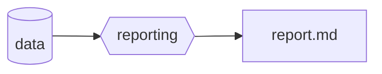
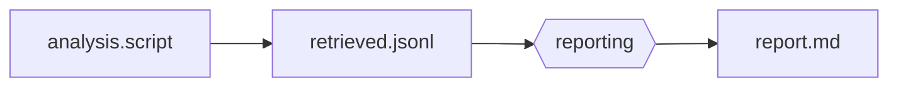
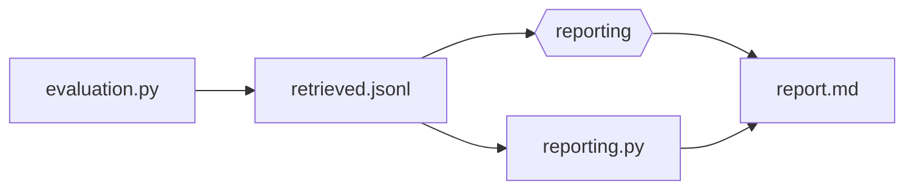
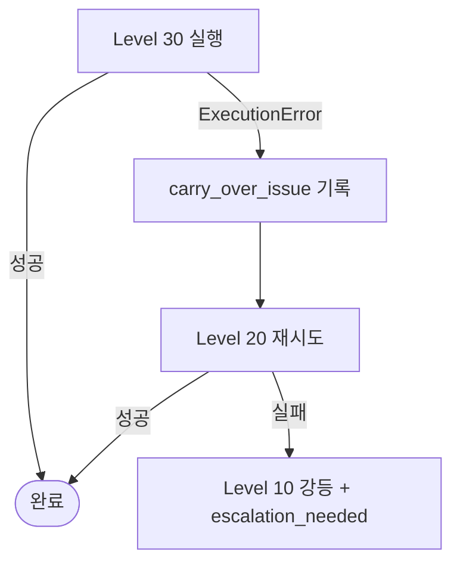

# module.automation-level

> Phase 3 전용. Automation Level 10/20/30 각각의 실행 흐름 상세.

---

## Level 10 — 단순 데이터 리포팅



### 적합 상황
- KPI 임계값 충족
- 분석 스크립트 미존재
- 빠른 현황 가시화만 필요

### 실행 단계

1. **data 로드**: `analysis.db` 또는 지정 소스에서 집계 데이터를 읽는다
2. **reporting**: 데이터를 구조화하여 Markdown 리포트로 변환한다
   - 포함 항목: 실행 요약, 주요 지표 테이블, 이상 감지 항목 (있을 경우)
3. **report.md 저장**: `{workspace}/.mso-context/active/<run_id>/optimizer/level10_report.md`

### 산출물 구조

```markdown
# Workflow Optimization Report (Level 10)
## 실행 요약
## 주요 지표
| 지표 | 현재값 | 임계값 | 상태 |
## 이상 감지 항목
```

---

## Level 20 — 스크립트 기반 분석 리포팅



### 적합 상황
- 분석 스크립트 존재, 평가 기준 미확정
- 구조적 패턴 분석이 필요한 경우
- Level 10보다 심층 분석, Level 30보다 빠른 피드백 필요

### 실행 단계

1. **analysis.script 실행**: SQL 쿼리 또는 Python 분석 스크립트를 실행한다
   - 입력: `analysis.db` 또는 지정 데이터소스
   - 출력: `retrieved.jsonl` (레코드별 분석 결과)
2. **retrieved.jsonl 파싱**: 분석 결과를 집계·해석한다
3. **reporting**: 트렌드, 패턴, 이상치를 포함한 Markdown 리포트를 생성한다
4. **report.md 저장**: `{workspace}/.mso-context/active/<run_id>/optimizer/level20_report.md`

### retrieved.jsonl 형식

```jsonl
{"record_id": "...", "metric": "...", "value": 0.0, "flag": null | "anomaly"}
```

### 산출물 구조

```markdown
# Workflow Optimization Report (Level 20)
## 실행 요약
## 분석 결과 (스크립트 기반)
### 트렌드
### 패턴
### 이상치
## 개선 제안
```

---

## Level 30 — 자동화 평가 리포팅



### 적합 상황
- KPI 임계값 미달
- evaluation.py (정량 평가 스크립트) 존재
- 자동화된 정밀 평가와 구체적 최적화 제안이 필요한 경우

### 실행 단계

1. **evaluation.py 실행**: 정량 평가 지표를 산출한다
   - 출력: `retrieved.jsonl` (평가 지표별 결과)
2. **병렬 실행** (단계 3a + 3b):
   - 3a. **reporting (LLM 기반)**: retrieved.jsonl의 의미 해석, 개선 방향 제안
   - 3b. **reporting.py (자동화 집계)**: 수치 집계, 비교 테이블, KPI 달성 여부 판정
3. **합성**: 3a + 3b 결과를 통합하여 최종 report.md 생성
4. **report.md 저장**: `{workspace}/.mso-context/active/<run_id>/optimizer/level30_report.md`

### 산출물 구조

```markdown
# Workflow Optimization Report (Level 30)
## 평가 요약
## KPI 달성 여부
| KPI | 현재값 | 목표값 | 달성 여부 |
## 개선 필요 구간
## 구체적 최적화 제안
### 우선순위 높음
### 우선순위 보통
## 다음 주기 권고
```

---

## Level 강등 정책

Level 30 실행 실패 시 자동으로 Level 20으로 강등하여 재시도한다:



Level 20도 실패하면 Level 10으로 강등하고 `escalation_needed: true`를 유지한다.
