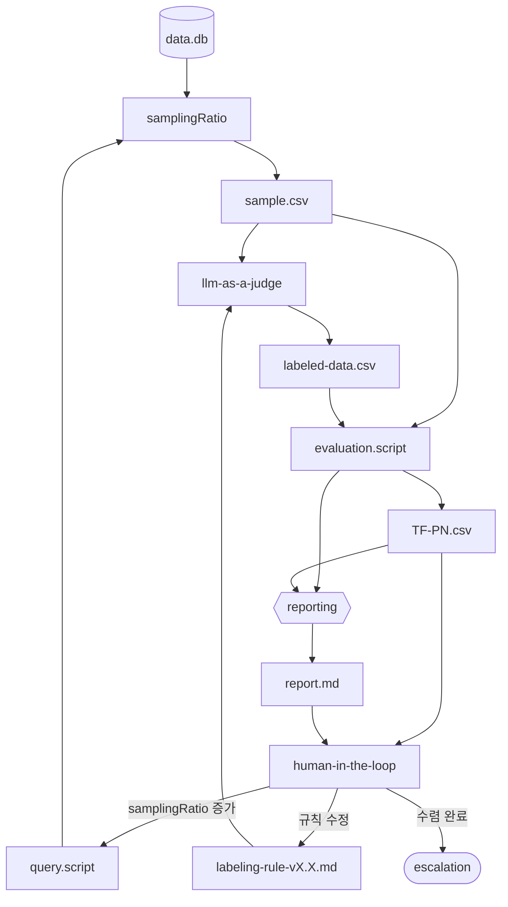
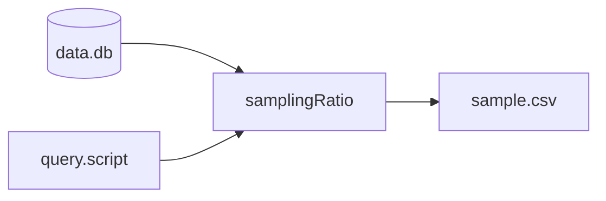
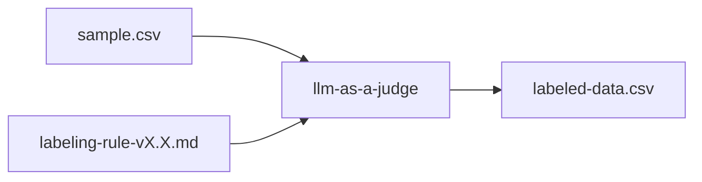
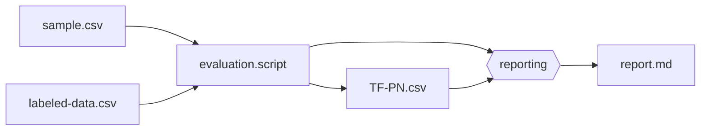
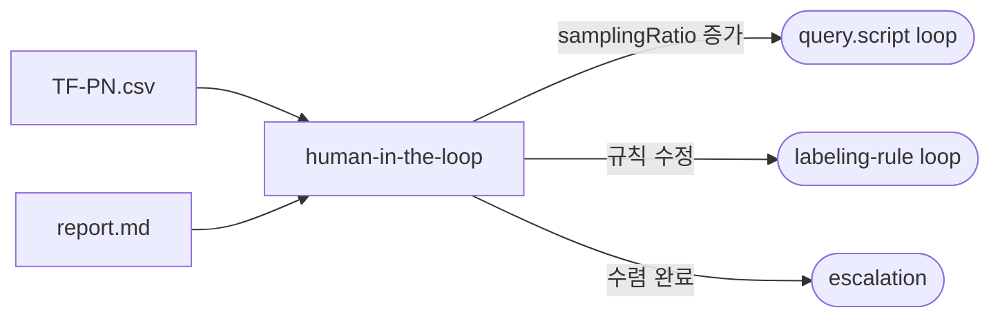

# module.llm-as-a-judge

> LLM을 활용하여 데이터를 라벨링·평가하고, 라벨링 품질을 정량 검증한 뒤
> human-in-the-loop 피드백으로 라벨링 규칙과 샘플링 전략을 반복 개선하는 모듈.

---

## 개요

llm-as-a-judge는 **LLM을 Judge로 활용**하여 데이터에 라벨을 부여하고,
그 라벨링 품질을 evaluation.script로 정량 검증하는 반복 워크플로우다.
`process-optimizing`의 서브프로세스로 호출되거나 독립적으로 실행될 수 있다.

## API 키 환경변수 계약

- skill-local env template: `{mso-workflow-optimizer}/.env.example`
- runtime env file (권장): `{mso-workflow-optimizer}/.env.local`
- fallback env file: `{mso-workflow-optimizer}/.env`
- model catalog: `{mso-workflow-optimizer}/configs/llm-model-catalog.yaml`
- selector script: `python3 {mso-workflow-optimizer}/scripts/select_llm_model.py --provider <name>`
- `LLM_API_PROVIDER` (optional): `openai` | `anthropic` | `google` (기본값: `openai`)
- `LLM_API_KEY` (preferred): 공통 API 키
- provider fallback key:
  - `OPENAI_API_KEY` (`LLM_API_PROVIDER=openai`)
  - `ANTHROPIC_API_KEY` (`LLM_API_PROVIDER=anthropic`)
  - `GOOGLE_API_KEY` (`LLM_API_PROVIDER=google`)
- optional: `LLM_API_BASE_URL`, `LLM_MODEL`

**키 조회 순서**
1. `LLM_API_KEY`
2. provider별 키

**에러 정책**
- 키가 없으면 라벨링 단계 시작 전 fail-fast.
- API 키 값은 로그/리포트/산출물에 기록하지 않는다.

---

## 워크플로우



**핵심 데이터 흐름:**
- `data.db`와 `query.script`는 `samplingRatio`에 **병렬 입력** (query.script는 추출 쿼리를 정의, data.db는 대상 소스)
- `evaluation.script`는 `sample.csv`(원본 샘플)와 `labeled-data.csv`(라벨링 결과) **이중 입력**을 받아 비교 평가
- `reporting`은 `evaluation.script` 직접 출력(해석 데이터)과 `TF-PN.csv`(정량 지표) **이중 입력**으로 리포트 생성

---

## 노드 정의

| 노드 | 유형 | 설명 |
|------|------|------|
| `data.db` | 데이터 저장소 | 평가 대상 원본 데이터 |
| `query.script` | 스크립트 | 데이터 추출 쿼리 정의 (SQL/Python). `samplingRatio`에 병렬 입력 |
| `samplingRatio` | 파라미터 | 샘플 크기 제어. `data.db`와 `query.script`를 병렬로 수신. 초기값 0.1, HITL 피드백으로 증가 |
| `sample.csv` | 데이터 산출물 | 샘플링된 데이터 파일 |
| `labeling-rule-vX.X.md` | 규칙 문서 | LLM에게 전달할 라벨링 기준 (버전 관리) |
| `llm-as-a-judge` | LLM 프로세스 | 라벨링 규칙에 따라 sample.csv를 라벨링 |
| `labeled-data.csv` | 데이터 산출물 | LLM이 라벨링한 결과 |
| `evaluation.script` | 스크립트 | `sample.csv`(원본)와 `labeled-data.csv`(라벨 결과)를 이중 입력 받아 품질을 정량 평가 |
| `TF-PN.csv` | 데이터 산출물 | True/False Positive/Negative 혼동 행렬 |
| `reporting` | 프로세스 | `evaluation.script` 직접 출력(해석 데이터) + `TF-PN.csv`(정량 지표) 이중 입력으로 평가 리포트 생성 |
| `report.md` | 산출물 | 라벨링 품질 평가 리포트 |
| `human-in-the-loop` | 의사결정 | HITL이 결과를 검토하고 다음 행동을 결정 |
| `escalation` | 종료점 | 품질 수렴 완료 또는 상위 프로세스로 핸드오프 |

---

## 실행 단계

### Step 1: 데이터 샘플링



1. `data.db`(대상 소스)와 `query.script`(추출 쿼리)를 `samplingRatio` 노드에 병렬 입력한다
2. `samplingRatio`에 따라 샘플 크기를 결정하고 쿼리를 실행한다
3. `sample.csv`를 생성한다

**samplingRatio 초기값**: 0.1 (10%)
**samplingRatio 상한**: 1.0 (100%)

**산출물 경로**: `{workspace}/.mso-context/active/<run_id>/optimizer/llm-as-a-judge/sample.csv`

---

### Step 2: LLM 라벨링



1. `labeling-rule-vX.X.md`를 읽어 라벨링 기준을 로드한다
2. `sample.csv`의 각 레코드에 대해 LLM이 라벨을 부여한다
3. `labeled-data.csv`를 생성한다

**labeling-rule 형식:**

```markdown
# Labeling Rule v{X.X}

## 라벨 정의
| 라벨 | 기준 | 예시 |
|------|------|------|
| positive | {기준 설명} | {예시} |
| negative | {기준 설명} | {예시} |

## 판단 우선순위
1. {규칙 1}
2. {규칙 2}

## 경계 사례 처리
- {경계 사례 → 판단 방향}
```

**labeled-data.csv 형식:**

| record_id | original_data | label | confidence | reasoning |
|-----------|--------------|-------|------------|-----------|
| R001 | ... | positive | 0.92 | "규칙 1에 의해..." |
| R002 | ... | negative | 0.78 | "규칙 2에 의해..." |

**산출물 경로**: `{workspace}/.mso-context/active/<run_id>/optimizer/llm-as-a-judge/labeled-data.csv`

---

### Step 3: 라벨링 품질 평가



1. `evaluation.script`에 `sample.csv`(원본 샘플)와 `labeled-data.csv`(라벨링 결과)를 **이중 입력**한다
2. 원본과 라벨 결과를 비교하여 혼동 행렬(`TF-PN.csv`)을 생성한다
3. `reporting` 프로세스가 `evaluation.script` 직접 출력(해석 데이터)과 `TF-PN.csv`(정량 지표)를 **이중 입력** 받아 `report.md`를 생성한다

**TF-PN.csv 형식:**

| metric | value |
|--------|-------|
| true_positive | {n} |
| false_positive | {n} |
| true_negative | {n} |
| false_negative | {n} |
| precision | {0.0–1.0} |
| recall | {0.0–1.0} |
| f1_score | {0.0–1.0} |
| cohen_kappa | {-1.0–1.0} |

**산출물 경로:**
- `{workspace}/.mso-context/active/<run_id>/optimizer/llm-as-a-judge/TF-PN.csv`
- `{workspace}/.mso-context/active/<run_id>/optimizer/llm-as-a-judge/report.md`

---

### Step 4: Human-in-the-Loop 검토



사용자에게 평가 결과를 제시하고 다음 행동을 결정한다:

```
[llm-as-a-judge 라벨링 품질 평가]
- 대상: {workflow_name}
- 샘플 크기: {sample_size} ({samplingRatio * 100}%)
- 라벨링 규칙: labeling-rule-v{X.X}.md

[혼동 행렬 요약]
| metric | value |
|--------|-------|
| precision | {value} |
| recall | {value} |
| f1_score | {value} |

[행동 선택]
1. 샘플 크기 확대 (samplingRatio 증가) — 현재 {ratio} → 제안 {ratio * 2}
2. 라벨링 규칙 수정 (labeling-rule 업데이트)
3. 품질 수렴 완료 (escalation → 상위 프로세스로 반환)
```

---

## HITL 피드백 처리

| 피드백 | 동작 | loop 대상 |
|--------|------|-----------|
| **samplingRatio 증가** | `samplingRatio = min(samplingRatio * 2, 1.0)` → Step 1로 재진입 | query.script |
| **labeling-rule 수정** | 사용자와 함께 규칙 수정 → 버전 증가 (vX.X → vX.{X+1}) → Step 2로 재진입 | labeling-rule |
| **품질 수렴 완료** | 최종 labeled-data.csv와 report.md를 확정하고 escalation | — |

**labeling-rule 버전 관리:**
- 수정 시마다 버전을 증가시킨다 (v1.0 → v1.1 → v1.2 → ...)
- 이전 버전은 삭제하지 않고 보존한다
- 규칙 변경 이력은 report.md에 기록한다

---

## 수렴 기준 (권고)

자동 수렴 제안 조건:

| 조건 | 설명 |
|------|------|
| f1_score ≥ 0.85 | 라벨링 품질이 충분히 높다 |
| 2회 연속 f1_score 변동 < 0.02 | 품질이 수렴했다 |
| samplingRatio = 1.0 | 전체 데이터를 사용했다 |

수렴 조건 충족 시 사용자에게 "품질 수렴 완료" 행동을 권고하되 강제하지 않는다.

---

## 호출 인터페이스

### 독립 실행 시 입력

```json
{
  "data_source": "path/to/data.db",
  "query_script": "path/to/query.script",
  "labeling_rule": "path/to/labeling-rule-v1.0.md",
  "evaluation_script": "path/to/evaluation.script",
  "initial_sampling_ratio": 0.1,
  "workflow_name": "{name}",
  "run_id": "{run_id}"
}
```

### process-optimizing에서 호출 시 입력

```json
{
  "data_source": "output.db",
  "labeling_context": "process_evaluation",
  "workflow_name": "{workflow_name}",
  "run_id": "{run_id}",
  "evaluation_focus": "process_quality | process_improvement_delta"
}
```

### 반환값

```json
{
  "status": "converged | iterating | escalated",
  "final_metrics": {
    "precision": 0.0,
    "recall": 0.0,
    "f1_score": 0.0,
    "cohen_kappa": 0.0
  },
  "labeled_data_path": "{workspace}/.mso-context/active/<run_id>/optimizer/llm-as-a-judge/labeled-data.csv",
  "llm_as_a_judge_report_path": "{workspace}/.mso-context/active/<run_id>/optimizer/llm-as-a-judge/report.md",
  "iterations": 1,
  "labeling_rule_version": "v1.0",
  "sampling_ratio_final": 0.1
}
```

---

## 산출물 구조

### report.md

```markdown
# llm-as-a-judge Labeling Quality Report
## 실행 요약
- 대상: {workflow_name}
- 라벨링 규칙: v{X.X}
- 샘플: {sample_size} / {total_size} ({ratio}%)
- 반복 횟수: {iterations}

## 혼동 행렬
| | Predicted Positive | Predicted Negative |
|---|---|---|
| Actual Positive | {TP} | {FN} |
| Actual Negative | {FP} | {TN} |

## 품질 지표
| metric | value |
|--------|-------|
| precision | {value} |
| recall | {value} |
| f1_score | {value} |
| cohen_kappa | {value} |

## 라벨링 규칙 변경 이력
| version | 변경 사항 | f1_score |
|---------|-----------|----------|

## 개선 권고
```

---

## 에러 처리

| 상황 | 처리 |
|------|------|
| `data.db` 미존재 | fail-fast, 데이터 소스 확인 요청 |
| `query.script` 실행 실패 | 스크립트 오류 상세 보고, 수정 후 재시도 |
| `labeling-rule` 미존재 | 기본 라벨링 규칙 템플릿(v0.1)을 생성하고 HITL에서 확정 |
| LLM 라벨링 타임아웃 | 현재 sample.csv를 분할하여 배치 재시도 |
| `evaluation.script` 실패 | labeled-data.csv만으로 기본 통계 산출, warning 표시 |
| 5회 이상 loop 반복 | 사용자에게 수렴 불가 경고, escalation 권고 |
| samplingRatio 1.0에서도 f1 < 0.5 | 라벨링 규칙 전면 재설계 권고, escalation_needed=true |
