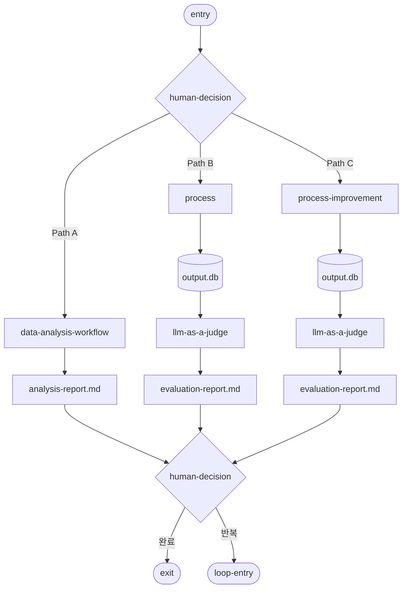
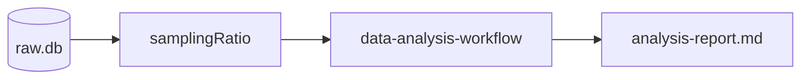
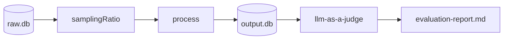
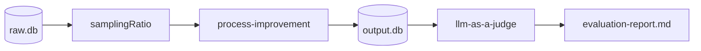

# module.process-optimizing

> 프로세스 실행·분석·평가를 반복하며 워크플로우를 점진적으로 개선하는 모듈.
> `llm-as-a-judge`를 서브프로세스로 호출하여 정성 평가를 수행한다.

---

## 개요

process-optimizing은 **실행 중인 프로세스**의 산출물을 분석·평가하여 개선 방향을 도출하는 반복(iterative) 워크플로우다.
기존 Phase 3(Automation Level 실행)과 달리, 이 모듈은 **프로세스 자체의 구조적 개선**에 초점을 둔다.

---

## 워크플로우



---

## 노드 정의

| 노드 | 유형 | 설명 |
|------|------|------|
| `entry` | 시작점 | 워크플로우 진입. trigger_context를 수신한다 |
| `human-decision` (상단) | 분기 | 사용자가 실행 경로를 선택한다 |
| `analysis-data` | 데이터 그룹 | `raw.db` 인스턴스를 포함하는 입력 데이터 |
| `samplingRatio` | 파라미터 | 각 경로별 샘플링 비율 제어 |
| `data-analysis-workflow` | 서브워크플로우 | 기존 분석 워크플로우 실행 (Path A) |
| `process` | 서브워크플로우 | 현행 프로세스 실행 및 결과 수집 (Path B) |
| `process-improvement` | 서브워크플로우 | 개선된 프로세스 변형을 실행 (Path C) |
| `output.db` | 데이터 저장소 | 프로세스 실행 결과를 저장 |
| `llm-as-a-judge` | 서브프로세스 | [module.llm-as-a-judge.md](module.llm-as-a-judge.md) 호출 |
| `analysis-report.md` | 산출물 | data-analysis-workflow 분석 결과 리포트 |
| `evaluation-report.md` | 산출물 | llm-as-a-judge 평가 결과 리포트 |
| `human-decision` (하단) | 수렴 | 리포트를 검토하고 종료/반복을 결정 |
| `exit` | 종료점 | 최적화 완료 |
| `loop-entry` | 재진입점 | 반복 실행을 위한 워크플로우 재시작 |

---

## 실행 단계

### Step 1: Entry + Human-Decision (경로 선택)

사용자에게 실행 가능한 경로를 제시하고 선택을 받는다:

```
[프로세스 최적화 경로 선택]
- workflow_name: {workflow_name}
- 사용 가능한 데이터: raw.db ({record_count} records)

[경로]
A. data-analysis-workflow — 데이터 분석만 수행
B. process — 현행 프로세스 실행 + 평가
C. process-improvement — 개선 프로세스 실행 + 평가

선택 (복수 가능): ___
```

**when_unsure**: 경로 판단이 불명확하면 Path A(분석 우선)를 기본으로 제안한다.

---

### Step 2: 경로별 실행

#### Path A — data-analysis-workflow



1. `raw.db`에서 `samplingRatio`에 따라 데이터를 샘플링한다
2. 기존 분석 워크플로우를 실행한다
3. `analysis-report.md`를 생성한다

**산출물 경로**: `{workspace}/.mso-context/active/<run_id>/optimizer/process/analysis-report.md`

#### Path B — process (현행 프로세스 실행)



1. `raw.db`에서 `samplingRatio`에 따라 데이터를 샘플링한다
2. 현행 프로세스(`process`)를 실행하여 `output.db`에 결과를 저장한다
3. `llm-as-a-judge` 서브프로세스를 호출하여 output.db를 평가한다
4. `evaluation-report.md`를 생성한다

**산출물 경로**: `{workspace}/.mso-context/active/<run_id>/optimizer/process/evaluation-report.md`

#### Path C — process-improvement (개선 프로세스)



1. `raw.db`에서 `samplingRatio`에 따라 데이터를 샘플링한다
2. 개선된 프로세스 변형을 실행하여 `output.db`에 결과를 저장한다
3. `llm-as-a-judge` 서브프로세스를 호출하여 output.db를 평가한다
4. `evaluation-report.md`를 생성한다

**산출물 경로**: `{workspace}/.mso-context/active/<run_id>/optimizer/process/improvement-evaluation-report.md`

---

### Step 3: 리포트 수렴 + Human-Decision (하단)

모든 경로의 산출물(analysis-report.md, evaluation-report.md)을 수집하여 사용자에게 제시한다:

```
[프로세스 최적화 결과]
- workflow_name: {workflow_name}
- 실행 경로: {selected_paths}

[산출물]
- analysis-report.md: {summary}
- evaluation-report.md: {summary}

[결정]
1. 최적화 완료 (exit)
2. 추가 반복 필요 (loop-entry) — 사유: ___
```

---

### Step 4: Exit / Loop-Entry

| 결정 | 동작 |
|------|------|
| **exit** | 산출물을 확정하고, Phase 4(decision-reporting-logging)로 전달 |
| **loop-entry** | `samplingRatio` 조정 또는 경로 변경 후 Step 1로 재진입 |

**loop-entry 시 컨텍스트 유지:**
```json
{
  "iteration": 2,
  "previous_reports": ["analysis-report.md", "evaluation-report.md"],
  "adjusted_params": {
    "samplingRatio": 0.3,
    "path_change": "B → C"
  }
}
```

---

## llm-as-a-judge 호출 인터페이스

process-optimizing에서 llm-as-a-judge를 호출할 때 전달하는 컨텍스트:

```json
{
  "data_source": "output.db",
  "labeling_context": "process_evaluation",
  "workflow_name": "{workflow_name}",
  "run_id": "{run_id}",
  "evaluation_focus": "process_quality | process_improvement_delta"
}
```

llm-as-a-judge 반환값은 `evaluation-report.md`에 통합된다.

---

## 산출물 구조

### analysis-report.md

```markdown
# Process Analysis Report
## 실행 요약
## 데이터 분석 결과
### 주요 지표
| 지표 | 현재값 | 기준값 | 상태 |
### 패턴 감지
### 이상치
## 개선 제안
```

### evaluation-report.md

```markdown
# Process Evaluation Report (llm-as-a-judge)
## 평가 요약
## 프로세스 품질 지표
| 항목 | 현행 | 개선안 | 변화량 |
## llm-as-a-judge 판단 근거
## 구조적 개선 권고
```

---

## 에러 처리

| 상황 | 처리 |
|------|------|
| `raw.db` 미존재 | fail-fast, 사용자에게 데이터 소스 확인 요청 |
| `process` 실행 실패 | Path A(분석 전용)로 폴백, `carry_over_issues`에 기록 |
| `llm-as-a-judge` 호출 실패 | 정량 평가만으로 evaluation-report.md 생성, warning 표시 |
| `samplingRatio`가 1.0 초과 요청 | 1.0으로 클리핑, 사용자에게 안내 |
| 3회 이상 loop-entry 반복 | 사용자에게 반복 종료를 권고, escalation_needed=true |
